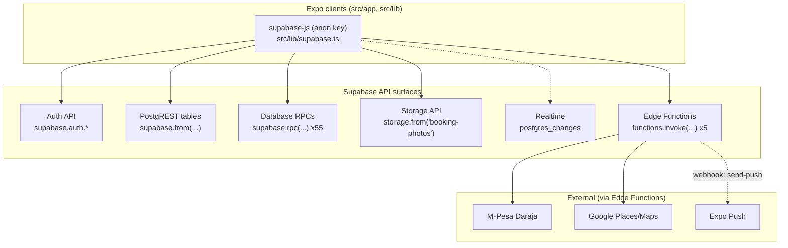
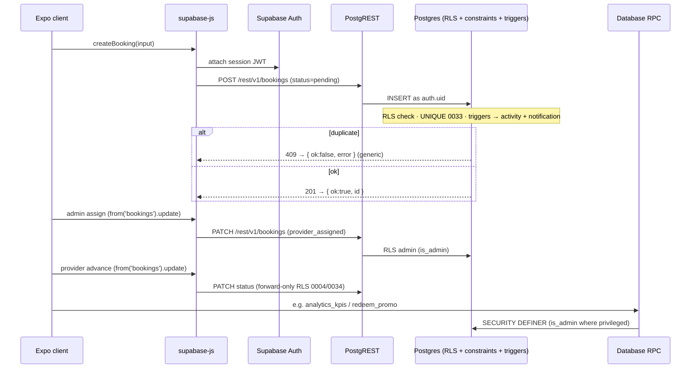

# QuickServe API

## 1. Purpose

The authoritative engineering reference for the QuickServe **API surface as implemented
in this repository today**. QuickServe has no bespoke REST server: clients call
**Supabase** directly. This document catalogues the five verified surfaces the app uses —
the Supabase client (Auth + PostgREST tables), database **RPCs**, **Edge Functions**,
**Storage**, and **Realtime** — with every entry traceable to repository evidence
(`src/lib/`, `supabase/functions/`, `supabase/migrations/`).

RLS policy text, auth internals, and secret handling are summarized here and deferred to
[security/](../security/README.md) and [authentication/](../authentication/README.md).
System context is in [architecture/](../architecture/README.md); the client/data layer and
the database in [backend/](../backend/README.md) and [database/](../database/README.md).

## 2. API Status

| Badge | Meaning |
|---|---|
| **Implemented** | Called by app code and/or exercised by certified tests. |
| **Partial** | Present but not fully integrated / not certified end-to-end. |
| **Planned** | Referenced but not built. |
| **QA-only** | Exercised only by the certification harness. |

**Summary:** the client uses **~12** PostgREST tables directly, **55** database RPCs,
**5** app-invoked Edge Functions (+2 webhook functions), one Storage bucket, and one
Realtime subscription. The booking/dispatch API path is **certified**; payments, push
delivery, storage, and realtime are **Partial** (uncertified end-to-end).

## 3. API Architecture

There is no custom API tier. The Expo client (`@supabase/supabase-js`, `src/lib/supabase.ts`,
anon key) talks to Supabase; the database enforces access via RLS. Five distinct surfaces:

- **Supabase client API (Auth + PostgREST)** — `supabase.auth.*` for identity;
  `supabase.from('<table>')` for direct row reads/writes over PostgREST.
- **Database RPCs** — `supabase.rpc('<fn>')` invoking `SECURITY DEFINER` Postgres functions
  (the primary path for mutations, aggregations, and privileged/admin actions).
- **Edge Functions** — `supabase.functions.invoke('<fn>')` for operations needing secrets or
  third parties (payments, maps, push registration).
- **Storage API** — `supabase.storage.from('booking-photos')` for evidence uploads/downloads.
- **Realtime API** — `postgres_changes` subscriptions for live data.

See [architecture/](../architecture/README.md) and [backend/](../backend/README.md) for the
platform view (not repeated here).

## 4. API Surface Inventory

Grouped, implemented surfaces only:

| Category | Surface | Evidence |
|---|---|---|
| Auth | `supabase.auth` (signUp, signInWithPassword, signOut, getSession, getUser) | `src/auth/auth-context.tsx`, `src/lib/*` |
| PostgREST tables (~12) | `bookings`, `booking_photos`, `booking_messages`, `notifications`, `notification_preferences`, `payments`, `reviews`, `review_private_feedback`, `promo_codes`, `promo_redemptions`, `support_cases`, `wallets` | `src/lib/*.ts` (`supabase.from(...)`) |
| Database RPCs (55) | analytics, quotes/payments, wallet, promotions, operations, provider quality, services admin, reviews, favorites, tracking, addresses, notifications (see §8) | `src/lib/*` (`supabase.rpc(...)`); defined in `supabase/migrations/` |
| Edge Functions (5 invoked) | `mpesa-stk-push`, `register-device`, `places-autocomplete`, `place-details`, `tracking-map` | `src/lib/*` (`functions.invoke(...)`) |
| Edge Functions (2 webhook) | `mpesa-callback`, `send-push` — not app-invoked | `supabase/functions/`, `supabase/config.toml` |
| Storage | `booking-photos` bucket (upload / signed-URL / remove) | `src/lib/photos.ts` |
| Realtime | `provider_locations` (`postgres_changes`) | `src/lib/tracking.ts` |

## 5. Authentication Requirements

High-level (details in [authentication/](../authentication/README.md)):

- **PostgREST tables & RPCs** — the caller's Supabase session JWT is sent by `supabase-js`;
  the database applies RLS by `auth.uid()` / `is_admin()`. Unauthenticated (anon) callers
  see only what anon RLS permits (e.g. bookings return `[]`).
- **Edge Functions** — five app-invoked functions require a valid JWT (`verify_jwt = true`);
  the two webhook functions (`mpesa-callback`, `send-push`) accept **no JWT** and are guarded
  by shared secrets (`supabase/config.toml`).
- **Storage** — `booking-photos` is private; access is via authenticated policies + signed URLs.

## 6. Client Operations

Verified client interactions (by domain, with maturity):

| Domain | Operations | Path(s) | Evidence | Maturity |
|---|---|---|---|---|
| Authentication | sign up / in / out, session + role resolution | `signUp`, `signIn`, `signOut` | `src/auth/auth-context.tsx` | Implemented (certified: admin login) |
| Profile / providers | read profile/role; browse public providers | RPC `list_public_providers`, `get_my_favorite_providers` | `src/lib/providers-browse.ts`, `favorites.ts` | Implemented |
| Services | read catalog; admin CRUD via RPC | RPC `admin_*_service/category` | `src/lib/services-catalog.ts` | Implemented |
| Bookings | create, read, list, update status | `from('bookings')` insert/select/update | `src/lib/bookings.ts` | Implemented (certified) |
| Assignment | admin assign provider | `from('bookings').update(...)` | `src/lib/bookings.ts` | Implemented (certified) |
| Quotes/payments | set/accept/decline quote; pay; attempts | RPC `set_quote`, `accept_quote`, `pay_payment`, `*_payment_attempt`, `override_payment_status` | `src/lib/quotes.ts`, `payments.ts`, `attempts.ts` | Partial |
| Notifications | list, mark read, preferences | `from('notifications')`, `from('notification_preferences')`; RPC `emit_notification` | `src/lib/notifications.ts` | Implemented (rows) |
| Uploads (evidence) | upload/read/remove booking photos | `storage.from('booking-photos')` + `from('booking_photos')` | `src/lib/photos.ts` | Implemented |
| Chat | read/send booking messages | `from('booking_messages')`; RPC `get_chat_peer_name` | `src/lib/messages.ts` | Implemented (no realtime sub) |
| Tracking | subscribe to provider location; upsert/clear | Realtime `provider_locations`; RPC `upsert_provider_location`, `clear_provider_location` | `src/lib/tracking.ts` | Partial |
| Wallet / promos | balance, ledger, redeem promo | `from('wallets')`; RPC `apply_wallet_to_payment`, `redeem_promo`, `admin_wallet_adjust` | `src/lib/wallet.ts`, `promotions.ts` | Implemented |
| Reviews | submit/edit review; rating breakdown | `from('reviews')`; RPC `edit_review`, `get_provider_rating_breakdown` | `src/lib/reviews.ts` | Implemented |
| Analytics (admin) | dashboards | RPC `analytics_*` (13) | `src/lib/analytics.ts`, `executive-analytics.ts` | Implemented (certified: Slices 41–42) |
| Operations (admin) | support cases, flags, notes, broadcast | RPC `create_support_case`, `flag_account`, `broadcast_announcement`, … | `src/lib/operations.ts` | Implemented |

## 7. Edge Function Inventory

Matches `supabase/functions/` exactly (7); `verify_jwt` from `supabase/config.toml`.

| Function | Purpose | Caller | Auth | External dep | Maturity | Certified? |
|---|---|---|---|---|---|---|
| `mpesa-stk-push` | Initiate an M-Pesa STK Push for a pending payment | App (`functions.invoke`) | JWT | M-Pesa Daraja | Implemented | No (E2E) |
| `mpesa-callback` | Receive Daraja's async STK result, persist | Safaricom (webhook) | Secret (`MPESA_CALLBACK_SECRET`) | M-Pesa Daraja | Implemented | No (E2E) |
| `send-push` | Translate DB trigger payloads into Expo push | DB `pg_net` webhook | Secret (`PUSH_WEBHOOK_SECRET`) | Expo Push | Implemented | No (delivery) |
| `register-device` | Register/update a device push token | App | JWT | — | Implemented | Indirect |
| `places-autocomplete` | Google Places autocomplete | App | JWT | Google Places | Implemented | No |
| `place-details` | Resolve address/coords + static map URL | App | JWT | Google Places/Maps | Implemented | No |
| `tracking-map` | Build a static map URL (two markers) | App | JWT | Google Maps | Implemented | No |

*Evidence:* `supabase/functions/<name>/index.ts`, `supabase/config.toml`; app invocations in
`src/lib/mpesa.ts`, `push.ts`, `places.ts`, `maps.ts`, `tracking.ts`.

## 8. Database RPC Inventory

**55** distinct RPCs are invoked by the client; **every one is defined in `supabase/migrations/`**
(verified: no app RPC is undefined). Grouped by domain (SQL not duplicated):

| Domain | RPCs (representative) | Migration |
|---|---|---|
| Quotes & payments | `set_quote`, `accept_quote`, `decline_quote`, `pay_payment`, `mark_payout_paid`, `override_payment_status` | 0010 |
| Payment attempts | `initiate_payment_attempt`, `confirm_payment_attempt`, `cancel_payment_attempt` | 0011 |
| Wallet | `apply_wallet_to_payment`, `admin_wallet_adjust` | 0023, 0024 |
| Promotions | `redeem_promo` | 0024 |
| Analytics (read) | `analytics_kpis`, `analytics_bookings_*`, `analytics_financial_*`, `analytics_providers`, `analytics_services`, `analytics_geography`, `analytics_customers`, `analytics_executive_overview`, `analytics_growth_timeseries`, `analytics_service_categories`, `analytics_notification_delivery` | 0025, 0032 |
| Operations / support | `create_support_case`, `add_support_case_note`, `assign_support_case`, `update_support_case_status`, `update_support_case_priority`, `set_dispute_outcome`, `flag_account`, `lift_account_flag`, `add_internal_note`, `broadcast_announcement`, `emit_notification` | 0026, 0031 |
| Provider quality | `accept_provider_conduct`, `record_provider_quality_action` | 0028 |
| Services admin | `admin_create_service`, `admin_update_service`, `admin_set_service_status`, `admin_duplicate_service`, `admin_reorder_services`, `admin_create_category`, `admin_update_category`, `admin_set_category_active`, `admin_reorder_categories` | 0030 |
| Reviews | `edit_review`, `get_provider_rating_breakdown` | 0022, 0029 |
| Favorites / browse | `get_my_favorite_providers`, `list_public_providers` | 0027 |
| Tracking | `upsert_provider_location`, `clear_provider_location` | 0018 |
| Addresses | `set_default_address`, `touch_saved_address` | 0019 |
| Booking / chat helpers | `get_booking_professional`, `get_chat_peer_name` | 0005, 0013 |

Most are `SECURITY DEFINER`; admin RPCs open with `is_admin()` (see [database/](../database/README.md) §12).

## 9. Storage API

- **Bucket:** `booking-photos` (private; `supabase/migrations/0006_booking_photos.sql`).
- **Upload:** `supabase.storage.from('booking-photos').upload(path, bytes, { contentType })`,
  written idempotently with a retry, then a `booking_photos` row is inserted
  (`src/lib/photos.ts`).
- **Download:** `createSignedUrl(photo_url, 3600)` — a 1-hour signed URL (private bucket).
- **Delete:** `remove([photo_url])` (admin-gated by storage policy, `0006`/`0016`).
- **Metadata:** the `booking_photos` table stores the object path (`photo_url`), uploader,
  and booking association.

## 10. Realtime API

- **Implemented:** a `postgres_changes` subscription on **`provider_locations`** for live
  tracking (`src/lib/tracking.ts`), used by the customer's booking-tracking screen.
- **Uncertified:** the tracking realtime path is not covered by connected certification.
- **Not realtime-subscribed:** chat (`booking_messages`) and notifications are read via direct
  table queries in `src/lib/` — **no** client realtime subscription is present for them (they
  refetch rather than subscribe).
- **Planned:** none asserted.

## 11. Error Handling

Verified behavior (no invented codes):

- **Duplicate active booking** — the DB partial unique index (`0033`) returns **HTTP 409**;
  the app's `createBooking` maps **any** insert error to a **generic** message
  ("Could not create booking. Please try again."), so the 409 is not surfaced as a specific
  "duplicate" message (`src/lib/bookings.ts`).
- **Authentication failures** — `mapAuthError` (`src/lib/auth-errors.ts`) translates Supabase
  auth errors into friendly copy (invalid credentials, already-exists, email-confirm,
  rate-limit).
- **Validation** — client-side validators (e.g. `src/lib/validation.ts`) block bad input before
  calls; server rejects invalid enum values via `CHECK` constraints (e.g. invalid booking
  status → 4xx, certified).
- **RLS denials** — unauthorized reads return empty sets; unauthorized/invalid writes fail
  (403 / 0 rows), certified in `qa/playwright/certification/`.
- **Edge Function failures** — functions validate input/secrets and return HTTP errors; the
  webhook functions reject on a bad shared secret.

## 12. Payments API

Implemented components (implementation ≠ certification):

- **Initiation** — `mpesa-stk-push` Edge Function (`functions.invoke`) for a pending payment.
- **Attempts** — RPCs `initiate_payment_attempt`, `confirm_payment_attempt`,
  `cancel_payment_attempt` and the `payment_attempts` table (`0011`).
- **Callback** — `mpesa-callback` (secret-gated) persists Daraja's async result via
  `apply_mpesa_callback` (`0012`).
- **Payment records** — `payments` + `provider_earnings` (`0010`); admin `override_payment_status`.
- **Client reads** — `src/lib/payments.ts`, `attempts.ts`, phone helpers `mpesa.ts`.
- **Certification** — **not verified end-to-end.** Real settlement (STK → callback → paid) is
  outside the connected certification scope (QA treats payments as manual/external). Not
  production-ready as certified.

## 13. Security Boundaries

Summary (full model in [security/](../security/README.md)):

- **RLS is the boundary** for all table/RPC access; the client uses the anon key.
- **Tenant isolation** (customer own / provider assigned / admin all) is certified.
- **Service-role** is server/QA-only (Edge Functions, QA teardown), never in the client.
- **Edge Function privilege** — JWT functions act on the caller; webhook functions are
  secret-gated and accept no JWT.

## 14. QA Coverage

Covered by **connected** certification (`qa/playwright/certification/`, 21/21):

- Auth for all four QA roles; anon/tenant RLS isolation.
- Booking create + persistence; admin queue, assign/reassign, accept/reject; provider
  forward progression; the end-to-end golden path; audit ordering; notification RLS scoping.
- Integrity: duplicate-active-booking (409, `0033`), terminal states (`0034`), concurrency
  characterization, insert atomicity.

Covered by **dashboard** suites (Slices 41–42): the `analytics_*` RPCs (mock mode + optional
connected).

**Not covered / uncertified:** M-Pesa settlement, push **delivery**, Storage upload/download,
Realtime tracking, chat, and the maps Edge Functions — plus all native-mobile UI paths.

## 15. API Constraints

Verified remaining constraints:

- **No optimistic concurrency** on booking mutations (last-write-wins).
- **Provider forward-skip permitted** (forward-only, not single-step).
- **External/edge APIs uncertified** end-to-end (payments, push delivery, maps).
- **Duplicate 409 surfaced generically** by the client (not a specific duplicate message).

## 16. API Change Rules

Repository workflow for API changes:

- **Schema/RPC/policy changes require a migration** (`supabase/migrations/`); no manual edits.
- **Edge Function changes** live in `supabase/functions/`; update `supabase/config.toml`
  (`verify_jwt`) as needed.
- **Behavioral changes update connected certification** (`qa/playwright/certification/`) to
  assert the new contract; never weaken assertions.
- **Re-run migration alignment + certification + health** after changes.
- **New environment variables** documented by name/purpose; **service-role never exposed to
  client code**.

## 17. Related Documentation

- [Architecture](../architecture/README.md) · [Backend](../backend/README.md) ·
  [Database](../database/README.md) · [Authentication](../authentication/README.md) ·
  [Security](../security/README.md) · [QA](../qa/README.md) ·
  [Deployment](../deployment/README.md) · [Operations](../operations/README.md)
- Engineering index: [../README.md](../README.md)
- QA (authoritative): `../../../qa/docs/LAUNCH-CERTIFICATION.md`

---

### A complete booking request through the API stack

*Verified against:* `src/lib/bookings.ts`, `src/lib/supabase.ts`, `supabase/migrations/0002`,
`0003`, `0004`, `0033`, `0034`, and `qa/playwright/certification/`.
