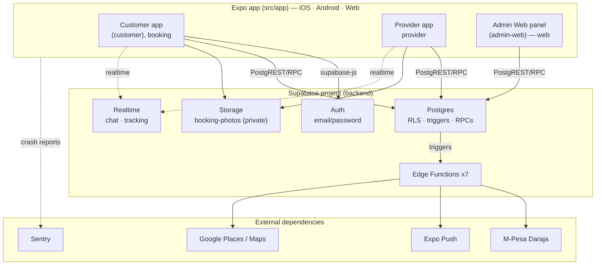
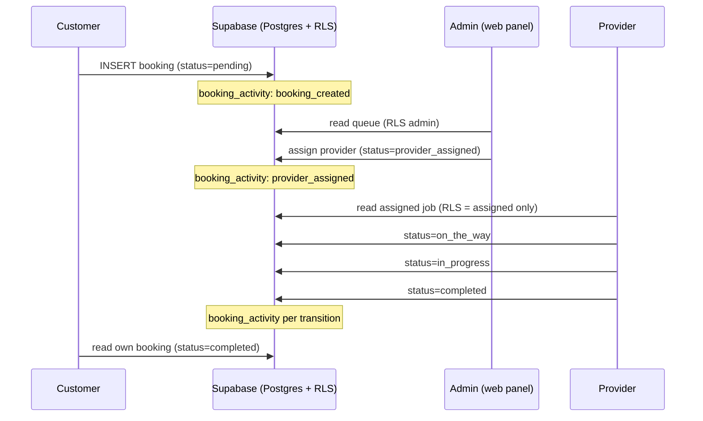

# QuickServe System Architecture

## 1. Purpose and Scope

This document describes the QuickServe system architecture **as implemented in this
repository today**, based only on inspected repository evidence. It is the entry point
for engineering readers; deeper topics (database schema, API contracts, auth, security)
have their own sections and are only summarized here.

Every major claim cites the source file(s) it was verified against. Where something is
configured but not fully integrated, or planned but not built, it is labelled as such
(see §2). Nothing here is inferred as "implemented" without repository evidence.

## 2. Architecture Status

Status legend used throughout this document:

| Badge | Meaning |
|---|---|
| **Implemented** | Present in the repository and exercised by app code and/or certified tests. |
| **Partially implemented** | Present but not fully integrated or not certified end-to-end. |
| **Planned** | Referenced/intended in code or docs but not built. |
| **QA-only** | Test/certification infrastructure, isolated from the shipped product. |
| **External** | Third-party dependency the system calls out to. |

## 3. High-Level System Overview

QuickServe is an **Expo (React Native) application** targeting **iOS, Android, and web**
from a single codebase (`app.json` → `platforms: ios, android, web`; `package.json` →
`expo ~56`, `react-native 0.85.3`, `react-native-web ~0.21`). It is backed by a single
**Supabase** project (Postgres + Auth + Storage + Realtime + Edge Functions) accessed via
`@supabase/supabase-js` (`src/lib/supabase.ts`).

Three user surfaces run from the same Expo app via **Expo Router** file-based routing
(`expo-router ~56`, `src/app/`):

- **Customer app** — `src/app/(customer)/`, `src/app/booking/` (mobile).
- **Provider app** — `src/app/provider/` (mobile).
- **Admin Web panel** — `src/app/(admin-web)/` (web; self-guarded, see §5).

Clients talk to Supabase directly over PostgREST/Auth/Storage/Realtime, with server-side
logic in Postgres (RLS policies, triggers, SECURITY DEFINER functions) and **7 Edge
Functions** (`supabase/functions/`) for operations that need secrets or third parties
(payments, push, maps).

*Verified against:* `app.json`, `package.json`, `src/lib/supabase.ts`, `src/app/`,
`supabase/functions/`, `supabase/migrations/`.

## 4. Repository Structure

Important top-level directories (not an exhaustive tree):

| Path | Role |
|---|---|
| `src/` | The Expo application: `app/` (routes), `lib/` (data-access + helpers), `auth/`, `components/`, `services/`, `constants/`, `hooks/`. |
| `supabase/` | Backend as code: `migrations/` (0001–0034) and `functions/` (Edge Functions). |
| `qa/` | **QA-only** Playwright workspace (own `package.json`/`node_modules`); certification + health suites. |
| `apps/website/` | **Partially implemented** separate Next.js 15 marketing website (own build/deploy). |
| `docs/` | Engineering docs (this section), plus `design/`, `pilot/`, `qa/`, `superpowers/` (specs/plans). |
| `test/` | Jest setup and shared mocks for the app's unit tests. |
| `scripts/`, `assets/` | Utility scripts and static assets. |

Root configuration of note: `app.json` (Expo), `eas.json` (EAS build profiles:
development/preview/production), `vercel.json` (web deploy), `metro.config.js`,
`babel.config.js`, `jest.config.js`, `tsconfig.json`.

> Note: `_parked/` and a stray `Claude`/scratch entry are non-architectural working
> artifacts and are not part of the system.

## 5. Application Components

All three surfaces are the **same Expo app**, separated by Expo Router route groups and
composed under a shared provider tree in `src/app/_layout.tsx`
(`AuthProvider → ServicesProvider → BookingDraftProvider`, plus `ErrorBoundary`,
`OfflineBanner`, `ThemeProvider`).

- **Customer app** — **Implemented.** `src/app/(customer)/` (home, search, bookings,
  notifications, profile, payments, favorites) and the booking flow `src/app/booking/`
  (`address → schedule → notes → review → success`, plus `track`, `chat`, `receipt`,
  `review`). Booking creation is certified against the backend (see §10).
- **Provider app** — **Implemented.** `src/app/provider/` with tabbed navigation
  (`(tabs)/index`, `notifications`, `profile`), job detail (`provider/job/[id]`), quality
  and code-of-conduct screens.
- **Admin Web panel** — **Implemented.** `src/app/(admin-web)/` (login, bookings queue +
  detail, analytics, providers, customers, payments, operations, reviews, notifications).
  It **manages its own auth guard**, so the root navigator explicitly skips it
  (`src/app/_layout.tsx`: `if (segments[0] === '(admin-web)') return`). Guard in
  `src/app/(admin-web)/_layout.tsx` (`useAdminGuard`, `src/hooks/use-admin-guard.ts`).
  This is the admin surface certified in the QA Admin suites.
- **Legacy mobile admin routes** — **Partially implemented.** A separate route tree
  `src/app/admin/` exists and is the target of `roleHref('admin') → '/admin'`
  (`src/constants/roles.ts`). The same file documents the intent that "admin access should
  move to a dedicated web admin portal," i.e. the `(admin-web)` panel is the forward
  direction. Both surfaces exist in the repository.
- **State management** — React Context/hooks only (no Redux/Zustand/etc.; verified absent
  in `package.json`). Cross-cutting state lives in providers: `src/auth/auth-context.tsx`,
  `src/services/services-provider.tsx`, `src/booking/booking-draft.tsx`.
- **Marketing website** — **Partially implemented / separate.** `apps/website/` is a
  Next.js 15 app with its own `package.json` and build; it is not part of the Expo app.

## 6. Backend and Data Platform

The backend is **Supabase** (one project), used as code via `supabase/`:

- **Database** — **Implemented.** Postgres with **34 migrations** (`supabase/migrations/`,
  `0001`–`0034`) defining ~30 tables spanning bookings, profiles, payments, reviews,
  notifications, provider quality, wallet, promotions, addresses, services catalog,
  support cases, and audit. Schema details belong in [database/](../database/README.md).
- **Row-Level Security** — **Implemented.** RLS is enforced on core tables (e.g. bookings
  insert/select/update policies and `is_admin()` in `supabase/migrations/0003_admin_dispatch.sql`,
  `0004_provider_jobs.sql`). Behavior is certified (see §10, §13).
- **Database functions & triggers** — **Implemented.** SECURITY DEFINER RPCs (analytics
  `0025`, executive analytics `0032`, wallet, promotions, quality) and triggers for audit
  and notifications (`0007`, `0015`, `0020`).
- **Storage** — **Implemented.** A private `booking-photos` bucket for completion evidence
  (`supabase/migrations/0006_booking_photos.sql`, tightened in `0016`).
- **Realtime** — **Implemented (capability).** Used by in-app chat (`booking_messages`,
  `0013`) and live tracking (`provider_locations`, `0018`).
- **Edge Functions** — **Implemented (deployed as code).** 7 functions in
  `supabase/functions/`: `mpesa-stk-push`, `mpesa-callback`, `send-push`,
  `register-device`, `places-autocomplete`, `place-details`, `tracking-map`. Their
  end-to-end effects with third parties are **not** all certified (see §12, §14).

## 7. Authentication and Authorization Architecture

**High-level only — see [authentication/](../authentication/README.md) and
[security/](../security/README.md) for detail.**

- **Authentication** — Supabase Auth email/password via a single client
  (`src/lib/supabase.ts`), with platform-aware session storage (web `localStorage`, native
  `AsyncStorage`) and `autoRefreshToken`/`persistSession`. Session/role state is resolved
  in `src/auth/auth-context.tsx` (session → `profiles.role` + `approval_status`).
- **Roles** — `customer | provider | admin` (`src/constants/roles.ts`). Public sign-up is
  limited to customer/provider; `admin` is never self-registrable and a backend safety net
  (`handle_new_user`, `supabase/migrations/0001_profiles.sql`) downgrades attempted admin
  signups to `customer`.
- **Authorization** — enforced in the database via RLS (customer sees own, provider sees
  assigned, admin sees all via `is_admin()`), not only in the UI. See §13.

## 8. Booking and Dispatch Data Flow

The booking lifecycle is the core of the system. Status values are defined in
`src/constants/booking-status.ts`:
`pending · accepted · provider_assigned · on_the_way · in_progress · completed · cancelled`.

Verified flow (certified end-to-end in QA — see §10):

1. **Customer request** → a `bookings` row is created with status **`pending`**
   (`createBooking`, `src/lib/bookings.ts`; RLS insert requires `customer_id = auth.uid()`).
2. **Admin review / assignment** → admin may **accept** (`pending → accepted`), **reject**
   (`→ cancelled`), or **assign a provider** (`assignProvider` sets `assigned_provider_id`
   + status **`provider_assigned`**). Admin actions use `updateBookingStatus` /
   `assignProvider` (`src/lib/bookings.ts`); admin RLS in `0003`.
3. **Provider progression** → the assigned provider advances **forward-only**
   `provider_assigned → on_the_way → in_progress → completed`
   (`PROVIDER_NEXT_STATUSES` in `src/constants/booking-status.ts`; RLS enforces forward-only
   and, since `supabase/migrations/0034_provider_terminal_states.sql`, prevents leaving the
   terminal `cancelled`/`completed` states).
4. **Completion or cancellation** → `completed` and `cancelled` are terminal. The customer
   and admin observe the final state per RLS.

Each transition writes an audit row and emits notifications (see §9).

*Verified against:* `src/constants/booking-status.ts`, `src/lib/bookings.ts`,
`supabase/migrations/0002_bookings.sql`, `0003_admin_dispatch.sql`, `0004_provider_jobs.sql`,
`0034_provider_terminal_states.sql`, and the QA certification suite (`qa/playwright/certification/`).

## 9. Notifications and Activity Tracking

- **Activity audit** — **Implemented.** Booking status changes write to `booking_activity`
  (`supabase/migrations/0007_activity_notifications.sql`; `log_booking_status_activity`
  recreated in `0020`). Certified ordering: `booking_created → provider_assigned →
  on_the_way → in_progress → completed` (QA golden-path, `qa/playwright/certification/golden-path.spec.ts`).
- **In-app notifications** — **Implemented.** A `notifications` table (`0020`) is populated
  by triggers on booking/payment/assignment/chat/review events; RLS scopes rows to their
  recipient (`user_id = auth.uid()`). Verified recipient scoping in QA.
- **Push delivery** — **Partially implemented / not certified.** Notification triggers hand
  off to the `send-push` Edge Function (`0015`, `0020`) which delivers via **Expo Push**
  (External). Row creation is certified; **actual device delivery is not** (QA treats push
  delivery as a manual item).

## 10. QA and Certification Architecture

**QA-only.** The QA system is isolated from the product and documented authoritatively in
`qa/docs/` (see [qa/](../qa/README.md)).

- **Dedicated QA backend** — a **separate** QA/staging Supabase project, configured through
  a distinct `QA_*` env namespace (`qa/playwright/support/connected/qa-accounts.ts`) with an
  `assertNotProduction()` guard so tests never target the app's production project.
- **Persistent QA roles** — four fixed accounts (1 customer, 1 admin, 2 providers),
  provisioned once via `qa/scripts/provision-accounts.mjs`.
- **Connected certification harness** — `qa/playwright/certification/` drives the **real**
  QA backend over PostgREST/Auth (`qa/playwright/support/connected/qa-client.ts`) and asserts
  real persistence, RLS, dispatch, provider progression, the golden path, and integrity.
- **Health checks** — framework/infra self-tests in `qa/playwright/tests/`.
- **Deterministic cleanup** — every certification test deletes what it creates and sweeps by
  marker (service-role used **only** for teardown, never to assert behavior).
- **Relationship to production code** — the `qa/` workspace is excluded from the app build
  and checks (`jest.config.js` `testPathIgnorePatterns` includes `/qa/`; `metro`/`tsconfig`
  exclusions). It never ships in the product bundle.

## 11. Environments and Configuration

Configuration boundaries (no secret values are stored in the repo; see
`docs/pilot/environment-secrets.md`):

- **App (client)** — `.env` with `EXPO_PUBLIC_SUPABASE_URL`, `EXPO_PUBLIC_SUPABASE_ANON_KEY`,
  optional `EXPO_PUBLIC_SENTRY_DSN` (`EXPO_PUBLIC_*` are bundled into the app; the anon key is
  public by design and RLS is the real access control).
- **Edge Functions (server)** — secrets held in the Supabase project, not the client bundle:
  `DARAJA_*` (M-Pesa), `GOOGLE_PLACES_API_KEY`, `MPESA_*`, `PUSH_WEBHOOK_SECRET`
  (names documented in `.env.example`).
- **QA** — `qa/.env` (git-ignored) with the `QA_*` namespace for the dedicated QA project +
  accounts + service-role (provisioning only).
- **Build/deploy** — `eas.json` build profiles (development/preview/production) for native;
  `vercel.json` deploys the web build via `expo export --platform web` → `dist/`.

## 12. External Integrations

- **Implemented / integrated:**
  - **Supabase** (Auth, Postgres/RLS, Storage, Realtime, Edge Functions) — the core platform.
  - **Google Places / Maps** — address autocomplete and tracking map via
    `places-autocomplete`, `place-details`, `tracking-map` Edge Functions (`GOOGLE_PLACES_API_KEY`).
  - **Sentry** — crash reporting, **gated**: a no-op unless `EXPO_PUBLIC_SENTRY_DSN` is set
    (`src/lib/monitoring.ts`, initialized in `src/app/_layout.tsx`).
- **Configured but not certified end-to-end:**
  - **M-Pesa (Daraja)** — STK push + callback Edge Functions (`mpesa-stk-push`,
    `mpesa-callback`) with `DARAJA_*`/`MPESA_*` config; **real settlement is not certified**
    (QA marks payments as a manual/external item).
  - **Expo Push** — `send-push`/`register-device` exist; **delivery is not certified** (§9).
- **Planned / future:** none asserted here beyond the items in §14.

## 13. Security Boundaries

**High-level only — details belong in [security/](../security/README.md).**

- **Tenant isolation** — enforced by RLS: a customer reads only their own bookings, a
  provider only their assigned bookings, admin all (via `is_admin()`); anonymous reads are
  denied. Certified in `qa/playwright/certification/` (customer-booking, admin-dispatch,
  provider-progression, golden-path).
- **Role enforcement** — server-side in the database (not UI-only); the `(admin-web)` guard
  is an additional client gate for the admin surface.
- **RLS write rules** — provider updates are forward-only and terminal-safe
  (`0004`, `0034`); duplicate active bookings are blocked by a partial unique index
  (`0033_booking_active_dedup.sql`).
- **Service-role usage** — the service-role key is used **only** by QA teardown and
  one-time provisioning (`qa/`), never by the shipped app; the app uses the public anon key.
- **Secret handling** — client secrets are limited to `EXPO_PUBLIC_*` (public by design);
  third-party secrets live server-side in Edge Functions; `qa/.env` is git-ignored. No
  secret values are committed.

## 14. Known Architectural Constraints and Technical Debt

Verified items (from QA certification findings, `qa/docs/LAUNCH-CERTIFICATION.md`):

- **Optimistic concurrency absent (last-write-wins)** — concurrent booking mutations have no
  version/`updated_at` guard; a concurrent admin+provider write can silently lose one update
  (P2/P1). No optimistic locking exists.
- **Provider forward-skip permitted (by design)** — RLS enforces forward-only but not
  single-step, so an assigned provider may skip intermediate states (e.g.
  `provider_assigned → completed`). This is intentional per design; single-step is a UI-only
  convention (F3, P2).
- **External services not certified end-to-end** — M-Pesa settlement and Expo Push delivery
  are configured but not E2E-certified (§9, §12).
- **Mobile-native coverage gap** — native customer/provider app UI (camera evidence, GPS
  tracking, real push) is not yet automated; a native (Maestro) certification phase is
  planned. iOS is not automatable in the current QA environment (Windows host).
- **Two admin surfaces** — the web panel (`(admin-web)`) and legacy mobile admin routes
  (`src/app/admin/`) both exist; consolidation toward the web portal is the stated direction
  (`src/constants/roles.ts`).

## 15. Architecture Decision Summary

Key verified decisions:

- **Single Expo codebase for all surfaces** — one app targets iOS/Android/web; the Admin
  panel is the web build (`vercel.json` + `expo export --platform web`).
- **Supabase-first backend** — business rules live in the database (RLS + triggers +
  SECURITY DEFINER RPCs); clients use the public anon key and rely on RLS for access control.
- **React Context for state** — no external state library.
- **Backend-enforced booking integrity** — RLS forward-only progression, terminal-state
  enforcement (`0034`), and duplicate protection (`0033`) are DB-level, not UI-level.
- **Isolated QA against a dedicated project** — connected certification proves real backend
  behavior without touching production.

Design history and per-slice rationale live in `docs/superpowers/specs/` and
`docs/superpowers/plans/`; there is no separate ADR log at this time.

## 16. Related Documentation

- Engineering index: [../README.md](../README.md)
- [Authentication](../authentication/README.md) · [Security](../security/README.md) ·
  [Database](../database/README.md) · [API](../api/README.md) · [Backend](../backend/README.md)
- [Deployment](../deployment/README.md) · [Operations](../operations/README.md) ·
  [Releases](../releases/README.md) · [Frontend](../frontend/README.md) · [Mobile](../mobile/README.md)
- QA (authoritative): [QA section](../qa/README.md) → `../../../qa/docs/ARCHITECTURE.md`,
  `../../../qa/docs/LAUNCH-CERTIFICATION.md`
- Specs & plans: [../../superpowers/specs/](../../superpowers/specs/),
  [../../superpowers/plans/](../../superpowers/plans/)
- Design system: [../../design/DESIGN-SYSTEM.md](../../design/DESIGN-SYSTEM.md)
- Pilot operations: [../../pilot/](../../pilot/)
