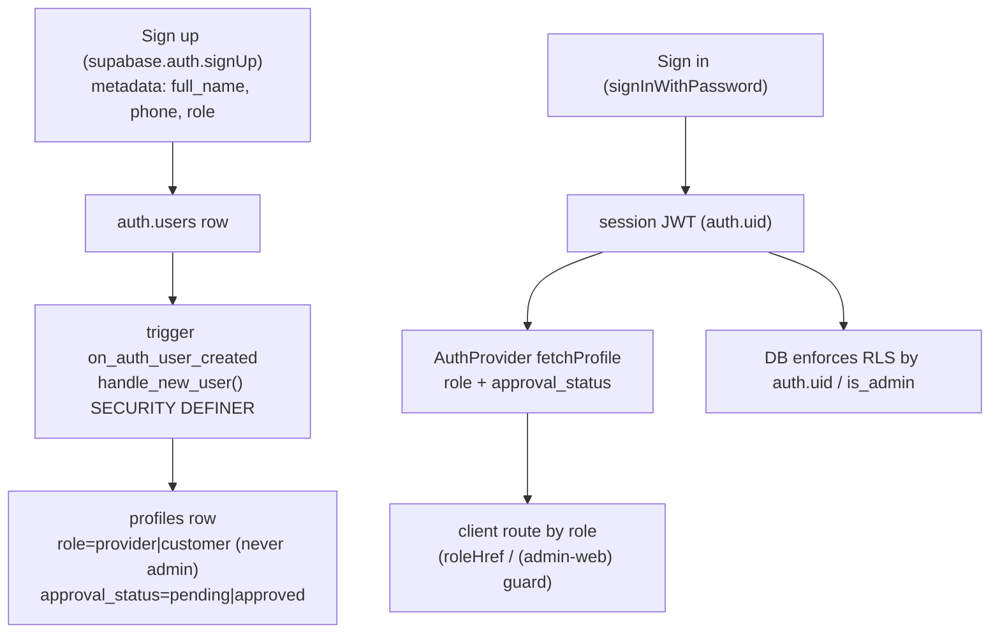
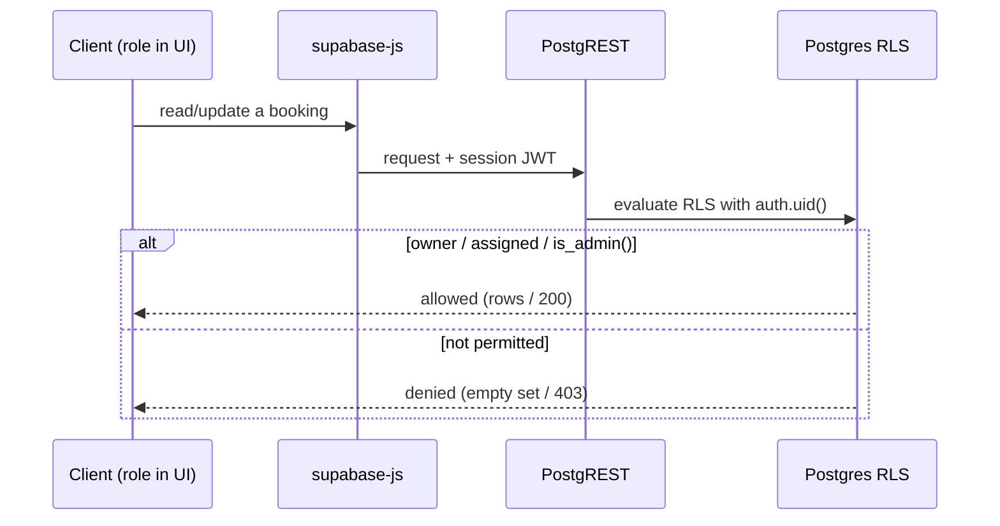

# QuickServe Authentication & Authorization

## 1. Purpose

The authoritative engineering reference for **how QuickServe authenticates users and
authorizes their actions, as implemented in the repository today**. Authentication is
Supabase Auth (email/password); authorization is enforced primarily by **Row-Level
Security** in the database, with client route guards on top. Every claim cites its source.

The full RLS policy text and secret handling are summarized here and deferred to
[security/](../security/README.md). System context: [architecture/](../architecture/README.md);
data model: [database/](../database/README.md); call surfaces: [api/](../api/README.md).

## 2. Current Status

| Badge | Meaning |
|---|---|
| **Implemented** | In app/DB code and/or exercised by certified tests. |
| **Partial** | Present but not fully integrated / not certified end-to-end. |
| **Planned** | Referenced but not built. |
| **QA-only** | Exercised only by the certification harness. |

**Summary:** email/password auth, session persistence, three roles
(`customer`/`provider`/`admin`), RLS-based authorization, `is_admin()` checks, and Edge
Function JWT/secret gating are **Implemented**. Admin login and cross-role RLS isolation are
**certified**; customer/provider signup UI and email-confirmation flows are **Partial**
(uncertified end-to-end).

## 3. Identity Architecture

- **Sign-up** creates a Supabase `auth.users` record; the `on_auth_user_created` trigger runs
  `handle_new_user()` (SECURITY DEFINER) to insert a `profiles` row from the signup metadata
  (`full_name`, `phone`, `role`) — `supabase/migrations/0001_profiles.sql`.
- **Role assignment at signup is constrained**: role is `provider` only when metadata
  `role = 'provider'`, **otherwise `customer`** — so `admin` is **never self-assignable**.
  Providers start `approval_status = 'pending'`; customers `approved`. Admins are created
  manually in Supabase (role=`admin`, approved) outside the trigger.
- **Sign-in** yields a session JWT whose `sub` is the user's `auth.uid()`, the anchor for all
  RLS. The client resolves the user's `profiles.role` + `approval_status` once via
  `src/auth/auth-context.tsx` (`fetchProfile`).

## 4. Authentication Components

- **Supabase Auth** — email/password identity via the single client (`src/lib/supabase.ts`,
  anon key). Methods used: `signUp`, `signInWithPassword`, `signOut`, `getSession`,
  `onAuthStateChange`, `getUser` (the last used widely in `src/lib/*` for owner-scoped ops).
- **Sessions** — `persistSession: true`, `autoRefreshToken: true`, `detectSessionInUrl: false`;
  storage is platform-aware (web `localStorage`, native `AsyncStorage`) (`src/lib/supabase.ts`).
- **JWT** — the session access token is attached by `supabase-js` on every request; the
  database reads `auth.uid()` from it for RLS.
- **Client auth state** — `AuthProvider` (`src/auth/auth-context.tsx`) holds `session`, `role`,
  `approvalStatus`, `isLoading`, `signedIn`, `authError`, `profileError` and exposes
  `signUp`/`signIn`/`signOut`/`selectRole`. It subscribes to `onAuthStateChange` and resolves
  the profile on session change.
- **Auth error mapping** — `src/lib/auth-errors.ts` (`mapAuthError`) turns Supabase auth errors
  into friendly copy (invalid credentials, already-registered, email-confirm, rate-limit).

## 5. User Roles

Three verified roles (`src/constants/roles.ts` `Role = 'customer' | 'provider' | 'admin'`).
No other roles exist.

| Role | Purpose | Permissions (high level) | Self-registrable? | Maturity |
|---|---|---|---|---|
| `customer` | Book services | Read/write **own** rows (e.g. bookings where `customer_id = auth.uid()`); create own bookings | Yes (default; `approved`) | Implemented (certified via QA account) |
| `provider` | Fulfil assigned jobs | Read **assigned** bookings; forward-only status updates (`0004`, `0034`); gated by `approval_status` | Yes (starts `pending`, admin-approved) | Implemented (certified) |
| `admin` | Operate the platform | Full read/update on core tables via `is_admin()`; admin RPCs | **No** (created manually; `handle_new_user` downgrades attempted admin signups) | Implemented (login certified) |

`profiles_update_own` (0001) lets a user edit their own profile **but pins `role` and
`approval_status`** to their stored values — a user cannot self-promote to admin or
self-approve.

## 6. Authorization Model

Authorization is layered; the **database is the enforcement boundary**:

1. **Client** — route guards decide *what UI to show*, not security: the root navigator routes
   by role (`src/app/_layout.tsx`, `roleHref` in `src/constants/roles.ts`); the admin web panel
   self-guards via `useAdminGuard` (`src/hooks/use-admin-guard.ts`, `src/app/(admin-web)/_layout.tsx`).
2. **RLS** — every core table has policies keyed on `auth.uid()` / `is_admin()` (30 tables) —
   the real access control (`supabase/migrations/0003`, `0004`).
3. **RPC** — `SECURITY DEFINER` functions perform privileged/aggregated work; admin RPCs open
   with `is_admin()`.
4. **Edge Functions** — JWT-verified (act on the caller) or secret-gated webhooks (§8).
5. **Admin checks** — `is_admin()` (`supabase/migrations/0003_admin_dispatch.sql`) is the single
   server-side admin predicate, reused across RLS and RPCs.

## 7. Session Lifecycle

Verified behavior (`src/auth/auth-context.tsx`, `src/lib/supabase.ts`):

- **Sign in** — `signInWithPassword(email, password)`; on success a session is established and
  `onAuthStateChange` fires, triggering `fetchProfile`.
- **Restore** — on app start `getSession()` loads any persisted session; `onAuthStateChange`
  keeps state in sync.
- **Refresh** — `autoRefreshToken: true` refreshes the access token automatically.
- **Sign out** — `signOut()` clears the session (and `pendingRole`); the root navigator returns
  the user to onboarding.

## 8. Edge Function Authentication

From `supabase/config.toml` (per-function `verify_jwt`):

| Function | `verify_jwt` | Gate |
|---|---|---|
| `mpesa-stk-push` | `true` | Caller JWT |
| `register-device` | `true` | Caller JWT |
| `places-autocomplete` | `true` | Caller JWT |
| `place-details` | `true` | Caller JWT |
| `tracking-map` | `true` | Caller JWT |
| `mpesa-callback` | `false` | Shared secret `MPESA_CALLBACK_SECRET` (Safaricom webhook) |
| `send-push` | `false` | Shared secret `PUSH_WEBHOOK_SECRET` (DB `pg_net` webhook) |

**Authenticated functions** require a valid session JWT and act on the caller's identity.
**Secret-gated callbacks** accept no JWT and validate a shared secret in the request
(`supabase/functions/mpesa-callback/index.ts`, `supabase/functions/send-push/index.ts`).

## 9. Permission Boundaries

Verified boundaries (enforced by RLS; certified in `qa/playwright/certification/`):

- **Customer** — reads/writes only own rows; can create own bookings; cannot see others' data
  or self-promote.
- **Provider** — reads only assigned bookings; updates are forward-only + terminal-safe; cannot
  read/act on unassigned bookings or alter assignment metadata.
- **Admin** — full read/update on core tables via `is_admin()`; can assign/reassign, change
  status, and run admin RPCs.
- **Anonymous** — no access to protected rows (reads return empty sets; writes denied); may use
  auth endpoints (sign in/up).

## 10. SECURITY DEFINER Usage

High-level (full inventory in [database/](../database/README.md) §12):

- `handle_new_user()` — creates the profile at signup (with the admin-downgrade rule).
- `is_admin()` — the admin predicate reused by RLS and admin RPCs.
- The large majority of the ~84 Postgres functions are `SECURITY DEFINER` (88 markers);
  privileged/admin functions guard with `is_admin()` and set `search_path = public`.

## 11. RLS Integration

- The session **JWT provides `auth.uid()`**, which every RLS policy uses (e.g. `bookings` where
  `customer_id = auth.uid()` / `assigned_provider_id = auth.uid()`).
- **`is_admin()`** is a `SECURITY DEFINER stable` function that reads `profiles.role` for the
  current user; RLS admin policies call it (`supabase/migrations/0003`).
- The client's `role` (from `AuthProvider`) drives **routing/UI only** — it is *not* the
  security boundary; the database re-checks every request via RLS regardless of client state.
- SQL is not duplicated here; see [security/](../security/README.md) and
  [database/](../database/README.md).

## 12. QA Coverage

Verified authentication testing:

- **Admin Authentication suite** (`qa/playwright/admin/authentication.spec.ts`) — login form
  render, client validation, protected-route redirect (all offline), plus invalid-credential
  rejection and the authenticated happy path (**backend-gated** on `E2E_ADMIN_*`).
- **Connected certification** (`qa/playwright/certification/`) — all four QA roles authenticate;
  anon/customer/provider/admin **RLS isolation** is asserted end-to-end.
- **`mockAdminSession`** (`qa/playwright/support/mock-admin-session.ts`) — establishes an admin
  session **through the real `(admin-web)` guard** for deterministic dashboard tests (it does
  not bypass the guard).

**Uncertified:** customer/provider **signup** UI, email-confirmation and password-reset flows,
and native-mobile auth UI are not covered by automated certification.

## 13. Known Constraints

Verified limitations:

- **Admin is not self-serviceable** — admin accounts must be provisioned manually in Supabase;
  `handle_new_user` downgrades any attempted admin signup to `customer`
  (`supabase/migrations/0001_profiles.sql`).
- **Provider approval gating** — providers start `pending` and depend on admin approval
  (`approval_status`); the approval workflow is admin-driven.
- **Email confirmation / password reset** — the mobile app implements both with the token-hash
  flow (§15). They depend on per-project Supabase auth settings (redirect allow-list, email
  templates) that are configured outside the repository; QA integration certification is a
  separate, separately-authorised phase. The admin web has **no** recovery surface yet (Slice B).
- **Client role is advisory** — UI routing trusts the fetched role, but security is enforced by
  RLS, not the client.

## 14. Change Rules

Repository workflow for authentication/authorization changes:

- **Role/RLS/policy/function changes require a migration** (`supabase/migrations/`); no manual
  production edits.
- **Never widen `handle_new_user` to allow self-assigned admin**; keep `role`/`approval_status`
  pinned in `profiles_update_own`.
- **Edge Function auth changes** update `supabase/config.toml` (`verify_jwt`) and the function's
  secret handling.
- **Behavioral changes update connected certification** (role auth + RLS isolation) — never
  weaken assertions — then re-run migration alignment + certification + health.
- **Service-role and secrets never appear in client code** (server/QA only).

## 15. Password Recovery and Email Confirmation (Mobile — Slice A)

### 15.1 Architecture: the token-hash flow

- **Request.** The shared customer/provider screen `src/app/(onboarding)/forgot-password.tsx`
  calls `requestPasswordReset(email)` (`src/auth/auth-context.tsx`), which invokes
  `supabase.auth.resetPasswordForEmail(email, { redirectTo: mobileAuthRedirectUrl('recovery') })`.
  Registration (`signUp`) passes `emailRedirectTo: mobileAuthRedirectUrl('signup')`; an explicit
  "Resend email" action calls `supabase.auth.resend({ type: 'signup', … })` with the same redirect.
- **Redirect targets** are fixed internal routes on the app's first configured scheme
  (`app.json` → `expo.scheme[0]` = `kwikserve`), built by `src/lib/auth-links.ts`:
  `kwikserve://auth/recovery` and `kwikserve://auth/confirm`. Nothing in a link can steer
  navigation: `next`, `redirect_to` and similar parameters are ignored; post-success navigation
  always goes through the root dispatcher (`/`), which routes by the verified profile role.
- **Link handling (HTTPS bridge).** Supabase renders email templates with Go `html/template`, which
  rewrites a custom-scheme value at the start of an `href` to `#ZgotmplZ`, so the emailed link must
  start with the HTTPS Site URL. The templates (§15.7) link
  `{{ .SiteURL }}/auth/recovery#token_hash={{ .TokenHash }}&type=recovery&redirect_to={{ .RedirectTo | urlquery }}`
  and `{{ .SiteURL }}/auth/confirm#token_hash={{ .TokenHash }}&type=signup&redirect_to={{ .RedirectTo | urlquery }}`.
  The values ride in the URL **fragment**, which browsers never send in the HTTP request, so the
  static host does not receive the token hash. On the web export the routes `src/app/auth/recovery.tsx`
  and `src/app/auth/confirm.tsx` render `AuthLinkBridge` (`src/components/auth/auth-link-bridge.tsx`),
  which reads the fragment once, validates it (`src/lib/auth-bridge.ts`), replaces the history entry
  with the clean route, keeps the values in memory, and opens
  `kwikserve://auth/<route>?token_hash=…&type=…` only when the user presses **Open QuickServe**. The
  native routes then read those parameters once, strip them with `router.replace('/auth/…')`, and ask
  the auth context to verify via `supabase.auth.verifyOtp({ token_hash, type })`.
- **Client options are unchanged**: default implicit flow, `detectSessionInUrl: false`, no PKCE.
  Access and refresh tokens are never carried in links and URL fragments are never read.

### 15.2 Token hash vs. access/refresh tokens

The link carries a **one-time, short-lived token hash**, not a session. It is still an
authentication secret while valid: it is captured once, kept in memory only, never logged,
persisted, displayed, sent to analytics or copied into an error, and stripped from the route as
soon as it is read. Exchanging it (`verifyOtp`) creates the session server-side; a second use
fails as "invalid or expired". Access/refresh tokens exist only inside auth-js session storage.

### 15.3 Shared identity-level behaviour

Customers and providers use the same request screen, routes and context functions. Role and
provider `approval_status` routing stay in the existing session/profile logic; the recovery
flow never branches on role.

### 15.4 Recovery lifecycle, guards and existing sessions

`recovery.stage`: `idle → verifying → ready → updating → done`, or `invalid`.
`sessionFromLink` records that the current session was created by a recovery link.

- Cold start and warm app both land on `/auth/recovery` through Expo Router's link handling;
  the screen snapshot of the opening parameters makes intake identical in both cases.
- A duplicated/replayed delivery while a recovery is active is ignored (idempotent).
- The root navigator (`src/auth/root-redirect.ts`) never redirects away from `auth/*` routes and
  holds ordinary role routing while a recovery is active, so the user reaches the set-password
  step; `(admin-web)` keeps its own guard.
- The set-password form renders only in `ready`; `completePasswordReset` refuses to call
  `updateUser` in any other stage. On success the new session is kept and the screen hands off
  to `/`. **Cancel** (`abandonRecovery`) signs out **locally and only if the session came from
  the link**, then returns to sign in. Requesting a new link from the error state also abandons.
- **Invalid, expired, malformed or reused links** show one safe state ("This link is invalid or
  has expired.") and perform no session change: an already signed-in user stays signed in.

### 15.5 Password policy and neutral responses

One validator (`validatePassword` in `src/lib/validation.ts`) serves registration and recovery:
at least 8 characters and not equal to the normalised email; confirmation must match.

Request outcomes (`resetPasswordForEmail`, `resend`) are classified by
`src/lib/auth-link-request.ts` from the installed auth-js error shape (`AuthApiError.code`
first, HTTP status only as secondary evidence; no status class is neutralised wholesale):

| Installed evidence | Outcome | User sees |
|---|---|---|
| no error | `sent` | "If an account exists for that email, we've sent a … link." |
| code `user_not_found` | `sent` | same neutral confirmation (no enumeration) |
| code `over_email_send_rate_limit` | `sent-rate-limited` | neutral confirmation + "wait a minute before trying again" |
| code `validation_failed` / `email_address_invalid` (not redirect-related) | `invalid-request` | "Please check the email address and try again." |
| message mentions the redirect URL, code `email_address_not_authorized`, `unexpected_failure`, unknown 4xx/code, non-object errors | `delivery-failed` | "We couldn't send the email. Please try again later or contact support." |
| `AuthRetryableFetchError` (status 0 / 5xx), `request_timeout`, `over_request_rate_limit`, network `TypeError`, uncoded 5xx | `retry` | "We couldn't send the email right now. Please try again." |

Raw messages, status values, codes, redirect URLs and the submitted address are never rendered
or logged on these paths; screens receive outcomes only.

### 15.6 Platform gating and the bridge's threat model

The web export (the admin surface on Cloudflare) emits `/forgot-password` (mobile-app notice, no
request), `/auth/recovery` and `/auth/confirm` (the bridge). The bridge:

- reads **only** the fragment; a token hash in the query string is never accepted, and
  `access_token` / `refresh_token` (implicit-flow fragments) are rejected;
- admits exactly one destination per route — `kwikserve://auth/recovery` for recovery,
  `kwikserve://auth/confirm` for confirmation — compared byte for byte after a single percent-decode;
  a missing, malformed, foreign, encoded, aliased (`quickserve://`), suffixed or browser destination
  fails closed with one neutral "invalid or expired" state and no actions (an absent destination is
  never treated as "mobile by default");
- strips the fragment and any query string from the address bar and history on first render
  (`history.replaceState` to the same-origin path); a refresh afterwards shows the invalid state
  because nothing was persisted;
- never imports the Supabase client, makes no network request, and never logs or renders the token;
- opens the app only on the explicit **Open QuickServe** action (no automatic navigation, duplicate
  presses guarded), then shows non-sensitive no-app guidance;
- has **no "Continue in browser" action**: the admin-web reset route is Slice B.

`public/_headers` adds `/auth/*`-scoped `Cache-Control: no-store`, `Referrer-Policy: no-referrer`
and `X-Robots-Tag: noindex` (only those two global values are replaced; CSP, frame, MIME and
permissions headers still apply), and the bridge sets page-level `referrer`/`robots` meta tags.
The fragment design keeps the token out of server request logs; if a future change moved the token
into the query string, the static host would receive it and infrastructure-log redaction would be
required. Universal Links / Android App Links are not required for this flow; they remain a
security and cross-device reliability requirement for public release.

### 15.7 Deferred configuration (per Supabase project; dashboard only; not in this repository)

QA project — **requires separate authorisation before it is applied**:
0. Hosting prerequisite: a dedicated QA HTTPS origin serving this web export's `/auth/recovery` and
   `/auth/confirm` documents (a separate QA Cloudflare Worker; Production keeps its own). Prefer a
   bridge-only export or an origin where the other QA routes stay guarded; the bridge pages themselves
   contain no data and make no requests.
1. Authentication → URL Configuration → Site URL: the QA bridge origin, **without a trailing slash**
   (a trailing slash renders `//auth/recovery`). Redirect URLs: add `kwikserve://auth/recovery` and
   `kwikserve://auth/confirm` (exact entries, no wildcard) so the app's `redirectTo` is carried as
   `{{ .RedirectTo }}` instead of falling back to Site URL.
2. Authentication → Email Templates → "Reset password":
   `<a href="{{ .SiteURL }}/auth/recovery#token_hash={{ .TokenHash }}&type=recovery&redirect_to={{ .RedirectTo | urlquery }}">Reset password</a>`.
   "Confirm signup":
   `<a href="{{ .SiteURL }}/auth/confirm#token_hash={{ .TokenHash }}&type=signup&redirect_to={{ .RedirectTo | urlquery }}">Confirm email</a>`.
   Validated against Go html/template: the href starts with Site URL, the token hash is unchanged,
   `redirect_to` is percent-encoded once and decoded once by the bridge.
3. Keep "Secure password change" off (otherwise `updateUser` needs a re-authentication nonce);
   set minimum password length to 8 (optional; the app already enforces 8); keep the default
   one-hour OTP expiry or shorter.
4. The built-in Supabase email service delivers only to project team members and 2 emails/hour;
   use a team-member fixture address or custom SMTP for QA.

Production project — **NOT AUTHORISED; do not apply**: the same steps with the Production bridge
origin as Site URL, executed only after QA certification and an explicit Production change approval.
Editing a project's templates affects every client of that project, so the admin-web slice (B)
must be in place before the Production templates change.

### 15.8 QA fixtures for integration certification (separately authorised)

- Create one dedicated QA auth user (e.g. `qa.recovery@<qa-domain>`) with a recorded password;
  never reuse the certification customer/provider/admin fixtures.
- Certification generates links through the emailed flow only (no Admin API `generate_link`
  in the app); read the token hash from the QA mailbox, open it on the test device, complete the
  reset with a new password, then restore the recorded password through the same recovery flow.
- Restoration check: sign in with the recorded password; `auth.users.updated_at` is the only
  expected change. Record the fixture id and timestamps in the certification evidence.

## 16. Related Documentation

- [Architecture](../architecture/README.md) · [Backend](../backend/README.md) ·
  [Database](../database/README.md) · [API](../api/README.md) ·
  [Security](../security/README.md) · [QA](../qa/README.md) ·
  [Deployment](../deployment/README.md) · [Operations](../operations/README.md)
- Engineering index: [../README.md](../README.md)
- QA (authoritative): `../../../qa/docs/LAUNCH-CERTIFICATION.md`
