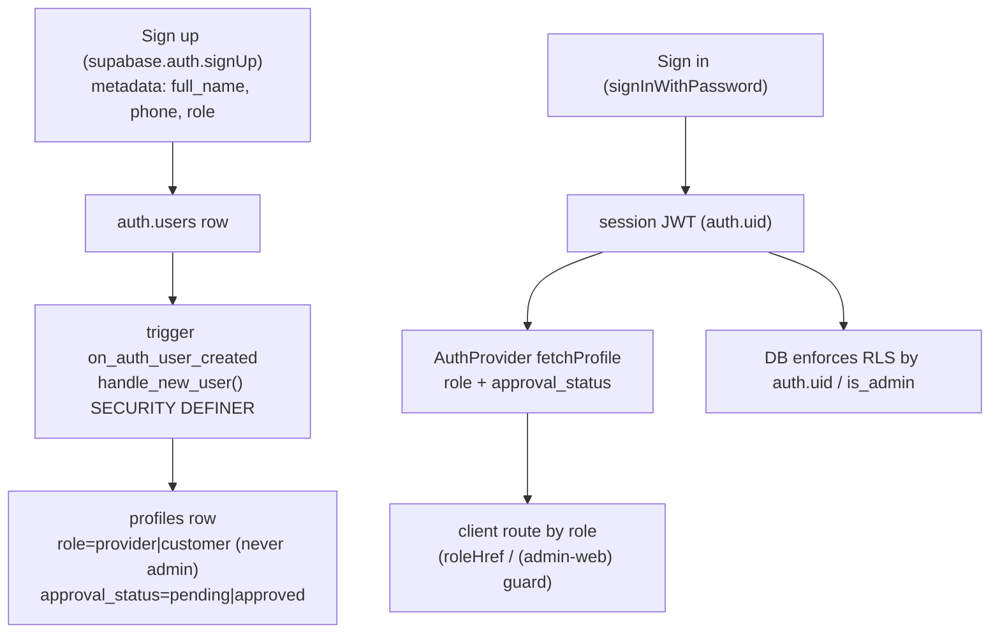
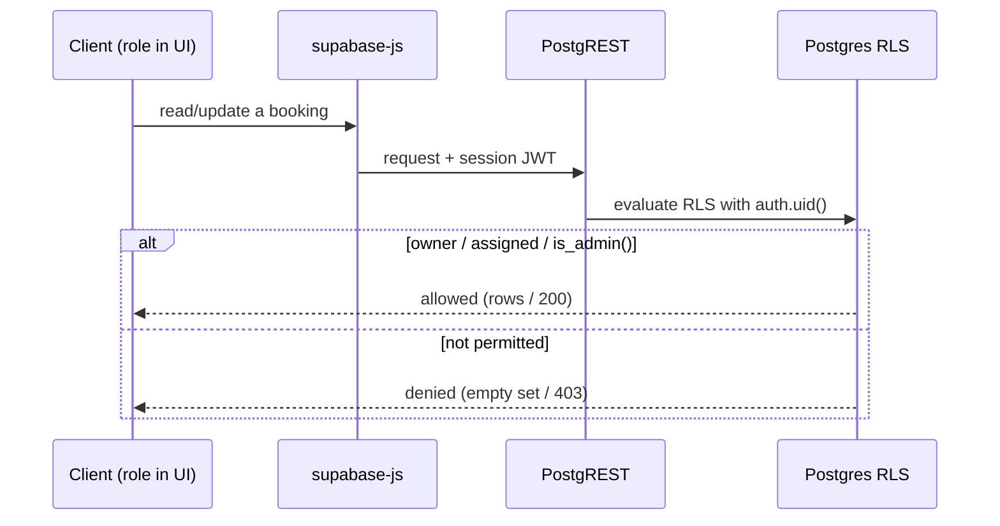

# QuickServe Authentication & Authorization

## 1. Purpose

The authoritative engineering reference for **how QuickServe authenticates users and
authorizes their actions, as implemented in the repository today**. Authentication is
Supabase Auth (email/password); authorization is enforced primarily by **Row-Level
Security** in the database, with client route guards on top. Every claim cites its source.

The full RLS policy text and secret handling are summarized here and deferred to
[security/](../security/README.md). System context: [architecture/](../architecture/README.md);
data model: [database/](../database/README.md); call surfaces: [api/](../api/README.md).

## 2. Current Status

| Badge | Meaning |
|---|---|
| **Implemented** | In app/DB code and/or exercised by certified tests. |
| **Partial** | Present but not fully integrated / not certified end-to-end. |
| **Planned** | Referenced but not built. |
| **QA-only** | Exercised only by the certification harness. |

**Summary:** email/password auth, session persistence, three roles
(`customer`/`provider`/`admin`), RLS-based authorization, `is_admin()` checks, and Edge
Function JWT/secret gating are **Implemented**. Admin login and cross-role RLS isolation are
**certified**; customer/provider signup UI and email-confirmation flows are **Partial**
(uncertified end-to-end).

## 3. Identity Architecture

- **Sign-up** creates a Supabase `auth.users` record; the `on_auth_user_created` trigger runs
  `handle_new_user()` (SECURITY DEFINER) to insert a `profiles` row from the signup metadata
  (`full_name`, `phone`, `role`) — `supabase/migrations/0001_profiles.sql`.
- **Role assignment at signup is constrained**: role is `provider` only when metadata
  `role = 'provider'`, **otherwise `customer`** — so `admin` is **never self-assignable**.
  Providers start `approval_status = 'pending'`; customers `approved`. Admins are created
  manually in Supabase (role=`admin`, approved) outside the trigger.
- **Sign-in** yields a session JWT whose `sub` is the user's `auth.uid()`, the anchor for all
  RLS. The client resolves the user's `profiles.role` + `approval_status` once via
  `src/auth/auth-context.tsx` (`fetchProfile`).

## 4. Authentication Components

- **Supabase Auth** — email/password identity via the single client (`src/lib/supabase.ts`,
  anon key). Methods used: `signUp`, `signInWithPassword`, `signOut`, `getSession`,
  `onAuthStateChange`, `getUser` (the last used widely in `src/lib/*` for owner-scoped ops).
- **Sessions** — `persistSession: true`, `autoRefreshToken: true`, `detectSessionInUrl: false`;
  storage is platform-aware (web `localStorage`, native `AsyncStorage`) (`src/lib/supabase.ts`).
- **JWT** — the session access token is attached by `supabase-js` on every request; the
  database reads `auth.uid()` from it for RLS.
- **Client auth state** — `AuthProvider` (`src/auth/auth-context.tsx`) holds `session`, `role`,
  `approvalStatus`, `isLoading`, `signedIn`, `authError`, `profileError` and exposes
  `signUp`/`signIn`/`signOut`/`selectRole`. It subscribes to `onAuthStateChange` and resolves
  the profile on session change.
- **Auth error mapping** — `src/lib/auth-errors.ts` (`mapAuthError`) turns Supabase auth errors
  into friendly copy (invalid credentials, already-registered, email-confirm, rate-limit).

## 5. User Roles

Three verified roles (`src/constants/roles.ts` `Role = 'customer' | 'provider' | 'admin'`).
No other roles exist.

| Role | Purpose | Permissions (high level) | Self-registrable? | Maturity |
|---|---|---|---|---|
| `customer` | Book services | Read/write **own** rows (e.g. bookings where `customer_id = auth.uid()`); create own bookings | Yes (default; `approved`) | Implemented (certified via QA account) |
| `provider` | Fulfil assigned jobs | Read **assigned** bookings; forward-only status updates (`0004`, `0034`); gated by `approval_status` | Yes (starts `pending`, admin-approved) | Implemented (certified) |
| `admin` | Operate the platform | Full read/update on core tables via `is_admin()`; admin RPCs | **No** (created manually; `handle_new_user` downgrades attempted admin signups) | Implemented (login certified) |

`profiles_update_own` (0001) lets a user edit their own profile **but pins `role` and
`approval_status`** to their stored values — a user cannot self-promote to admin or
self-approve.

## 6. Authorization Model

Authorization is layered; the **database is the enforcement boundary**:

1. **Client** — route guards decide *what UI to show*, not security: the root navigator routes
   by role (`src/app/_layout.tsx`, `roleHref` in `src/constants/roles.ts`); the admin web panel
   self-guards via `useAdminGuard` (`src/hooks/use-admin-guard.ts`, `src/app/(admin-web)/_layout.tsx`).
2. **RLS** — every core table has policies keyed on `auth.uid()` / `is_admin()` (30 tables) —
   the real access control (`supabase/migrations/0003`, `0004`).
3. **RPC** — `SECURITY DEFINER` functions perform privileged/aggregated work; admin RPCs open
   with `is_admin()`.
4. **Edge Functions** — JWT-verified (act on the caller) or secret-gated webhooks (§8).
5. **Admin checks** — `is_admin()` (`supabase/migrations/0003_admin_dispatch.sql`) is the single
   server-side admin predicate, reused across RLS and RPCs.

## 7. Session Lifecycle

Verified behavior (`src/auth/auth-context.tsx`, `src/lib/supabase.ts`):

- **Sign in** — `signInWithPassword(email, password)`; on success a session is established and
  `onAuthStateChange` fires, triggering `fetchProfile`.
- **Restore** — on app start `getSession()` loads any persisted session; `onAuthStateChange`
  keeps state in sync.
- **Refresh** — `autoRefreshToken: true` refreshes the access token automatically.
- **Sign out** — `signOut()` clears the session (and `pendingRole`); the root navigator returns
  the user to onboarding.

## 8. Edge Function Authentication

From `supabase/config.toml` (per-function `verify_jwt`):

| Function | `verify_jwt` | Gate |
|---|---|---|
| `mpesa-stk-push` | `true` | Caller JWT |
| `register-device` | `true` | Caller JWT |
| `places-autocomplete` | `true` | Caller JWT |
| `place-details` | `true` | Caller JWT |
| `tracking-map` | `true` | Caller JWT |
| `mpesa-callback` | `false` | Shared secret `MPESA_CALLBACK_SECRET` (Safaricom webhook) |
| `send-push` | `false` | Shared secret `PUSH_WEBHOOK_SECRET` (DB `pg_net` webhook) |

**Authenticated functions** require a valid session JWT and act on the caller's identity.
**Secret-gated callbacks** accept no JWT and validate a shared secret in the request
(`supabase/functions/mpesa-callback/index.ts`, `supabase/functions/send-push/index.ts`).

## 9. Permission Boundaries

Verified boundaries (enforced by RLS; certified in `qa/playwright/certification/`):

- **Customer** — reads/writes only own rows; can create own bookings; cannot see others' data
  or self-promote.
- **Provider** — reads only assigned bookings; updates are forward-only + terminal-safe; cannot
  read/act on unassigned bookings or alter assignment metadata.
- **Admin** — full read/update on core tables via `is_admin()`; can assign/reassign, change
  status, and run admin RPCs.
- **Anonymous** — no access to protected rows (reads return empty sets; writes denied); may use
  auth endpoints (sign in/up).

## 10. SECURITY DEFINER Usage

High-level (full inventory in [database/](../database/README.md) §12):

- `handle_new_user()` — creates the profile at signup (with the admin-downgrade rule).
- `is_admin()` — the admin predicate reused by RLS and admin RPCs.
- The large majority of the ~84 Postgres functions are `SECURITY DEFINER` (88 markers);
  privileged/admin functions guard with `is_admin()` and set `search_path = public`.

## 11. RLS Integration

- The session **JWT provides `auth.uid()`**, which every RLS policy uses (e.g. `bookings` where
  `customer_id = auth.uid()` / `assigned_provider_id = auth.uid()`).
- **`is_admin()`** is a `SECURITY DEFINER stable` function that reads `profiles.role` for the
  current user; RLS admin policies call it (`supabase/migrations/0003`).
- The client's `role` (from `AuthProvider`) drives **routing/UI only** — it is *not* the
  security boundary; the database re-checks every request via RLS regardless of client state.
- SQL is not duplicated here; see [security/](../security/README.md) and
  [database/](../database/README.md).

## 12. QA Coverage

Verified authentication testing:

- **Admin Authentication suite** (`qa/playwright/admin/authentication.spec.ts`) — login form
  render, client validation, protected-route redirect (all offline), plus invalid-credential
  rejection and the authenticated happy path (**backend-gated** on `E2E_ADMIN_*`).
- **Connected certification** (`qa/playwright/certification/`) — all four QA roles authenticate;
  anon/customer/provider/admin **RLS isolation** is asserted end-to-end.
- **`mockAdminSession`** (`qa/playwright/support/mock-admin-session.ts`) — establishes an admin
  session **through the real `(admin-web)` guard** for deterministic dashboard tests (it does
  not bypass the guard).

**Uncertified:** customer/provider **signup** UI, email-confirmation and password-reset flows,
and native-mobile auth UI are not covered by automated certification.

## 13. Known Constraints

Verified limitations:

- **Admin is not self-serviceable** — admin accounts must be provisioned manually in Supabase;
  `handle_new_user` downgrades any attempted admin signup to `customer`
  (`supabase/migrations/0001_profiles.sql`).
- **Provider approval gating** — providers start `pending` and depend on admin approval
  (`approval_status`); the approval workflow is admin-driven.
- **Email confirmation / password reset** — the app maps email-confirmation and rate-limit auth
  errors (`src/lib/auth-errors.ts`), but these flows depend on the Supabase project's auth
  settings and are not certified in this repository; no in-app password-reset flow is documented.
- **Client role is advisory** — UI routing trusts the fetched role, but security is enforced by
  RLS, not the client.

## 14. Change Rules

Repository workflow for authentication/authorization changes:

- **Role/RLS/policy/function changes require a migration** (`supabase/migrations/`); no manual
  production edits.
- **Never widen `handle_new_user` to allow self-assigned admin**; keep `role`/`approval_status`
  pinned in `profiles_update_own`.
- **Edge Function auth changes** update `supabase/config.toml` (`verify_jwt`) and the function's
  secret handling.
- **Behavioral changes update connected certification** (role auth + RLS isolation) — never
  weaken assertions — then re-run migration alignment + certification + health.
- **Service-role and secrets never appear in client code** (server/QA only).

## 15. Related Documentation

- [Architecture](../architecture/README.md) · [Backend](../backend/README.md) ·
  [Database](../database/README.md) · [API](../api/README.md) ·
  [Security](../security/README.md) · [QA](../qa/README.md) ·
  [Deployment](../deployment/README.md) · [Operations](../operations/README.md)
- Engineering index: [../README.md](../README.md)
- QA (authoritative): `../../../qa/docs/LAUNCH-CERTIFICATION.md`
