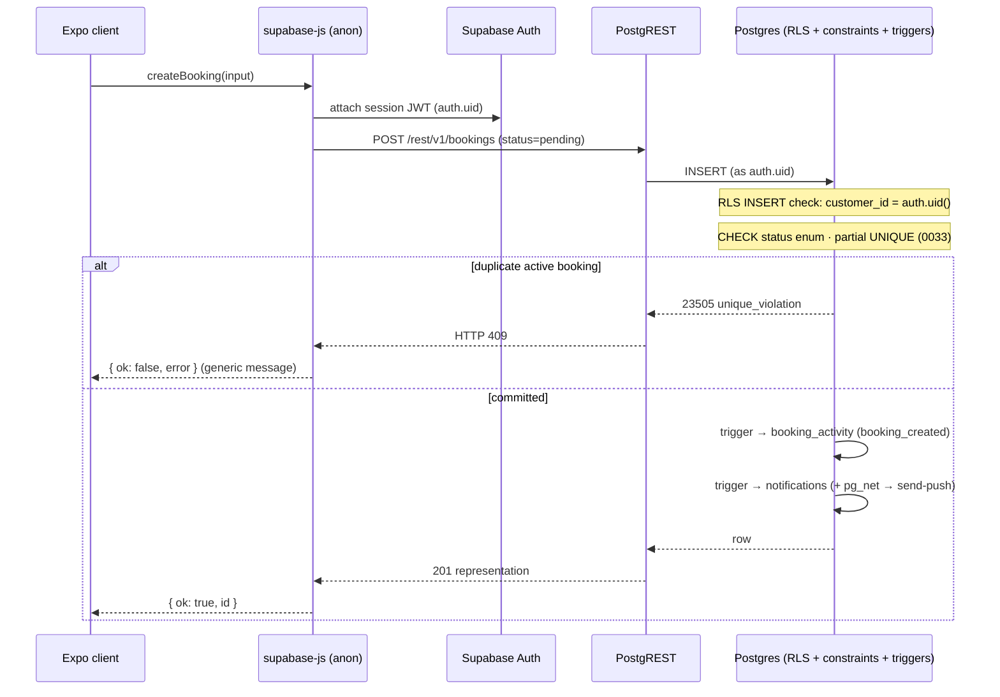

# QuickServe Backend

## 1. Purpose and Scope

This document describes the **QuickServe backend as implemented in this repository
today** — the Supabase platform (Auth, Postgres + RLS, Storage, Realtime, Edge
Functions), the application-side Supabase **client** code, and the external services
the backend calls. Every major claim is traceable to a repository path.

Deferred to their own sections: full schema and RLS policy text
([database/](../database/README.md)), endpoint/RPC contracts ([api/](../api/README.md)),
auth internals ([authentication/](../authentication/README.md)), the full security model
([security/](../security/README.md)), deploy/runbooks
([deployment/](../deployment/README.md), [operations/](../operations/README.md)), and the
QA framework ([qa/](../qa/README.md)). The system-wide picture is in
[architecture/](../architecture/README.md).

> **Terminology:** the Expo application is a **client** of the backend. "Backend" here
> means Supabase-managed services + Edge Functions. Supabase **service-role** access is
> server/QA-only and is never normal client behavior (see §5, §15).

## 2. Backend Status

| Badge | Meaning |
|---|---|
| **Implemented** | Present and exercised by app code and/or certified tests. |
| **Partially implemented** | Present but not fully integrated or not certified end-to-end. |
| **Planned** | Referenced/intended but not built. |
| **QA-only** | Certification infrastructure, isolated from the shipped product. |

**Current state (summary):** the core backend — Auth, Postgres with RLS, the booking
lifecycle, audit, in-app notifications, storage, and 7 Edge Functions — is
**implemented** and, for the booking/dispatch spine, **certified** against a dedicated QA
Supabase project (21/21 connected tests). **M-Pesa payments** and **push delivery** are
implemented as code paths but **not certified end-to-end**. Migrations `0001`–`0034` are
aligned with the QA project.

## 3. Backend Architecture

Verified backend model (see [architecture/](../architecture/README.md) for the full view;
not duplicated here):

- **Expo clients** use a single Supabase client (`src/lib/supabase.ts`, `@supabase/supabase-js`)
  with the **public anon key**; access control is enforced by the database, not the client.
- **Supabase Auth** — email/password identity and sessions.
- **PostgreSQL** — the source of truth; ~30 tables (`supabase/migrations/`).
- **RLS** — per-role row access on core tables (`0003`, `0004`).
- **Database functions / RPCs** — SECURITY DEFINER aggregation/mutation functions
  (analytics `0025`/`0032`, wallet, promotions, quality).
- **Triggers** — audit and notification side effects (`0007`, `0015`, `0020`).
- **Storage** — private `booking-photos` bucket (`0006`, `0016`).
- **Realtime** — chat (`booking_messages`, `0013`) and tracking (`provider_locations`, `0018`).
- **Edge Functions** — 7 Deno functions for payments, push, and maps (`supabase/functions/`).
- **External services** called by Edge Functions: M-Pesa Daraja, Expo Push, Google Places/Maps.

```mermaid
graph TD
    subgraph Clients["Expo clients (src/app)"]
        CL["Customer · Provider · Admin Web"]
    end
    SDK["Supabase client<br/>src/lib/supabase.ts (anon key)"]
    subgraph SB["Supabase (backend)"]
        AUTH["Auth"]
        PG["Postgres + RLS<br/>triggers · RPCs"]
        STG["Storage<br/>booking-photos"]
        RT["Realtime<br/>chat · tracking"]
        EF["Edge Functions x7"]
    end
    subgraph EXT["External"]
        DAR["M-Pesa Daraja"]
        EXPO["Expo Push"]
        GOOG["Google Places / Maps"]
    end
    CL --> SDK --> AUTH
    SDK --> PG
    SDK --> STG
    SDK -.-> RT
    CL -->|invoke (JWT)| EF
    PG -->|pg_net webhook| EF
    EF --> DAR
    EF --> EXPO
    EF --> GOOG
```

## 4. Backend Repository Map

| Path | Responsibility |
|---|---|
| `src/lib/` | Application-side backend **client** code — Supabase client (`supabase.ts`), domain data-access wrappers (`bookings.ts`, `payments.ts`, `notifications.ts`, `reviews.ts`, `wallet.ts`, `analytics.ts`, `tracking.ts`, `push.ts`, `messages.ts`, …), and `monitoring.ts`. |
| `src/auth/` | Auth context / session + role state (`auth-context.tsx`). |
| `src/hooks/` | Backend-facing hooks incl. `use-admin-guard.ts`. |
| `src/constants/` | `booking-status.ts` (status enum + transitions), `roles.ts`. |
| `supabase/migrations/` | Schema, RLS, functions, triggers, storage — `0001`–`0034`. |
| `supabase/functions/` | Edge Functions (Deno): payments, push, maps. |
| `supabase/config.toml` | Per-function `verify_jwt` settings. |
| `qa/` | **QA-only** connected certification + health harness. |

## 5. Supabase Client Layer

`src/lib/supabase.ts`:

- **Initialization** — `createClient(url, anonKey, { auth: { storage, autoRefreshToken: true, persistSession: true, detectSessionInUrl: false } })`. Throws at startup if env is missing.
- **Environment (names only)** — `EXPO_PUBLIC_SUPABASE_URL`, `EXPO_PUBLIC_SUPABASE_ANON_KEY`. These are `EXPO_PUBLIC_*` (bundled into the app); the anon key is public by design.
- **Session persistence** — `persistSession: true` with `autoRefreshToken: true`.
- **Platform-specific behavior** — storage adapter selected by platform: web uses `window.localStorage` (guarded for export/SSR), native uses `@react-native-async-storage/async-storage`.
- **Monitoring hook** — `src/lib/monitoring.ts` (`initMonitoring`) runs at startup from `src/app/_layout.tsx`; a **no-op unless `EXPO_PUBLIC_SENTRY_DSN` is set**.
- **Privileged keys forbidden here** — the client uses **only** the anon key. The `SUPABASE_SERVICE_ROLE_KEY` is never referenced by app client code; it exists only server-side (Edge Functions) and in QA (`qa/`).

## 6. Authentication Service Boundary

Backend-focused summary (details in [authentication/](../authentication/README.md)):

- **Supabase Auth** provides identity and sessions (email/password) via the single client.
- **Identity** — the authenticated user's `auth.uid()` is the anchor for RLS.
- **Profile / role lookup** — after a session resolves, `src/auth/auth-context.tsx` reads
  `profiles.role` + `approval_status` (`fetchProfile`). Roles: `customer | provider | admin`
  (`src/constants/roles.ts`).
- **Authorization vs authentication** — authentication proves *who* you are (Auth);
  authorization (*what you may read/write*) is enforced in the **database via RLS**, not the
  UI. Public sign-up cannot create admins; `handle_new_user` (`supabase/migrations/0001_profiles.sql`)
  downgrades attempted admin signups to `customer`.

## 7. Core Backend Domains

Each domain is backed by tables/policies in `supabase/migrations/` and client wrappers in `src/lib/`.

| Domain | Evidence | Maturity |
|---|---|---|
| Users & profiles | `0001_profiles.sql`; `src/auth/` | Implemented |
| Services catalog | `0030_services_marketplace.sql`; `src/services/`, `src/lib/services-catalog.ts` | Implemented |
| Bookings | `0002_bookings.sql`; `src/lib/bookings.ts` | Implemented (certified) |
| Provider assignment | `0003_admin_dispatch.sql`, `0004_provider_jobs.sql`; `src/lib/bookings.ts` | Implemented (certified) |
| Booking lifecycle | `src/constants/booking-status.ts`; `0004`, `0034` | Implemented (certified) |
| Booking activity / audit | `0007_activity_notifications.sql`, `0020` | Implemented (certified) |
| Notifications (in-app) | `0020_notification_system.sql`; `src/lib/notifications.ts` | Implemented (rows certified) |
| Push delivery | `0015_push_triggers.sql`, `send-push`; `src/lib/push.ts` | Implemented (physically certified on QA — Android [5E](../../qa/PHASE-5E-ANDROID-PACKAGE-MIGRATION-FCM-PUSH-CERTIFICATION.md), iOS [6H](../../qa/PHASE-6H-IOS-KWIKSERVE-APNS-PUSH-CERTIFICATION.md); production uncertified) |
| Chat | `0013_booking_messages.sql`; `src/lib/messages.ts` | Implemented |
| Location / tracking | `0018_provider_locations.sql`, `tracking-map`; `src/lib/tracking.ts` | Partial (not E2E-certified) |
| Ratings & reviews | `0008`, `0022_ratings_v2.sql`, `0029`; `src/lib/reviews.ts` | Implemented |
| Payments (M-Pesa) | `0010`–`0012`, `mpesa-stk-push`, `mpesa-callback`; `src/lib/payments.ts`, `mpesa.ts` | Partial (uncertified E2E) |
| Storage uploads | `0006_booking_photos.sql`, `0016`; `src/lib/photos.ts` | Implemented |
| Wallet & promotions | `0023_wallet.sql`, `0024_promotions.sql`; `src/lib/wallet.ts`, `promotions.ts` | Implemented |

## 8. Booking Lifecycle Enforcement

Status identifiers (exact, from `src/constants/booking-status.ts`):
`pending`, `accepted`, `provider_assigned`, `on_the_way`, `in_progress`, `completed`, `cancelled`.

- **Customer creation** — `createBooking` inserts a row with status `pending`
  (`src/lib/bookings.ts`); RLS insert requires `customer_id = auth.uid()`
  (`supabase/migrations/0002_bookings.sql`).
- **Admin review & assignment** — admin may **accept** (`pending → accepted`), **reject/cancel**
  (`→ cancelled`), or **assign a provider** (`assignProvider` → `assigned_provider_id` +
  `provider_assigned`). Admin RLS via `is_admin()` (`supabase/migrations/0003_admin_dispatch.sql`).
- **Provider progression** — **forward-only** `provider_assigned → on_the_way → in_progress →
  completed`, enforced by the provider RLS `WITH CHECK` (`supabase/migrations/0004_provider_jobs.sql`).
- **Customer / admin visibility** — RLS: customer sees own, provider sees assigned, admin sees
  all; anonymous denied.
- **Cancellation & terminal states** — `completed` and `cancelled` are terminal. Since
  `supabase/migrations/0034_provider_terminal_states.sql`, the provider policy additionally
  requires the pre-update status to be `provider_assigned`/`on_the_way`/`in_progress`, so a
  provider **cannot** transition out of `cancelled`/`completed` (this closed a defect where a
  provider could complete an admin-cancelled booking).
- **Duplicate-active-booking protection** — a partial unique index blocks a second *active*
  booking for the same `(customer_id, service_id, scheduled_for)`
  (`supabase/migrations/0033_booking_active_dedup.sql`); a duplicate insert returns HTTP 409.
- **Known forward-skip behavior** — the forward-only rule is `rank(new) > rank(old)`, so a
  provider may skip intermediate states (e.g. `provider_assigned → completed`). This is
  intentional; single-step is a UI-only convention (see §18).
- **Admin override** — admin updates are governed only by `is_admin()` (no rank restriction),
  so admin retains full status control by design (verified in QA admin-dispatch tests).

Backend mutation & enforcement path for a booking create (verified components only):



(Full policy SQL is intentionally not pasted here; see [database/](../database/README.md).)

## 9. Data Integrity Controls

Verified in SQL and/or QA certification (`qa/playwright/certification/`):

- **Foreign keys** — e.g. `bookings.customer_id → auth.users` (on delete cascade),
  `assigned_provider_id → profiles`; child tables (`booking_activity`, `notifications`,
  `payments`, …) reference `bookings(id) on delete cascade`.
- **Uniqueness** — one-to-one links such as `reviews.booking_id`, `payments.booking_id` unique.
- **Partial unique index** — `bookings_active_dedup` over active statuses (`0033`, §8).
- **Check constraints** — `bookings.status` restricted to the valid enum (`0002`/`0003`);
  invalid status values are rejected (409/4xx, certified).
- **Triggers** — status changes write `booking_activity`; booking/payment/assignment events
  create `notifications` (`0007`, `0015`, `0020`).
- **RLS WITH CHECK / field pinning** — the provider update policy pins non-status fields
  (customer/service/address/schedule/assignment/admin_notes) to their stored values and
  enforces forward-only + terminal-safe transitions (`0004`, `0034`).
- **Audit records** — `booking_activity` ordering is certified (golden-path,
  `qa/playwright/certification/golden-path.spec.ts`).
- **QA cleanup** — certification deletes what it creates (cascades audit/notifications) and
  sweeps by marker; verified zero residual.

## 10. Edge Functions

Inventory matches `supabase/functions/` exactly (7 functions). `verify_jwt` from
`supabase/config.toml`.

| Function | Purpose | Invocation / caller | Auth (`verify_jwt`) | External dep | Status | Certified? |
|---|---|---|---|---|---|---|
| `mpesa-stk-push` | Initiate an M-Pesa STK Push for a pending payment | App invoke | `true` (+ service-role for writes) | M-Pesa Daraja | Implemented | No (E2E) |
| `mpesa-callback` | Receive Daraja's async STK result, persist outcome | Called by Safaricom | `false` (secured by `MPESA_CALLBACK_SECRET`; service-role) | M-Pesa Daraja | Implemented | No (E2E) |
| `send-push` | Translate DB trigger payloads into Expo push sends | DB `pg_net` webhook | `false` (secured by `PUSH_WEBHOOK_SECRET`; service-role) | Expo Push | Implemented | No (delivery) |
| `register-device` | Register/update a device push token for the user | App invoke | `true` | — | Implemented | Indirect |
| `places-autocomplete` | Google Places autocomplete suggestions | App invoke | `true` | Google Places | Implemented | No |
| `place-details` | Resolve address/coords + static map URL | App invoke | `true` | Google Places/Maps | Implemented | No |
| `tracking-map` | Build a server-side static map URL (two markers) | App invoke | `true` | Google Maps | Implemented | No |

Notes: `mpesa-stk-push`/`register-device` validate the caller with their JWT and use the
anon client for the caller plus service-role only for privileged writes; `mpesa-callback`
and `send-push` accept **no JWT** and are protected by shared secrets. (Deployment/rollout
status of these functions is out of scope for this document — see
[deployment/](../deployment/README.md).)

## 11. Storage and File Handling

- **Bucket** — a single **private** `booking-photos` bucket
  (`supabase/migrations/0006_booking_photos.sql`; `public = false`), tightened in
  `0016_tighten_booking_photos_storage.sql`.
- **What is stored** — before/after job photos (completion evidence), associated with a booking.
- **Access pattern** — authenticated upload/select via `storage.objects` policies scoped to the
  `booking-photos` bucket; client wrapper `src/lib/photos.ts`.
- **Public vs private** — private bucket; objects are not publicly readable.
- **Metadata / booking association** — photos are linked to bookings (see `booking_photos`
  table, `0006`).
- **Size/type validation** — **not documented as verified here.** Any client-side constraints
  in `src/lib/photos.ts` are not covered by this overview; storage-policy detail belongs in
  [database/](../database/README.md)/[security/](../security/README.md). State: **incomplete in
  this document by design.**

## 12. Notifications and Realtime

- **In-app notification persistence** — **Implemented.** `notifications` table populated by
  triggers on booking/payment/assignment/chat/review events; RLS scopes rows to their recipient
  (`user_id = auth.uid()`). Recipient scoping certified (`qa/playwright/certification/golden-path.spec.ts`).
- **DB-triggered creation** — **Implemented.** Trigger functions (`0020`) build payloads;
  push hand-off uses **`pg_net`** `net.http_post` to the `send-push` webhook
  (`supabase/migrations/0015_push_triggers.sql`).
- **Realtime subscriptions** — **Implemented (capability).** Used by chat (`booking_messages`)
  and tracking (`provider_locations`).
- **Push delivery** — **Implemented and physically certified on QA.** `send-push` → Expo Push →
  FCM/APNs, with real device delivery certified on physical hardware for both platforms
  ([Phase 5E](../../qa/PHASE-5E-ANDROID-PACKAGE-MIGRATION-FCM-PUSH-CERTIFICATION.md) Android,
  [Phase 6H](../../qa/PHASE-6H-IOS-KWIKSERVE-APNS-PUSH-CERTIFICATION.md) iOS). **Production push
  delivery remains uncertified.**

## 13. Payments Backend

M-Pesa (Daraja) components that exist in the repository:

- **Configuration** — `DARAJA_*`, `MPESA_MODE`, `MPESA_CALLBACK_SECRET` (names in `.env.example`),
  held server-side (Edge Functions).
- **Initiation** — `mpesa-stk-push` (Edge Function) starts an STK Push for a pending payment.
- **Callback handling** — `mpesa-callback` receives Daraja's async result (secret-gated) and
  persists the outcome via service-role.
- **Persistence** — `payments` and `payment_attempts` tables (`0010`, `0011`, `0012`);
  client reads via `src/lib/payments.ts`, phone helpers `src/lib/mpesa.ts`.
- **Reconciliation** — an admin `override_payment_status` RPC exists (used by the admin payments
  screen) as a manual control.
- **Frontend integration** — booking receipt/payment screens exist (`src/app/booking/receipt.tsx`).
- **End-to-end certification** — **not verified.** Real settlement (STK → callback → paid) is
  **not** covered by connected certification; QA treats payments as a manual/external item.

> **Not production-ready as certified.** The payment path is coded but its live behavior with
> Safaricom is unverified in this repository.

## 14. Error Handling and Observability

- **Supabase error propagation** — data wrappers return safe results, not throws. Example:
  `createBooking` returns `{ ok: false, error }` on any insert error, mapping it to a **generic
  user-facing message** ("Could not create booking. Please try again.") — so the dedup **409**
  is surfaced generically, not as a specific "duplicate" message (`src/lib/bookings.ts`).
- **Auth error mapping** — `src/lib/auth-errors.ts` (`mapAuthError`) translates Supabase auth
  errors into friendly copy (invalid credentials, already-exists, email-confirm, rate-limit).
- **Duplicate-booking 409** — enforced at the DB (unique index `0033`) and returned by PostgREST;
  verified in QA (`qa/playwright/certification/integrity.spec.ts`, "B2 FIXED").
- **Monitoring** — Sentry via `src/lib/monitoring.ts`, **off unless `EXPO_PUBLIC_SENTRY_DSN` is
  set** (`captureException` wrapper never throws; `tracesSampleRate: 0`).
- **Edge Function error handling** — functions validate input/secrets and return HTTP errors on
  failure (per-function `index.ts`).
- **Observability gaps** — no alerting/dashboards are defined in the repository; server-side logs
  rely on Supabase/Edge platform logging. No claims of alerting are made here.

## 15. Security and Privileged Access Boundaries

Concise backend summary (full model in [security/](../security/README.md)):

- **RLS is the primary client-data boundary** — the app uses the anon key; the database decides
  access. Tenant/user isolation (customer own / provider assigned / admin all) is certified.
- **Role restrictions** — provider writes are forward-only + terminal-safe (`0004`, `0034`);
  duplicate active bookings blocked (`0033`).
- **Service-role usage** — restricted to server-side Edge Functions (privileged writes / callbacks)
  and **QA** teardown/provisioning; **never** in shipped client code.
- **QA provisioning privileges** — `qa/scripts/provision-accounts.mjs` uses the QA project
  service-role once to create the four persistent accounts; guarded against targeting production
  (`assertNotProduction`, `qa/playwright/support/connected/qa-accounts.ts`).
- **Secret handling** — client secrets limited to `EXPO_PUBLIC_*` (public by design); third-party
  secrets live server-side; `qa/.env` is git-ignored; no secret values are committed
  (`docs/pilot/environment-secrets.md`).
- **Edge Function privilege boundary** — JWT-verified functions act on the caller's identity;
  webhook functions (`mpesa-callback`, `send-push`) accept no JWT and are secret-gated.

## 16. QA and Backend Certification

Summary (authoritative detail in `qa/docs/LAUNCH-CERTIFICATION.md`; see [qa/](../qa/README.md)):

- **Dedicated QA Supabase project** — separate from production, via a `QA_*` namespace with an
  `assertNotProduction()` guard.
- **Four persistent QA roles** — 1 customer, 1 admin, 2 providers.
- **Connected backend certification** — `qa/playwright/certification/` drives the real QA backend
  (PostgREST/Auth) and asserts persistence, RLS, dispatch, provider progression, the golden path,
  and integrity (dedup, terminal states, concurrency).
- **Health checks** — `qa/playwright/tests/` (framework/infra).
- **Serial execution** — certification runs `--workers=1` to avoid a Supabase Auth rate-limit flake.
- **Deterministic cleanup** — service-role teardown + marker sweep; verified zero residual.
- **Current certified result** — **21/21** connected certification, **19/19** health.
- **Known flake** — parallel/first runs can hit a Supabase Auth rate limit; it clears on the
  serial re-run and is not a product defect.
- **Not covered** — payments settlement, push delivery, GPS/camera, and native mobile UI.

## 17. Environment and Configuration Boundaries

Names and purposes only (no values). Verified against `src/lib/supabase.ts`, the Edge Function
`index.ts` files, `.env.example`, and `qa/.env.example`.

**Client-safe (bundled, `EXPO_PUBLIC_*`):**
- `EXPO_PUBLIC_SUPABASE_URL` — Supabase project URL used by the app client.
- `EXPO_PUBLIC_SUPABASE_ANON_KEY` — public anon key (RLS is the real boundary).
- `EXPO_PUBLIC_SENTRY_DSN` — optional; enables Sentry when set.

**Server-only (Edge Functions):**
- `SUPABASE_URL`, `SUPABASE_ANON_KEY`, `SUPABASE_SERVICE_ROLE_KEY` — platform-injected; service-role for privileged writes.
- `MPESA_CALLBACK_SECRET`, `PUSH_WEBHOOK_SECRET` — shared secrets guarding the no-JWT webhooks.
- `MPESA_MODE` — payment environment mode.

**QA-only (git-ignored `qa/.env`):**
- `QA_SUPABASE_URL`, `QA_SUPABASE_ANON_KEY`, `QA_SERVICE_ROLE_KEY` (provisioning only).
- `QA_CUSTOMER_*`, `QA_ADMIN_*`, `QA_PROVIDER1_*`, `QA_PROVIDER2_*` (email/password).

**External integration (server-only):**
- `DARAJA_BASE_URL`, `DARAJA_CALLBACK_URL`, `DARAJA_CONSUMER_KEY`, `DARAJA_CONSUMER_SECRET`, `DARAJA_PASSKEY`, `DARAJA_SHORTCODE` — M-Pesa Daraja.
- `GOOGLE_PLACES_API_KEY` — Google Places/Maps functions.

## 18. Known Backend Constraints and Technical Debt

Verified (from `qa/docs/LAUNCH-CERTIFICATION.md`):

- **No optimistic concurrency (last-write-wins)** — concurrent booking mutations have no
  version/`updated_at` guard; a concurrent admin+provider write can silently lose one update (P2/P1).
- **Provider forward-skip permitted (by design)** — forward-only but not single-step (F3, P2).
- **External integrations not E2E-certified** — M-Pesa settlement and Google Places calls.
- **Push delivery not certified** — rows/triggers certified; Expo delivery is manual.
- **Mobile-native E2E gap** — camera evidence, GPS tracking, real push, and native customer/
  provider UI are not automated; iOS is not automatable in the current QA environment.
- **Two admin surfaces** — the `(admin-web)` panel and legacy mobile admin routes
  (`src/app/admin/`) both exist; consolidation toward the web portal is the stated direction
  (`src/constants/roles.ts`).

## 19. Backend Change Rules

Operational rules derived from repository practice (QA slices + RC workflow):

- **Branch from `main`** for every backend change; do not commit backend changes directly to `main`.
- **Schema/policy changes require a migration** in `supabase/migrations/` (sequential, forward-only);
  no manual/ad-hoc changes to the database.
- **No direct manual production changes** — apply via `supabase db push` to the target project.
- **Behavioral changes must update connected certification** in `qa/playwright/certification/` to
  assert the new behavior (strengthen, never weaken, assertions).
- **Preserve deterministic cleanup** — new certification data must clean up (per-test + marker sweep).
- **Re-run migration alignment and certification** after backend changes (`supabase migration list`,
  the certification + health suites).
- **Document new environment variables** by name/purpose (here and in `.env.example`).
- **Never expose service-role credentials to client code** — service-role stays server/QA-only.

## 20. Related Documentation

- [Architecture](../architecture/README.md) · [Database](../database/README.md) ·
  [API](../api/README.md) · [Authentication](../authentication/README.md) ·
  [Security](../security/README.md) · [QA](../qa/README.md) ·
  [Deployment](../deployment/README.md) · [Operations](../operations/README.md) ·
  [Releases](../releases/README.md)
- Engineering index: [../README.md](../README.md)
- QA (authoritative): `../../../qa/docs/LAUNCH-CERTIFICATION.md`, `../../../qa/docs/ARCHITECTURE.md`
- Pilot backend/ops & secrets: [../../pilot/](../../pilot/) (incl. `environment-secrets.md`)
- Specs & plans: [../../superpowers/specs/](../../superpowers/specs/), [../../superpowers/plans/](../../superpowers/plans/)
