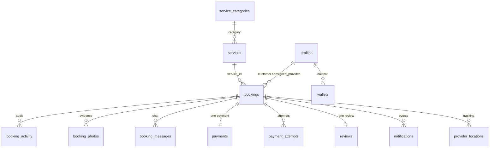
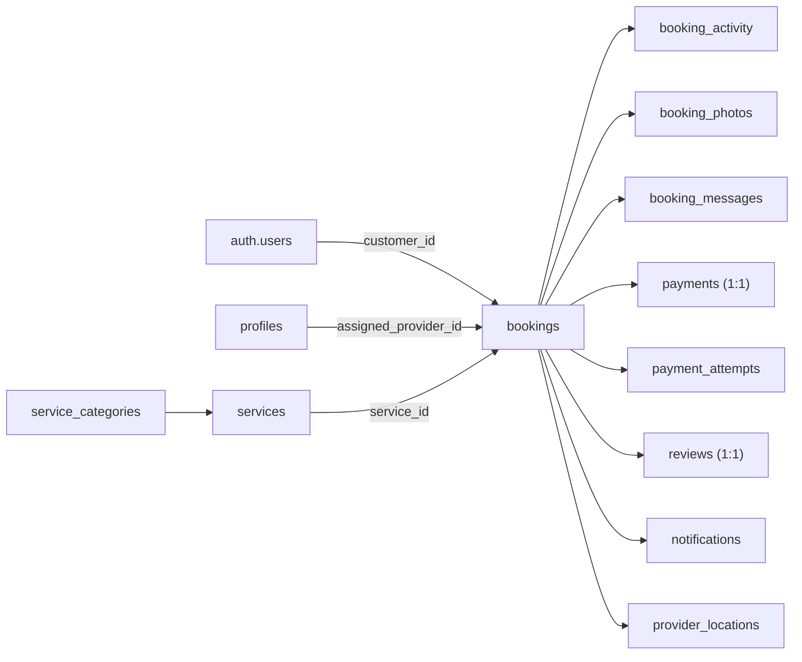

# QuickServe Database

## 1. Purpose

The authoritative engineering reference for the QuickServe database **as implemented in
`supabase/migrations/0001`–`0034`**. It describes the schema, integrity controls,
triggers, functions/RPCs, RLS boundaries, storage, and migration history exactly as the
SQL defines them. Every major claim cites the migration(s) it was verified against.

Full RLS policy text and API/RPC call contracts are summarized here and deferred to
[security/](../security/README.md) and [api/](../api/README.md). System context is in
[architecture/](../architecture/README.md); the client/data-access layer is in
[backend/](../backend/README.md).

## 2. Current Database Status

| Badge | Meaning |
|---|---|
| **Implemented** | Defined in an applied migration and in use. |
| **Partial** | Present but not fully integrated / not certified end-to-end. |
| **Planned** | Referenced but not built. |
| **QA-only** | Exercised only by the certification harness. |

**Summary:** the database is **Implemented** and frozen at the Release Candidate baseline.
Migrations `0001`–`0034` are aligned local↔remote with the dedicated QA project. RLS is
enabled on **30** tables (**84** policies). There are **21** triggers and **~84** Postgres
functions (most `SECURITY DEFINER`). The booking/dispatch spine is certified
(`qa/playwright/certification/`); payment settlement is **Partial** (uncertified end-to-end).
Push delivery is **physically certified on QA** for both platforms (Android
[Phase 5E](../../qa/PHASE-5E-ANDROID-PACKAGE-MIGRATION-FCM-PUSH-CERTIFICATION.md), iOS
[Phase 6H](../../qa/PHASE-6H-IOS-KWIKSERVE-APNS-PUSH-CERTIFICATION.md)); production push is not.

## 3. Database Platform

- **PostgreSQL** managed by **Supabase** (verified: `supabase/config.toml`,
  `supabase/migrations/`). Postgres extensions used include **`pg_net`** for outbound
  webhooks (`supabase/migrations/0015_push_triggers.sql`).
- **Schemas:** `public` (application tables/functions), `auth` (Supabase-managed users),
  `storage` (Supabase-managed objects/buckets), and a `private` schema holding the push
  webhook config (`private.push_config`, `0015`).
- Migrations are plain SQL applied via `supabase db push`.

## 4. Database Design Principles

Verified from the SQL (no ADRs are invented):

- **Database-enforced business rules** — access and lifecycle rules live in RLS policies,
  `CHECK` constraints, and triggers, not only in app code (`0003`, `0004`, `0033`, `0034`).
- **RLS-first access control** — clients use the anon key; every core table has RLS
  (`enable row level security` on 30 tables).
- **`SECURITY DEFINER` functions for privileged/aggregated operations** — admin actions,
  payments, wallet, analytics, and operations run as guarded functions (opening with
  `is_admin()` where privileged).
- **Audit + notification via triggers** — status changes and events emit `booking_activity`
  and `notifications` rows automatically (`0007`, `0020`).
- **Additive, forward-only migrations** — 34 sequential files; later migrations `alter`
  rather than rewrite (e.g. `0002` → `0003` expands the booking-status check).

## 5. Schema Overview

The database is organized around the **booking** as the central entity, with identity,
services, payments, notifications, reviews, chat, tracking, and audit attached to it.

*Verified against:* `supabase/migrations/0001`, `0002`, `0006`, `0007`, `0008`, `0010`,
`0011`, `0013`, `0018`, `0020`, `0023`, `0030`.

## 6. Core Entity Groups

| Group | Purpose | Principal tables | Migration(s) | Maturity |
|---|---|---|---|---|
| **Identity** | Users, roles, devices, addresses, preferences, favorites | `profiles`, `device_tokens`, `customer_addresses`, `notification_preferences`, `favorite_providers`, `favorite_services` | 0001, 0014, 0019, 0020, 0027, 0029 | Implemented |
| **Services** | Bookable catalog | `services`, `service_categories` | 0030 | Implemented |
| **Bookings** | Core booking + lifecycle + evidence | `bookings`, `booking_activity`, `booking_photos` | 0002, 0007, 0006 | Implemented (certified) |
| **Providers** | Provider stats, earnings, quality, conduct, live location | `provider_earnings`, `provider_quality_actions`, `provider_conduct_acceptances`, `provider_locations` (+ provider fields on `profiles`) | 0005, 0010, 0018, 0028 | Implemented / Partial (tracking) |
| **Notifications** | In-app notifications + push config | `notifications`, `notification_preferences`, `private.push_config` | 0007, 0015, 0020 | Implemented (QA delivery certified — Android 5E, iOS 6H; production uncertified) |
| **Payments** | Payments and attempts (M-Pesa) | `payments`, `payment_attempts` | 0010, 0011, 0012 | Partial (uncertified E2E) |
| **Chat** | Per-booking messaging | `booking_messages` | 0013 | Implemented |
| **Reviews** | Ratings + private feedback | `reviews`, `review_private_feedback` | 0008, 0022, 0029 | Implemented |
| **Wallet & promos** | Wallet balances/ledger, promo codes | `wallets`, `wallet_transactions`, `promo_codes`, `promo_redemptions` | 0023, 0024 | Implemented |
| **Administration / operations** | Support cases, notes, flags, audit notes | `support_cases`, `support_case_notes`, `support_case_events`, `internal_notes`, `account_flags` | 0026 | Implemented |
| **Storage** | Evidence photos | `booking-photos` bucket (+ `booking_photos`) | 0006, 0016 | Implemented |
| **Audit** | Activity trail | `booking_activity` | 0007, 0020 | Implemented (certified) |

## 7. Table Inventory

All implemented tables (30 in `public` + 1 in `private`). Maturity reflects certification
where applicable.

| Table | Purpose | Migration | Maturity |
|---|---|---|---|
| `profiles` | User identity, role, approval, provider fields | 0001 (+0005) | Implemented |
| `bookings` | Core booking + lifecycle status | 0002 (+0003, 0017, 0021) | Implemented (certified) |
| `booking_photos` | Evidence photo records | 0006 | Implemented |
| `booking_activity` | Status/audit trail | 0007 | Implemented (certified) |
| `notifications` | In-app notifications | 0007 (+0020) | Implemented (certified) |
| `reviews` | Ratings + review text | 0008 (+0022, 0029) | Implemented |
| `payments` | One payment per booking | 0010 | Partial |
| `provider_earnings` | Provider payout records | 0010 | Implemented |
| `payment_attempts` | M-Pesa STK attempts | 0011 | Partial |
| `booking_messages` | Per-booking chat | 0013 | Implemented |
| `device_tokens` | Expo push tokens | 0014 | Implemented |
| `provider_locations` | Live tracking points | 0018 | Partial |
| `customer_addresses` | Saved addresses | 0019 | Implemented |
| `notification_preferences` | Per-user notif settings | 0020 | Implemented |
| `review_private_feedback` | Private feedback | 0022 | Implemented |
| `wallets` | Wallet balance | 0023 | Implemented |
| `wallet_transactions` | Wallet ledger | 0023 | Implemented |
| `promo_codes` | Promotion definitions | 0024 | Implemented |
| `promo_redemptions` | Promo usage | 0024 | Implemented |
| `support_cases` | Operations/support cases | 0026 | Implemented |
| `support_case_notes` | Case notes | 0026 | Implemented |
| `support_case_events` | Case timeline | 0026 | Implemented |
| `internal_notes` | Admin internal notes | 0026 | Implemented |
| `account_flags` | Account risk flags | 0026 | Implemented |
| `favorite_providers` | Saved providers | 0027 | Implemented |
| `provider_conduct_acceptances` | Code-of-conduct acceptance | 0028 | Implemented |
| `provider_quality_actions` | Quality actions log | 0028 | Implemented |
| `favorite_services` | Saved services | 0029 | Implemented |
| `service_categories` | Catalog categories | 0030 | Implemented |
| `services` | Bookable services | 0030 | Implemented |
| `private.push_config` | Push webhook URL/secret (private schema) | 0015 | Implemented |

## 8. Relationships

Important foreign keys (verified in the create-table SQL):

- `bookings.customer_id → auth.users(id)` (`on delete cascade`) and
  `bookings.assigned_provider_id → profiles(id)` (`0002`, `0004`).
- Booking children reference `bookings(id) on delete cascade`: `booking_activity`,
  `booking_photos`, `booking_messages`, `notifications`, `payments`, `payment_attempts`,
  `provider_locations`, `reviews` (`0006`–`0018`).
- `reviews.booking_id` and `payments.booking_id` are **unique** (one-to-one with a booking).
- `services.category_id → service_categories` (`0030`); `booking_activity.actor_id`,
  `notifications.user_id → profiles(id)`.

## 9. Constraints and Integrity

Verified controls (with the migration that defines them):

- **Primary keys** — every table has a PK (mostly `uuid default gen_random_uuid()`).
- **Foreign keys + cascades** — booking children cascade-delete with the booking (§8);
  `profiles`/`auth.users` references as above.
- **Unique constraints / indexes** —
  - `reviews.booking_id`, `payments.booking_id` unique (one per booking, `0008`/`0010`).
  - `bookings_active_dedup` — **partial unique index** on `(customer_id, service_id,
    scheduled_for)` `WHERE status NOT IN ('cancelled','completed')`
    (`supabase/migrations/0033_booking_active_dedup.sql`) — **duplicate-active-booking
    protection**; a duplicate insert returns HTTP 409.
  - `customer_addresses_one_default` — one default address per customer (`0019`).
  - `notifications_dedup_key` — notification de-duplication (`0020`).
- **Check constraints** — enumerations and non-negative money:
  `profiles.role`/`approval_status` (`0001`); `bookings.status` (7-value set finalized in
  `0003`); `payments.status`, `quote_status`, `payout_status`, and `provider_share/
  quickserve_share >= 0` (`0010`); `payment_attempts.status` (`0011`);
  `notifications.push_status` (`0020`); wallet `balance >= 0` / `wallet_applied >= 0`
  (`0023`); `promo_discount >= 0` (`0024`).
- **NOT NULL** — required booking fields (`customer_id`, `service_id`, `address`,
  `scheduled_for`, `status`) are `not null` (`0002`).
- **Terminal-state enforcement** — the provider update RLS `WITH CHECK` requires the
  pre-update status to be `provider_assigned`/`on_the_way`/`in_progress`, so `cancelled`
  and `completed` are terminal for the provider
  (`supabase/migrations/0034_provider_terminal_states.sql`) and forward-only progression is
  enforced (`0004`).

## 10. Indexes

- **Primary keys** index every table by `id`.
- **Foreign-key columns** are used for the RLS filters and joins above.
- **Explicit unique / partial-unique indexes** (the only non-PK indexes created by name):
  `bookings_active_dedup` (`0033` — dedup + fast active-booking lookup),
  `customer_addresses_one_default` (`0019`), `notifications_dedup_key` (`0020`).

No additional performance indexes are asserted beyond those defined in the migrations
(no speculation).

## 11. Triggers

All 21 triggers (name · table · purpose · migration · side effects):

| Trigger | Table | Purpose | Migration | Side effect |
|---|---|---|---|---|
| `on_auth_user_created` | `auth.users` | Create `profiles` row from signup metadata (admin downgraded) | 0001 | insert `profiles` |
| `trg_bump_completed_jobs` | `bookings` | Increment provider completed-jobs count | 0005 | update `profiles` |
| `trg_log_booking_created` | `bookings` | Log booking creation | 0007 | insert `booking_activity` |
| `trg_log_booking_status` | `bookings` | Log status change | 0007 | insert `booking_activity` |
| `trg_log_photo_added` | `booking_photos` | Log photo added | 0007 | insert `booking_activity` |
| `trg_log_photo_verified` | `booking_photos` | Log photo verified | 0007 | insert `booking_activity` |
| `trg_recompute_provider_rating` | `reviews` | Recompute provider rating | 0008 | update `profiles` |
| `trg_create_payment_on_accept` | `bookings` | Create payment on quote accept | 0010 | insert `payments` |
| `trg_create_earning_on_paid` | `payments` | Create provider earning on paid | 0010 | insert `provider_earnings` |
| `trg_push_bookings` | `bookings` | Push webhook on booking change | 0015 | `pg_net` → send-push |
| `trg_push_payments` | `payments` | Push webhook on payment change | 0015 | `pg_net` → send-push |
| `trg_push_booking_messages` | `booking_messages` | Push webhook on new message | 0015 | `pg_net` → send-push |
| `trg_push_notification` | `notifications` | Deliver a notification via push | 0020 | `pg_net` → send-push |
| `tg_notify_booking_created` | `bookings` | Create notification(s) on new booking | 0020 | insert `notifications` |
| `tg_notify_booking_update` | `bookings` | Notify on status/quote/assignment change | 0020 | insert `notifications` |
| `tg_notify_payment_paid` | `payments` | Notify on payment paid | 0020 | insert `notifications` |
| `tg_notify_payment_failed_ins` | `payment_attempts` | Notify on failed attempt (insert) | 0020 | insert `notifications` |
| `tg_notify_payment_failed_upd` | `payment_attempts` | Notify on transition to failed (update) | 0020 | insert `notifications` |
| `tg_notify_chat_message` | `booking_messages` | Notify recipient of a chat message | 0020 | insert `notifications` |
| `tg_notify_review` | `reviews` | Notify on new review | 0020 | insert `notifications` |
| `tg_notify_provider_pending` | `profiles` | Notify admins of a pending provider | 0020 | insert `notifications` |

*(Verified: `supabase/migrations/0001`, `0005`, `0007`, `0008`, `0010`, `0015`, `0020`. The
split `tg_notify_payment_failed_ins/upd` is the corrected form of the earlier single trigger.)*

## 12. Database Functions / RPCs

~84 Postgres functions; the large majority are `SECURITY DEFINER` (88 `security definer`
markers across migrations). Privileged/admin functions open with `is_admin()`. Grouped
inventory (SQL not copied):

| Domain | Representative functions | Migration | Security | Caller |
|---|---|---|---|---|
| Auth / identity | `handle_new_user`, `is_admin` | 0001, 0003 | DEFINER | trigger / RLS |
| Dispatch / booking helpers | `get_booking_professional`, `bump_completed_jobs` | 0005 | DEFINER | app / trigger |
| Audit | `log_booking_created`, `log_booking_status_activity`, `log_photo_added`, `log_photo_verified` | 0007, 0020 | DEFINER | trigger |
| Ratings | `recompute_provider_rating`, `get_provider_rating_breakdown`, `edit_review` | 0008, 0022, 0029 | DEFINER | trigger / app |
| Payments / quotes | `set_quote`, `accept_quote`, `decline_quote`, `pay_payment`, `create_payment_on_accept`, `create_earning_on_paid`, `mark_payout_paid`, `override_payment_status` | 0010 | DEFINER | app / admin / trigger |
| Payment attempts (M-Pesa) | `initiate_payment_attempt`, `confirm_payment_attempt`, `cancel_payment_attempt`, `apply_mpesa_callback` | 0011, 0012 | DEFINER | Edge Functions |
| Chat | `get_chat_peer_name` | 0013 | DEFINER | app |
| Push | `notify_send_push`, `tg_push_bookings/payments/booking_messages` | 0015 | DEFINER | trigger |
| Tracking | `upsert_provider_location`, `clear_provider_location` | 0018 | DEFINER | app |
| Addresses | `set_default_address`, `touch_saved_address` | 0019 | DEFINER | app |
| Notifications | `notify_user`, `notify_admins`, `tg_notify_*` | 0020 | DEFINER | trigger |
| Wallet | `_ensure_wallet`, `_wallet_post`, `apply_wallet_to_payment`, `admin_wallet_adjust` | 0023, 0024 | DEFINER | app / admin |
| Promotions | `redeem_promo` | 0024 | DEFINER | app |
| Analytics (read) | `analytics_kpis`, `analytics_bookings_*`, `analytics_financial_*`, `analytics_providers`, `analytics_services`, `analytics_geography`, `analytics_customers` (0025); `analytics_executive_overview`, `analytics_growth_timeseries`, `analytics_service_categories`, `analytics_notification_delivery` (0032) | 0025, 0032 | DEFINER (admin-guarded, read-only) | admin web (certified Slices 41–42) |
| Operations / support | `create_support_case`, `add_support_case_note`, `assign_support_case`, `update_support_case_status/priority`, `set_dispute_outcome`, `flag_account`, `lift_account_flag`, `add_internal_note` | 0026 | DEFINER | admin |
| Favorites / browse | `get_my_favorite_providers`, `list_public_providers` | 0027 | DEFINER | app |
| Provider quality | `accept_provider_conduct`, `record_provider_quality_action` | 0028 | DEFINER | app / admin |
| Services admin | `admin_create_service`, `admin_update_service`, `admin_set_service_status`, `admin_duplicate_service`, `admin_reorder_services`, `admin_create_category`, `admin_update_category`, `admin_set_category_active`, `admin_reorder_categories` | 0030 | DEFINER | admin |

The analytics functions are certified via the Executive/Detailed Analytics suites
(`qa/`); most mutation RPCs are covered by the app's Jest unit tests (`src/lib/*.test.ts`)
and, for the booking spine, by connected certification.

## 13. Row Level Security

High-level only (policy SQL is not pasted; see [security/](../security/README.md)):

- **Enabled on 30 tables; 84 policies total.**
- **Customer access** — reads/writes limited to own rows (e.g. `bookings` where
  `customer_id = auth.uid()`); can insert own bookings.
- **Provider access** — reads only assigned bookings; updates are forward-only and
  terminal-safe (`0004`, `0034`), with non-status fields pinned.
- **Admin access** — full read/update on core tables via `is_admin()` (`0003`); admin RPCs
  are `SECURITY DEFINER` and open with `is_admin()`.
- **Service-role boundary** — the service role **bypasses RLS** and is used only by Edge
  Functions (privileged writes / callbacks) and QA teardown/provisioning — **never** by the
  shipped client, which uses the anon key.

## 14. Storage

- **Bucket:** `booking-photos` — **private** (`public = false`),
  `supabase/migrations/0006_booking_photos.sql`.
- **Related table:** `booking_photos` stores the object path (`photo_url =
  storage.objects.name`) and booking association.
- **Policies (`storage.objects`):** authenticated `insert`/`select` scoped to the
  `booking-photos` bucket; `delete` requires `is_admin()`. **Tightened in
  `0016_tighten_booking_photos_storage.sql`** so `select` is restricted to objects
  referenced by a `booking_photos.photo_url` the caller may access (correlated to the
  booking), rather than any object in the bucket.

## 15. Audit and Activity

- **`booking_activity`** — the status/audit trail. Triggers (`0007`) log booking creation,
  status changes, and photo add/verify. Certified event ordering
  (`booking_created → provider_assigned → on_the_way → in_progress → completed`) in
  `qa/playwright/certification/golden-path.spec.ts`.
- **Notification generation** — event triggers (`0020`) insert `notifications` rows;
  `0015` triggers post to the `send-push` webhook via `pg_net` for delivery.
- **QA cleanup interaction** — booking children (`booking_activity`, `notifications`,
  payments, …) cascade-delete with the booking, so certification teardown that deletes a
  booking removes its audit/notification rows; verified zero residual
  (`qa/docs/LAUNCH-CERTIFICATION.md`).

## 16. Migration History

34 sequential migrations (`0001`–`0034`), aligned local↔remote with the QA project.
Grouped timeline:

| Range | Theme | Highlights |
|---|---|---|
| 0001–0005 | Foundation | profiles + `handle_new_user`; bookings; admin dispatch + `is_admin()`; provider jobs (forward-only RLS); provider profiles |
| 0006–0009 | Evidence, audit, reviews | `booking-photos` storage; `booking_activity` + notifications; reviews; review-count pin |
| 0010–0012 | Payments | payments + earnings + quote/pay RPCs; payment_attempts; M-Pesa callback apply |
| 0013–0016 | Chat, push, storage | booking_messages; device_tokens; `pg_net` push triggers; tighten photo storage |
| 0017–0021 | Address, tracking, scheduling | booking address fields; provider_locations; customer_addresses; notification system; scheduling |
| 0022–0025 | Ratings, wallet, promos, analytics | ratings v2; wallet + ledger; promotions; 9 analytics RPCs |
| 0026–0032 | Operations & growth | operations portal; favorites; provider quality; customer experience; services marketplace; communication center; executive analytics |
| **0033** | **Duplicate protection (RC1)** | **`bookings_active_dedup` partial unique index — blocks duplicate active bookings (fixes B2, P0)** |
| **0034** | **Terminal states (RC1)** | **provider RLS recreated so `cancelled`/`completed` are terminal for the provider (fixes F4, P1)** |

`0033` and `0034` are the Release Candidate integrity fixes and are the reason the
duplicate-booking and cancellation-override defects no longer reproduce (certified in
`qa/playwright/certification/integrity.spec.ts`).

## 17. Database Performance

Verified mechanisms only:

- **Indexes** — PKs on every table; the explicit unique/partial-unique indexes in §10
  (notably `bookings_active_dedup`, which also serves active-booking lookups).
- **Uniqueness** — one-payment/one-review-per-booking constraints avoid duplicate rows.
- **RLS as filter** — role predicates (`auth.uid()`, `is_admin()`) constrain result sets at
  the database.

No caching, materialized views, or partitioning are defined in the migrations (analytics
RPCs are computed on demand). No performance claims beyond the above.

## 18. Database Risks

Verified remaining items (from `qa/docs/LAUNCH-CERTIFICATION.md`):

- **No optimistic concurrency (last-write-wins)** — booking mutations have no
  version/`updated_at` guard; concurrent admin+provider writes can silently lose one update.
- **Provider forward-skip permitted (by design)** — forward-only but not single-step
  (`rank(new) > rank(old)`), so intermediate states may be skipped.
- **Uncertified external integrations** — M-Pesa settlement (`payments`/`payment_attempts`
  path) and push delivery are not certified end-to-end.

No other risks are asserted.

## 19. Database Change Rules

Established workflow (repository practice):

- **Schema/policy/function changes require a migration** in `supabase/migrations/`
  (sequential, forward-only); no manual production edits.
- **Apply via `supabase db push`** to the target project; keep local↔remote **aligned**
  (`supabase migration list`).
- **Behavioral changes update connected certification** (`qa/playwright/certification/`) to
  assert the new behavior; never weaken assertions.
- **Re-run migration alignment + certification + health** after DB changes.
- **QA validation with deterministic cleanup** before merge.

## 20. Related Documentation

- [Architecture](../architecture/README.md) · [Backend](../backend/README.md) ·
  [API](../api/README.md) · [Authentication](../authentication/README.md) ·
  [Security](../security/README.md) · [QA](../qa/README.md) ·
  [Deployment](../deployment/README.md) · [Operations](../operations/README.md)
- Engineering index: [../README.md](../README.md)
- QA (authoritative): `../../../qa/docs/LAUNCH-CERTIFICATION.md`

---

### Booking state enforcement at the database layer

```mermaid
stateDiagram-v2
    [*] --> pending: customer INSERT (RLS: customer_id=auth.uid; UNIQUE 0033)
    pending --> accepted: admin (is_admin)
    pending --> cancelled: admin reject
    pending --> provider_assigned: admin assign (+assigned_provider_id)
    accepted --> provider_assigned: admin assign
    provider_assigned --> on_the_way: provider (RLS forward-only)
    on_the_way --> in_progress: provider
    in_progress --> completed: provider
    provider_assigned --> cancelled: admin
    on_the_way --> cancelled: admin
    in_progress --> cancelled: admin
    completed --> [*]
    cancelled --> [*]
    note right of completed: terminal (0034)
    note right of cancelled: terminal for provider (0034)
```

*Verified against:* `src/constants/booking-status.ts`, `supabase/migrations/0002`, `0003`,
`0004`, `0033`, `0034`, and `qa/playwright/certification/`.
