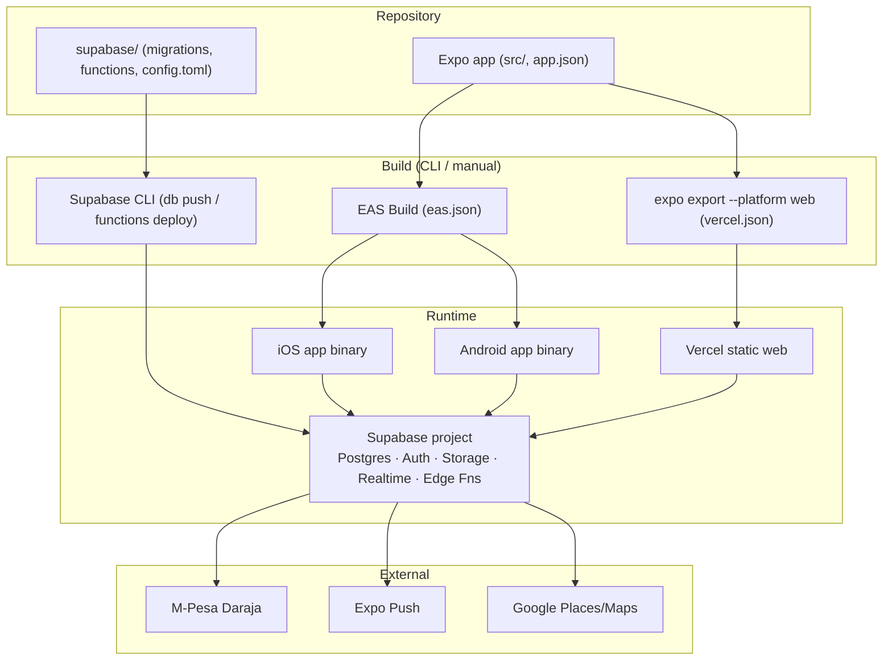
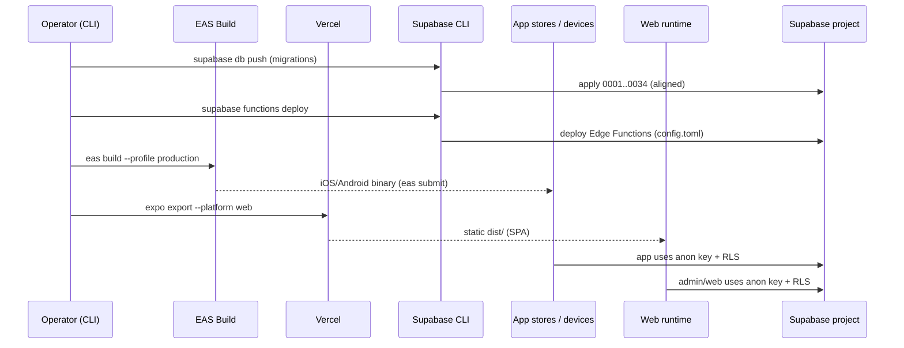

# QuickServe Deployment

## 1. Purpose

The authoritative deployment engineering reference for QuickServe, describing **only the
build and deployment mechanisms present in the repository today**, each traceable to source
(`eas.json`, `app.json`, `vercel.json`, `package.json`, `supabase/config.toml`,
`supabase/migrations/`). Where a pipeline or practice is not evidenced, it is marked
**Not verified** / **Not documented** rather than invented.

Operational runbooks and release records are cross-referenced but deferred to
[operations/](../operations/README.md) and [releases/](../releases/README.md).

## 2. Current Deployment Status

| Badge | Meaning |
|---|---|
| **Implemented** | Configured in the repository. |
| **Partial** | Present but incomplete / not fully wired. |
| **Planned** | Referenced but not built. |
| **QA-only** | Certification infrastructure. |
| **Not verified** | The repository does not prove this exists. |

**Summary:** three build targets are configured — **EAS** (iOS/Android), **Vercel** (web
export), and **Supabase CLI** (backend migrations + Edge Functions). Deployment is
**manual / CLI-driven**. There is **no CI/CD pipeline** (`.github/workflows/` absent),
**no Docker**, and **no OTA / EAS Update** wiring (`expo-updates` absent, `app.json updates`
null). Operator procedures exist under `docs/pilot/`.

## 3. Deployment Architecture

QuickServe deploys from one repository to three runtime surfaces:

- **Mobile apps (iOS/Android)** — built by **EAS Build** from the Expo app (`eas.json`).
- **Web (incl. Admin panel)** — a **static export** deployed to **Vercel** (`vercel.json`,
  `npx expo export --platform web`).
- **Backend** — a **Supabase** project updated via the **Supabase CLI** (migrations + Edge
  Functions). Storage/Realtime are managed by Supabase.

## 4. Build Targets

Verified from `eas.json`, `app.json`, `vercel.json`:

| Target | Tool | Output | Evidence |
|---|---|---|---|
| iOS app | EAS Build | native binary (bundle id `ke.co.hiredcorp.quickserve`) | `eas.json`, `app.json` |
| Android app | EAS Build | APK (dev/preview) / production build (package `com.quickserve.app`) | `eas.json`, `app.json` |
| Web | Expo web export | static `dist/` (SPA) served by Vercel | `vercel.json`, `package.json` |

`app.json` sets `platforms: ios, android, web`, `runtimeVersion { policy: "appVersion" }`, and
plugins (expo-router, splash, image-picker, notifications, location, Sentry). **No `owner`/EAS
`projectId` is stored in the repo** — EAS project linking happens at build time.

## 5. Runtime Components

- **Mobile app binaries** (iOS/Android) installed on devices; talk to Supabase with the anon key.
- **Web static site** on Vercel (the whole Expo web build, including the `(admin-web)` panel).
- **Supabase project** — Postgres (+RLS), Auth, Storage, Realtime, Edge Functions.
- **External services** — M-Pesa Daraja, Expo Push, Google Places/Maps (reached from Edge
  Functions). **Sentry** is optional (gated on `EXPO_PUBLIC_SENTRY_DSN`).

## 6. Environment Configuration

Names only (values never committed; see [security/](../security/README.md) §9):

- **Client-safe (`EXPO_PUBLIC_*`, bundled):** `EXPO_PUBLIC_SUPABASE_URL`,
  `EXPO_PUBLIC_SUPABASE_ANON_KEY`, `EXPO_PUBLIC_SENTRY_DSN`.
- **Server-only (Edge Functions):** `SUPABASE_SERVICE_ROLE_KEY`, `MPESA_CALLBACK_SECRET`,
  `PUSH_WEBHOOK_SECRET`, `MPESA_MODE`.
- **External integrations (server-only):** `DARAJA_BASE_URL`, `DARAJA_CALLBACK_URL`,
  `DARAJA_CONSUMER_KEY`, `DARAJA_CONSUMER_SECRET`, `DARAJA_PASSKEY`, `DARAJA_SHORTCODE`,
  `GOOGLE_PLACES_API_KEY`.
- **QA-only (git-ignored `qa/.env`):** `QA_SUPABASE_URL`, `QA_SUPABASE_ANON_KEY`,
  `QA_SERVICE_ROLE_KEY`, `QA_{CUSTOMER,ADMIN,PROVIDER1,PROVIDER2}_*`.

Evidence: `.env.example`, `qa/.env.example`, `src/lib/supabase.ts`, `supabase/functions/*/index.ts`.

## 7. Build Process

Verified build flow (CLI / manual; there is no build automation script beyond `qa:release`):

- **Mobile** — `eas build --profile <development|preview|production>` per `eas.json`:
  - `development`: `developmentClient: true`, internal distribution, Android APK, iOS device
    (`simulator: false`), channel `development`.
  - `preview`: internal distribution, Android APK, channel `preview`.
  - `production`: `autoIncrement: true`, channel `production`; store submission via
    `eas submit` (`submit.production` configured).
- **Web** — `npx expo export --platform web` → `dist/` (SPA), the exact command in
  `vercel.json` (`buildCommand`).
- **Local checks** — `qa:release` (`package.json`) chains `jest && tsc --noEmit && expo export
  --platform web && expo export --platform android && npm --prefix qa run qa:test:all-browsers`
  as a manual pre-release gate.

`appVersionSource: "local"` (`eas.json`) — versioning is driven from the local app config.

## 8. Deployment Components

- **Expo application (mobile)** — EAS builds; distribution via internal channels (dev/preview) or
  store submission (production). **Implemented.**
- **Web** — Vercel builds/serves the exported `dist/` (SPA rewrites all routes to `/`). **Implemented.**
- **Supabase backend (database)** — migrations applied via `supabase db push` (`supabase/migrations/`).
  **Implemented** (RC baseline `0001`–`0034` aligned to the QA project).
- **Edge Functions** — source + `verify_jwt` config in the repo; deployed via the Supabase CLI
  (`supabase functions deploy`). **Implemented (source); deploy is CLI-driven, not scripted.**
- **Storage / Realtime** — Supabase-managed; bucket/policies defined in migrations (`0006`, `0016`).
  **Implemented.**

## 9. Environment Separation

Verified environments:

- **Production/app backend** — the Supabase project referenced by the app's
  `EXPO_PUBLIC_SUPABASE_URL` (`src/lib/supabase.ts`).
- **Dedicated QA/staging** — a **separate** Supabase project via the `QA_*` namespace
  (`qa/.env`, `qa/playwright/support/connected/qa-accounts.ts`), guarded by `assertNotProduction`.
- **Local development** — `expo start` (`package.json`).

`eas.json` defines EAS **build channels** `development` / `preview` / `production`. These are
build-distribution channels; **OTA update channels are not active** because `expo-updates` and
`app.json.updates` are not configured (§14). No other environments are evidenced.

## 10. Release Dependencies

Before deploying, the repository implies these must hold:

- **Database migrations applied and aligned** (`supabase db push`; verify with
  `supabase migration list`).
- **Environment variables configured** for the target (client `EXPO_PUBLIC_*`; server/edge
  secrets; §6).
- **A reachable Supabase project** for the app's `EXPO_PUBLIC_SUPABASE_URL`.
- **EAS project linked** at mobile build time (no `projectId` in the repo).
- **External integrations configured** (Daraja, Google, Expo Push) for full functionality — else
  those paths degrade (they are uncertified regardless; see [security/](../security/README.md)).

## 11. Secrets Handling

Secrets are grouped by boundary in §6 and governed by [security/](../security/README.md) §9–§10:
client holds only `EXPO_PUBLIC_*`; service-role and third-party secrets are server/QA-only; no
values are committed (`docs/pilot/environment-secrets.md`). **No secret rotation process is
documented** (Not documented).

## 12. Database Deployment

Verified migration workflow (established in the Release Candidate work):

- Migrations are **sequential, forward-only** SQL in `supabase/migrations/` (`0001`–`0034`).
- Applied via **`supabase db push`** to the linked project; **alignment verified** with
  `supabase migration list` (local == remote, 0 drift).
- **No manual production schema edits** — all changes go through a migration.
- The current RC baseline (incl. `0033`, `0034`) is applied and aligned with the QA project
  (`qa/docs/LAUNCH-CERTIFICATION.md`).

## 13. Edge Function Deployment

- Function **source** lives in `supabase/functions/<name>/index.ts`; **auth config** in
  `supabase/config.toml` (`verify_jwt` per function).
- Deployment mechanism is the **Supabase CLI** (`supabase functions deploy <name>`), invoked
  manually — **not scripted in the repository and not automated** (Not verified as an automated
  pipeline). Secrets are set via Supabase (`supabase secrets set ...`, referenced in
  `supabase/functions/send-push/index.ts`).

## 14. Rollback Strategy

- **Code (app / docs):** rollback via `git revert` on `main` (the repository's normal branch
  workflow).
- **Database:** migrations are forward-only; there is **no automated rollback pipeline** — a
  rollback requires a **corrective forward migration**. Some slice docs include per-task rollback
  notes (e.g. `docs/pilot/analytics.md`), but there is no repository-wide automated rollback.
- **Web:** Vercel retains previous deployments (platform feature), but no rollback procedure is
  defined in-repo.
- **Overall:** a formal, automated rollback procedure is **Not documented**.

## 15. Deployment Risks

Verified risks:

- **No CI/CD** — deploys are manual; the `qa:release` gate is run by hand, not enforced.
- **No OTA updates** — app fixes require a full EAS rebuild + store resubmission (no `expo-updates`).
- **EAS project not linked in-repo** — builds depend on out-of-repo EAS linking.
- **Manual DB deployment** — `supabase db push` correctness depends on operator discipline and
  migration alignment.
- **External integrations must be configured** per environment or those paths fail (payments,
  push, maps) — and remain uncertified regardless.

## 16. QA Relationship

- **Pre-release gate** — `qa:release` (`package.json`) runs Jest + `tsc` + web/android exports +
  the multi-browser QA suite; the connected certification (`qa/playwright/certification/`, 21/21)
  proves the backend spine against the **dedicated QA project** (never production).
- **Migration alignment** is validated (`supabase migration list`) as part of the RC baseline.
- QA is isolated from the shipped build (`qa/` excluded from Jest/Metro/tsc), so it never ships.
- See [qa/](../qa/README.md) and `qa/docs/LAUNCH-CERTIFICATION.md`.

## 17. Deployment Change Rules

Repository practice for deployment-affecting changes:

- **Database:** new migration → `supabase db push` → verify alignment; never edit production
  schema manually.
- **Edge Functions:** update source + `supabase/config.toml`; deploy via CLI; set secrets via
  Supabase.
- **App/web:** branch from `main`, PR, then EAS build / Vercel deploy of the merged result.
- **Re-run certification + health** for behavioral changes; keep migrations aligned.
- **Document new environment variables** by name/purpose (`.env.example`, security/deployment docs).
- **Never expose service-role or third-party secrets to client code.**

## 18. Related Documentation

- [Architecture](../architecture/README.md) · [Backend](../backend/README.md) ·
  [Database](../database/README.md) · [API](../api/README.md) ·
  [Authentication](../authentication/README.md) · [Security](../security/README.md) ·
  [QA](../qa/README.md) · [Operations](../operations/README.md) · [Releases](../releases/README.md)
- Engineering index: [../README.md](../README.md)
- Operator release guides (existing): [../../pilot/](../../pilot/) — e.g. `web-admin-deploy.md`,
  `android-release.md`, `ios-release.md`, `environment-secrets.md`

---

### Build → Deploy → Runtime flow

*Verified against:* `eas.json`, `app.json`, `vercel.json`, `package.json`,
`supabase/config.toml`, `supabase/migrations/`, `supabase/functions/`, and
`qa/docs/LAUNCH-CERTIFICATION.md`.
