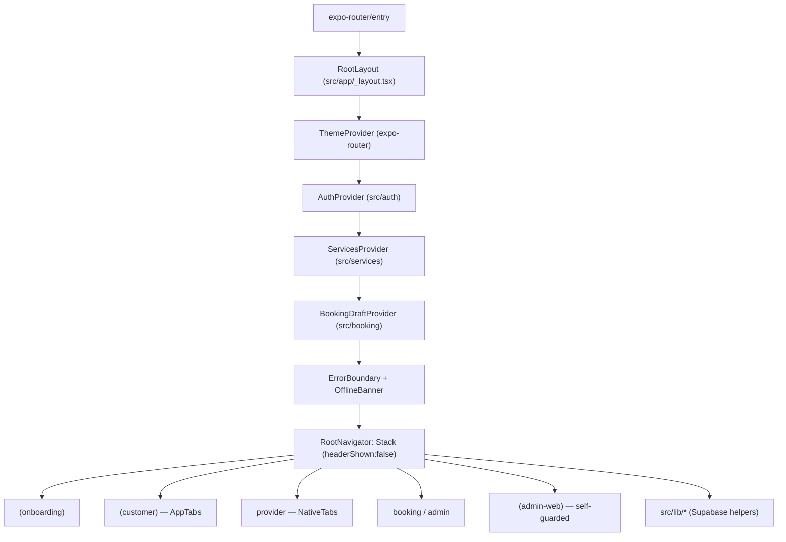
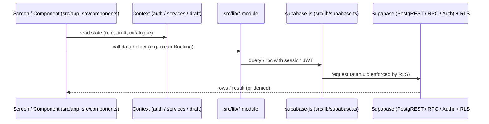

# QuickServe Frontend

## 1. Purpose

The authoritative engineering reference for **the QuickServe frontend as implemented in the
repository today** — the Expo React Native application (`src/`) that renders the customer,
provider, mobile-admin, and web-admin surfaces from a single codebase. Every claim cites its
source. The separate Next.js marketing site (`apps/website/`) is noted only as a cross-reference.

Backend/data specifics are deferred to [backend/](../backend/README.md), [api/](../api/README.md),
and [authentication/](../authentication/README.md); system context is in
[architecture/](../architecture/README.md); the visual design system lives in
`../../design/DESIGN-SYSTEM.md`.

## 2. Current Frontend Status

| Badge | Meaning |
|---|---|
| **Implemented** | Present in `src/` and exercised by the app. |
| **Partial** | Present but incomplete or not fully integrated. |
| **Planned** | Referenced but not built. |
| **Deprecated** | Superseded but still present. |
| **Not implemented** | No repository evidence. |

| Area | Status |
|---|---|
| Expo Router file-based routing (single codebase, RN + web) | **Implemented** (`src/app/`) |
| Customer / Provider / Onboarding / Booking surfaces | **Implemented** |
| Web-admin panel (`(admin-web)`, self-guarded) | **Implemented** |
| React Context state (auth / services / booking draft) | **Implemented** |
| `StyleSheet` + token theme (`constants/theme.ts`) | **Implemented** |
| ErrorBoundary + OfflineBanner + Sentry monitoring | **Implemented** |
| Mobile-admin routes (`src/app/admin/`) | **Deprecated** (superseded by `(admin-web)`; still present) |
| NativeWind / Tailwind / Redux / Zustand | **Not implemented** (not in `package.json`) |

## 3. Frontend Architecture

- **Framework** — Expo (SDK ~56), React 19, React Native 0.85, **Expo Router** (`package.json`
  `main: "expo-router/entry"`). Web is served by **react-native-web** from the same code.
- **Path alias** — `@/*` → `./src/*` (`tsconfig.json`); `@/assets/*` also mapped.
- **Provider composition** — `src/app/_layout.tsx` wraps the app in, outermost-first:
  `ThemeProvider` (expo-router) → `AuthProvider` → `ServicesProvider` → `BookingDraftProvider`,
  with `OfflineBanner` and an `ErrorBoundary` around the `RootNavigator` (`Stack`). Crash
  reporting is initialised once at startup (`initMonitoring()`).
- **No global store** — state is React Context + local component state/hooks; there is **no
  Redux/Zustand** (absent from `package.json`).

## 4. Application Structure

Verified organisation of `src/`:

- **`app/`** — Expo Router routes. Route groups: `(onboarding)` (welcome, login, register,
  role-select), `(customer)` (index, search, bookings, providers, payments, favorites, profile,
  etc.), `booking/` (detail, `chat/`, `track/`), `provider/` (with `(tabs)` and `job/`),
  `admin/` (legacy mobile admin — **Deprecated**), and `(admin-web)` (the web admin panel).
  Root-level screens: `_layout.tsx`, `notification-settings.tsx`, `saved-addresses.tsx`,
  `wallet.tsx`.
- **`auth/`** — `auth-context.tsx` (`AuthProvider`, session/role/approval state).
- **`services/`** — `services-provider.tsx` (`ServicesProvider`, service catalogue state).
- **`booking/`** — `booking-draft.tsx` (`BookingDraftProvider`, in-progress booking state).
- **`components/`** — ~109 files across `ui/` (reusable primitives), `customer/`, `provider/`,
  `admin-web/`, `notifications/`, plus shared items (`error-boundary`, `app-tabs`,
  `themed-text`, `themed-view`, `animated-icon`).
- **`hooks/`** — 6 hooks (`use-admin-guard`, `use-color-scheme`, `use-theme`,
  `use-paginated-list`, `use-provider-location-sharing`).
- **`lib/`** — 45 data/util modules wrapping Supabase (the frontend↔backend layer).
- **`constants/`** — 13 modules (`theme`, `roles`, `services`, `booking-status`, `icons`,
  `motion`, `notifications`, …).
- **`global.css`** — web font CSS variables, imported by `constants/theme.ts`.

## 5. Navigation

Verified routing (Expo Router, file-based):

- **Root** — a `Stack` with `headerShown: false` (`src/app/_layout.tsx`).
- **Redirect logic** (`RootNavigator`) — when not loading: if the segment is `(admin-web)` it
  **returns early** (the web-admin group manages its own guard); if not signed in and not in
  `(onboarding)` → `router.replace('/welcome')`; if signed in with a role while in onboarding →
  `router.replace(roleHref(role))`.
- **Role routing** — `roleHref` (`src/constants/roles.ts`): `customer → '/'`,
  `provider → '/provider'`, `admin → '/admin'`.
- **Customer tabs** — a custom `AppTabs` component (`@/components/app-tabs`, with a `.web`
  variant) is the `(customer)` layout.
- **Provider tabs** — `NativeTabs` (`expo-router/unstable-native-tabs`): My Jobs, Notifications,
  My Profile (`src/app/provider/(tabs)/_layout.tsx`).
- **Web-admin** — `(admin-web)/_layout.tsx` renders a `Slot` gated by `useAdminGuard`;
  no session → `Redirect` to `/(admin-web)/login`.
- **Route groups** — parenthesised group names are stripped from the browser URL by Expo Router
  (e.g. `(customer)/search` → `/search`).
- **Platform variants** — `.web.tsx` files provide web-specific implementations
  (`app-tabs`, `animated-icon`, `use-color-scheme`).

## 6. State Management

Verified mechanisms only (React Context + local state; no external store):

- **`AuthProvider`** (`src/auth/auth-context.tsx`) — `createContext`; holds `session`, `role`,
  `approvalStatus`, loading/error flags; exposes `signUp`/`signIn`/`signOut`/`selectRole`;
  subscribes to `onAuthStateChange`.
- **`ServicesProvider`** (`src/services/services-provider.tsx`) — `createContext`; the service
  catalogue used across booking/discovery screens.
- **`BookingDraftProvider`** (`src/booking/booking-draft.tsx`) — `createContext`; the multi-step
  in-progress booking draft.
- **Theme state** — `useColorScheme` (react-native) + expo-router `ThemeProvider`; `useTheme`
  hook (`src/hooks/use-theme.ts`).
- **Local/list state** — component `useState`/`useEffect` and helper hooks such as
  `use-paginated-list` (pagination) and `use-provider-location-sharing`.

## 7. UI Component System

- **Reusable primitives** — `src/components/ui/` holds the shared library (e.g. `button`,
  `card`, `input`, `avatar`, `empty-state`, `icon-chip`, status **badges**
  (`payment-status-badge`, `attempt-status-badge`), `chat-thread`, `message-bubble`,
  `photo-gallery`/`photo-upload-button`, `offline-banner`, skeletons). **Almost every component
  has a co-located `.test.tsx`.**
- **Themed primitives** — `themed-text.tsx` / `themed-view.tsx` apply theme colours by name.
- **Domain component folders** — `customer/`, `provider/`, `admin-web/`, and `notifications/`
  group screen-specific components separately from the shared `ui/` primitives.
- **Composition** — screens under `src/app/**` compose these components and call `src/lib/*`
  for data; components are presentational + local state, not data owners.

## 8. Styling System

Verified styling (there is **no** utility-class framework):

- **`StyleSheet.create`** — the styling mechanism, used across ~150 files. **NativeWind/Tailwind
  are not used** (no `className` usage; not in `package.json`).
- **Design tokens** — `src/constants/theme.ts` exports `Colors` (full **light**/**dark**
  ramps + semantic colours/surfaces), `Fonts` (`Platform.select` — web maps to the
  `--font-*` CSS variables), `Spacing`, `Radii`, `Shadows` (elevation set), `Typography`,
  `Weights`, plus `BottomTabInset` and `MaxContentWidth`.
- **Colour scheme** — light/dark driven by `useColorScheme` and the expo-router `ThemeProvider`
  (`DarkTheme`/`DefaultTheme`).
- **Web fonts** — `src/global.css` defines `--font-display/-mono/-rounded/-serif`, imported once
  via `constants/theme.ts`.
- **Design reference** — `../../design/DESIGN-SYSTEM.md` and `../../design/ui-audit.md` document
  the intended system; this section reflects the code.

## 9. Data Flow

Verified frontend → backend interaction:

- **Single Supabase client** — `src/lib/supabase.ts` creates one `supabase-js` client from
  `EXPO_PUBLIC_SUPABASE_URL` / `EXPO_PUBLIC_SUPABASE_ANON_KEY` (throws if unset), with
  platform-aware auth storage (web `localStorage`, native `AsyncStorage`).
- **`lib/*` data modules** — the 45 modules (e.g. `bookings.ts`, `payments.ts`, `reviews.ts`,
  `providers.ts`) wrap Supabase queries/RPCs and own the frontend's data access.
- **Screens/components** call `lib/*` functions; **contexts** hold cross-cutting state; **RLS**
  in the database enforces authorization regardless of client (see
  [authentication/](../authentication/README.md) and [security/](../security/README.md)).

## 10. Error Handling

Verified frontend behavior:

- **`ErrorBoundary`** (`src/components/error-boundary.tsx`) wraps the navigator and catches
  render errors.
- **`OfflineBanner`** (`src/components/ui/offline-banner.tsx`) surfaces connectivity state
  (`@react-native-community/netinfo`, via `src/lib/net.ts`).
- **Auth-error mapping** — `src/lib/auth-errors.ts` (`mapAuthError`) converts Supabase auth
  errors into friendly copy.
- **Crash reporting** — `src/lib/monitoring.ts` (`initMonitoring`, Sentry) is initialised at
  startup and is a **no-op unless `EXPO_PUBLIC_SENTRY_DSN` is set**.
- **Empty/loading states** — `ui/empty-state`, skeleton components, and per-screen loading flags
  handle non-error edge states.

## 11. Frontend Constraints

- **Single codebase, three surfaces** — customer/provider/mobile-admin render natively; the
  web-admin panel and marketing exports come from the same RN code via react-native-web.
- **No external state library** — Context + local state only.
- **No utility-CSS framework** — `StyleSheet` + token theme; do not introduce class-based
  styling without a decision.
- **Client is not the security boundary** — routing/guards decide UI only; RLS enforces access
  server-side.
- **Public env only in the bundle** — only `EXPO_PUBLIC_*` values reach the client; no
  service-role secrets (see [security/](../security/README.md)).
- **Legacy mobile-admin retained** — `src/app/admin/` is **Deprecated** in favour of
  `(admin-web)` but still present and routable for manually-created admin accounts.

## 12. Relationship to Backend

The frontend holds **no business-authoritative state**: it reads/writes through `src/lib/*` →
`supabase-js` → Supabase, and the database's **RLS** is the access-control boundary
(see [backend/](../backend/README.md), [api/](../api/README.md),
[authentication/](../authentication/README.md)). The client `role` (from `AuthProvider`) drives
**routing/UI only**, not security. Edge Functions and RPCs are called through `lib/*`
(e.g. `mpesa.ts`, `push.ts`, `places.ts`), never directly with privileged keys.

## 13. Related Documentation

- [Architecture](../architecture/README.md) · [Backend](../backend/README.md) ·
  [Database](../database/README.md) · [API](../api/README.md) ·
  [Authentication](../authentication/README.md) · [Security](../security/README.md) ·
  [Deployment](../deployment/README.md) · [Operations](../operations/README.md) ·
  [QA](../qa/README.md) · [Releases](../releases/README.md)
- [Mobile](../mobile/README.md) (placeholder)
- Engineering index: [../README.md](../README.md)
- Design system: `../../design/DESIGN-SYSTEM.md`, `../../design/ui-audit.md`
- Marketing site (separate Next.js app, not this frontend): `apps/website/`

*Verified against:* `package.json`, `tsconfig.json`, `app.json`, `babel.config.js`,
`metro.config.js`, `src/app/_layout.tsx`, `src/app/**`, `src/auth/`, `src/services/`,
`src/booking/`, `src/components/**`, `src/hooks/`, `src/lib/**`, `src/constants/theme.ts`,
`src/constants/roles.ts`, `src/global.css`, and `docs/design/`.
