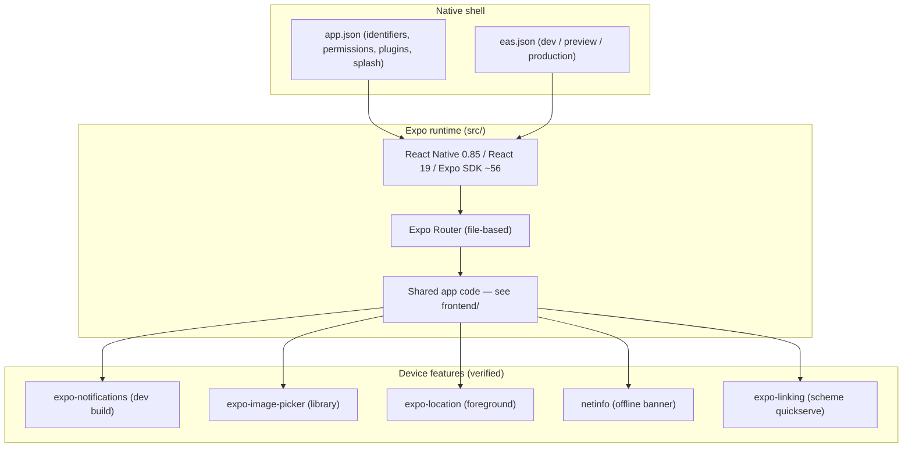
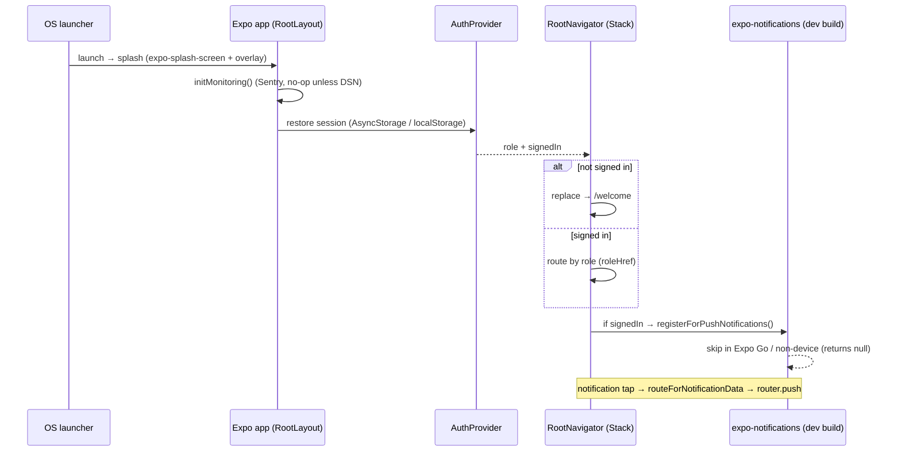

# QuickServe Mobile

## 1. Purpose

The authoritative engineering reference for **QuickServe's native mobile concerns as implemented
in the repository today** — Android/iOS configuration, Expo services, and the device features the
app actually uses. It is the native-platform companion to [frontend/](../frontend/README.md),
which covers the shared UI/navigation/state code; this document does **not** duplicate it.

Every claim cites its source. Features that are **not** implemented (e.g. secure storage,
biometrics, background location, camera capture, offline sync) are marked as such rather than
described.

## 2. Current Mobile Status

| Badge | Meaning |
|---|---|
| **Implemented** | Present in config/code and used by the app. |
| **Partial** | Present but incomplete, placeholder, or dev-build-gated. |
| **Planned** | Referenced but not built. |
| **Deprecated** | Superseded but still present. |
| **Not implemented** | No repository evidence. |

| Area | Status |
|---|---|
| Single Expo codebase → Android + iOS (+ web) | **Implemented** (`app.json`, `package.json`) |
| EAS build profiles (dev / preview / production) | **Implemented** (`eas.json`) |
| Push notifications (dev/EAS build only; Expo Go excluded) | **Partial** (`src/lib/push.ts`) |
| Photo attach via media library | **Implemented** (`expo-image-picker`) |
| Provider foreground location sharing | **Implemented** (`expo-location`) |
| Network monitoring / offline banner | **Implemented** (`@react-native-community/netinfo`) |
| Deep links (custom scheme + notification routing) | **Implemented**; universal links **Partial** (placeholder domain) |
| Splash screen | **Implemented** (`expo-splash-screen` + overlay) |
| Camera capture | **Not implemented** (removed; no camera permission) |
| Secure storage / biometrics | **Not implemented** (no `expo-secure-store` / `expo-local-authentication`) |
| Background location / offline data sync | **Not implemented** |
| Custom font loading | **Not implemented** (system fonts; no `useFonts`) |

## 3. Mobile Architecture

- **One codebase, three targets** — the Expo app (`src/`) builds to **Android**, **iOS**, and
  **web** (react-native-web) from the same source. React 19 / React Native 0.85 / Expo SDK ~56
  (`package.json`).
- **Runtime shell** — `app.json` (`expo` config) defines the native app: identifiers, icons,
  splash, permissions, plugins; `eas.json` defines the build/submit profiles.
- **App composition** — the root layout, providers, navigation, and data layer are the shared
  frontend code documented in [frontend/](../frontend/README.md); this document covers only the
  **native/device** surface below that.

## 4. Native Platforms

Verified from `app.json`:

- **Android** — `package: "ke.co.hiredcorp.kwikserve"`, `versionCode: 1`; adaptive icon
  (foreground/background/monochrome, `backgroundColor #E6F4FE`); `predictiveBackGestureEnabled:
  false`. Builds via EAS: `development`/`preview` → **APK**
  (`eas.json android.buildType: "apk"`), `production` → **AAB** (default).
- **iOS** — `bundleIdentifier: "ke.co.hiredcorp.kwikserve"` (Hired Corp Ltd; same string as the Android `package` by design — Apple App IDs and Android application IDs are separate namespaces), `buildNumber: "1"`; icon
  `./assets/expo.icon`; `associatedDomains: ["applinks:REPLACE_ME.quickserve.app"]` (a
  **placeholder** — see §6). Builds via EAS `production` → **.ipa**; `development` is real-device
  only (`eas.json ios.simulator: false`).
- **Shared version identity** — `expo.version: "1.0.0"`, `runtimeVersion.policy: "appVersion"`;
  `eas.json` `appVersionSource: "local"`, production `autoIncrement: true`. Release/store steps:
  see [releases/](../releases/README.md), `docs/pilot/android-release.md`, `docs/pilot/ios-release.md`.

## 5. Expo Integration

Verified Expo packages in use (`package.json`; wiring in `src/`):

- **expo-router** — file-based navigation (§7); entry `expo-router/entry`.
- **expo-notifications** — push, dynamically imported and guarded (§6).
- **expo-image-picker** — media-library photo attach (§6).
- **expo-location** — provider foreground location (§6).
- **expo-splash-screen** — native splash, configured via the `app.json` plugin (§6).
- **expo-constants** / **expo-device** — environment detection (Expo Go check, EAS `projectId`,
  device name) in `src/lib/push.ts`.
- **expo-linking** — deep-link handling (`src/app/provider/job/[id].tsx`).
- **Supporting UI/system modules** — `expo-image`, `expo-linear-gradient`, `expo-haptics`,
  `expo-symbols`, `expo-glass-effect`, `expo-status-bar`, `expo-system-ui`, `expo-web-browser`.
- **expo-font** — listed as a dependency but the app does **not** call `useFonts`/`loadAsync`
  (see §6, Fonts).
- **Crash reporting** — `@sentry/react-native` via `src/lib/monitoring.ts` (no-op unless
  `EXPO_PUBLIC_SENTRY_DSN` is set; see [operations/](../operations/README.md)).

## 6. Device Features

Only verified usage; absent features explicitly marked.

- **Notifications** — `src/lib/push.ts`. Requests permission, obtains an Expo push token (using
  the EAS `projectId` when present), and registers it with the backend via the `register-device`
  Edge Function. `expo-notifications` is **dynamically imported and skipped in Expo Go**
  (`Constants.appOwnership`/`executionEnvironment`) and on non-devices — **push requires a dev or
  EAS build**, never Expo Go. Tapping a notification deep-links via
  `setupNotificationResponseListener` → `routeForNotificationData` (the payload `route`) →
  `router.push` (`src/app/_layout.tsx`). The function **never throws** (returns `null` on
  denied/unsupported/error).
- **Camera** — **Not implemented.** No camera capture is used and **no camera permission** is
  declared in `app.json` (camera was removed; confirmed by `docs/pilot/ios-release.md` and
  `src/__tests__/ios-permissions.test.ts`).
- **Photo library** — `src/components/ui/photo-upload-button.tsx` uses
  `ImagePicker.requestMediaLibraryPermissionsAsync()` + `launchImageLibraryAsync()`
  (library only). iOS `NSPhotoLibraryUsageDescription` comes from the `expo-image-picker`
  plugin's `photosPermission` in `app.json`.
- **Location** — `src/hooks/use-provider-location-sharing.ts` uses
  `Location.requestForegroundPermissionsAsync()` + `watchPositionAsync` (`Accuracy.Balanced`)
  to share a provider's live location during an active job. **Foreground only** — there is **no
  background location** (`app.json` declares only `locationWhenInUsePermission`).
- **Secure storage** — **Not implemented.** There is no `expo-secure-store`. The Supabase session
  is persisted via `AsyncStorage` on native / `localStorage` on web (`src/lib/supabase.ts`) — not
  the OS secure enclave/keychain.
- **Biometrics** — **Not implemented** (no `expo-local-authentication`).
- **Deep links** — custom scheme **`quickserve`** (`app.json scheme`); notification-tap routing
  as above; `expo-linking` used in `src/app/provider/job/[id].tsx`. **Universal/App Links are
  Partial** — `associatedDomains` is the placeholder `applinks:REPLACE_ME.quickserve.app` and
  must be set before universal links work.
- **Splash screen** — `expo-splash-screen` plugin in `app.json` (`splash-icon.png`, white
  background) plus a branded `AnimatedSplashOverlay` (`src/components/animated-icon.tsx`, no
  Reanimated) rendered at the root.
- **Fonts** — **No custom font loading.** `expo-font` is a dependency but the app uses system
  fonts via `src/constants/theme.ts` `Fonts` (`Platform.select` — `system-ui`/`ui-rounded` on
  native; `--font-*` CSS variables on web from `src/global.css`); there is no `useFonts` call.
- **Network monitoring** — `@react-native-community/netinfo` via `src/lib/net.ts` (connectivity
  state + `isTransient`/`withRetry` read-retry helper) drives the `OfflineBanner`
  (`src/components/ui/offline-banner.tsx`).

## 7. Mobile Navigation

Navigation is the shared Expo Router implementation documented in
[frontend/](../frontend/README.md) §5 — summarised here for the native surface:

- **Root** — an Expo Router `Stack` (`headerShown: false`, `src/app/_layout.tsx`).
- **Customer** — a custom `AppTabs` tab bar (`src/app/(customer)/_layout.tsx`).
- **Provider** — **`NativeTabs`** (`expo-router/unstable-native-tabs`): My Jobs, Notifications,
  My Profile (`src/app/provider/(tabs)/_layout.tsx`).
- **Platform variants** — `.web.tsx` files provide web-specific implementations
  (e.g. `app-tabs.web.tsx`); native uses the base `.tsx`.

## 8. Mobile Constraints

- **Push needs a real build** — `expo-notifications` is skipped in Expo Go and on simulators;
  verify push only on a dev/EAS build on a physical device (`docs/pilot/*-release.md`).
- **Placeholders block first build** — `app.json` `extra.eas.projectId` is empty and
  `associatedDomains` is `REPLACE_ME`; both must be set before EAS builds / universal links work
  (see [releases/](../releases/README.md) §8).
- **No offline data layer** — network handling is limited to a connectivity banner and idempotent
  **read** retries (`withRetry` — reads only, never mutations); there is **no offline queue or
  sync**.
- **Foreground-only location; no background tracking.**
- **No secure enclave / biometrics** — sessions live in AsyncStorage, not the keychain.
- **Native journeys are not certified** — automated certification covers the backend spine only;
  native Android/iOS flows are untested (see [qa/](../qa/README.md) §10).

## 9. Relationship to Frontend

The mobile apps and the web surface are the **same Expo codebase**. Shared architecture —
provider composition, routing, React Context state (Auth/Services/BookingDraft), the
`StyleSheet` + `constants/theme.ts` styling system, and the `src/lib/*` → `supabase-js` data
layer — is documented once in [frontend/](../frontend/README.md) and is **not repeated here**.
This document adds only the native/device specifics (§4–§6). As on web, the client is **not** the
security boundary; RLS enforces access server-side.

## 10. Related Documentation

- [Architecture](../architecture/README.md) · [Backend](../backend/README.md) ·
  [Database](../database/README.md) · [API](../api/README.md) ·
  [Authentication](../authentication/README.md) · [Security](../security/README.md) ·
  [Deployment](../deployment/README.md) · [Operations](../operations/README.md) ·
  [QA](../qa/README.md) · [Releases](../releases/README.md) · [Frontend](../frontend/README.md)
- Engineering index: [../README.md](../README.md)
- Store/release checklists: `../../pilot/android-release.md`, `../../pilot/ios-release.md`

---

### Mobile startup flow

*Verified against:* `app.json`, `eas.json`, `package.json`, `src/app/_layout.tsx`,
`src/lib/push.ts`, `src/lib/net.ts`, `src/lib/supabase.ts`, `src/lib/monitoring.ts`,
`src/hooks/use-provider-location-sharing.ts`, `src/components/ui/photo-upload-button.tsx`,
`src/components/ui/offline-banner.tsx`, `src/components/animated-icon.tsx`,
`src/constants/theme.ts`, `src/app/provider/(tabs)/_layout.tsx`, `src/app/provider/job/[id].tsx`,
`src/__tests__/ios-permissions.test.ts`, and `docs/pilot/android-release.md` /
`docs/pilot/ios-release.md`.
