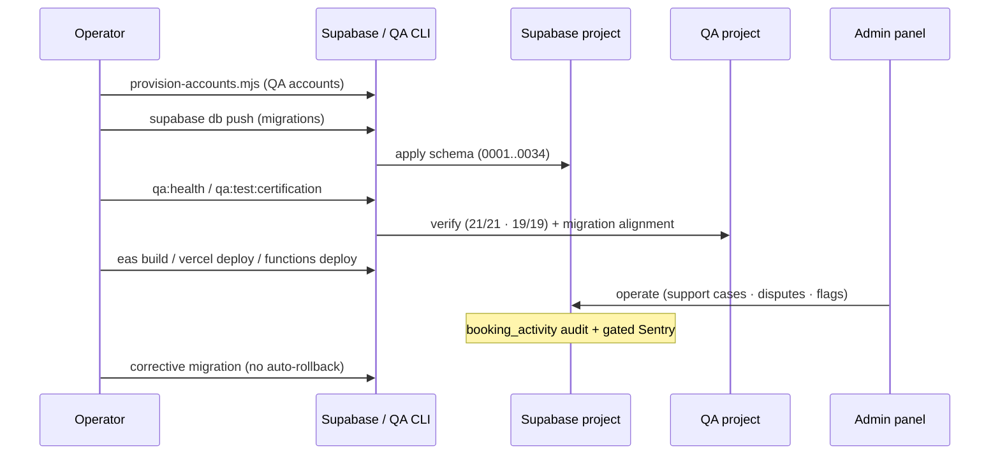

# QuickServe Operations

## 1. Purpose

The authoritative operations engineering reference for QuickServe, describing **only the
operational capabilities that exist in the repository today** — provisioning, health
verification, logging/audit, error handling, and the admin operations tooling — each
traceable to source. Where an operational practice (monitoring, alerting, backups, incident
response, on-call, SRE) is not implemented or documented, it is marked **Not verified** /
**Not documented** rather than invented.

Deploy mechanics are in [deployment/](../deployment/README.md); release records in
[releases/](../releases/README.md); the security posture in [security/](../security/README.md).

## 2. Current Operational Status

| Badge | Meaning |
|---|---|
| **Implemented** | Present in code/scripts/SQL. |
| **Partial** | Present but incomplete / off by default. |
| **Planned** | Referenced but not built. |
| **QA-only** | Certification/test infrastructure. |
| **Not verified** | The repository does not prove this exists. |

**Summary:** provisioning (QA accounts + schema migrations), **health verification** scripts
(QA/dev), an in-app **admin operations portal** (support/disputes/flags), DB **audit**
(`booking_activity`), and **gated crash reporting** (Sentry) are **Implemented/Partial**.
Continuous production monitoring, alerting/dashboards, backup/recovery procedures, incident
response, and on-call are **Not documented / Not verified** in the repository.

## 3. Operational Architecture

QuickServe runs on managed platforms (Supabase + Vercel + EAS builds), so operations is
mostly **platform-managed plus repository-supported scripts and in-app admin tooling**:

- **Operators** run CLI utilities (provisioning, migrations, health/certification) and use the
  **admin web panel** for runtime operational actions.
- **Supabase** hosts the database/Auth/Storage/Realtime/Edge Functions and provides
  platform-level logs (not configured in-repo).
- **Clients** optionally report crashes to **Sentry** (off unless a DSN is set).

```mermaid
flowchart TD
    OP["Operator (CLI)"] -->|db push / functions deploy| SUP["Supabase project"]
    OP -->|provision-accounts.mjs| SUP
    OP -->|qa:health / certification / migration list| QA["QA verification (dedicated QA project)"]
    ADM["Admin (web panel)"] -->|ops portal RPCs (0026)| SUP
    APP["Mobile / web clients"] -->|anon key + RLS| SUP
    APP -.->|crash reports (if DSN set)| SEN["Sentry (gated)"]
    SUP --> EF["Edge Functions"] --> EXT["Daraja · Expo Push · Google"]
    SUP -.->|platform logs / backups| PLAT["Supabase platform (not configured in-repo)"]
```

## 4. Runtime Responsibilities

- **Mobile application** — authenticates via the anon key; persists/refreshes sessions;
  registers a push token (`register-device`); reports crashes to Sentry **only if**
  `EXPO_PUBLIC_SENTRY_DSN` is set (`src/lib/monitoring.ts`).
- **Web application** — the Vercel-served Expo web build; hosts the **admin operations panel**
  (`src/app/(admin-web)/operations/*`) for runtime operational actions.
- **Supabase** — enforces access (RLS), runs triggers/RPCs, stores data/objects, and serves
  Realtime; provides platform logs/backups (platform-managed, not configured in-repo).
- **Edge Functions** — payments (`mpesa-stk-push`/`mpesa-callback`), push (`send-push`),
  device registration, and maps; secret-gated where webhook-style; the push path has a
  **kill-switch** (`send_push_url` NULL in `private.push_config`, `supabase/migrations/0015`).
- **Database** — the source of truth; enforces integrity + writes the `booking_activity` audit
  trail (`supabase/migrations/0007`, `0020`).
- **Storage** — the private `booking-photos` bucket (`supabase/migrations/0006`, `0016`).
- **External integrations** — M-Pesa Daraja, Expo Push, Google Places/Maps (reached from Edge
  Functions).

## 5. Operational Processes

Verified, repository-supported activities only:

- **Schema deployment** — apply migrations via `supabase db push`; verify alignment with
  `supabase migration list` (see [deployment/](../deployment/README.md), [database/](../database/README.md)).
- **Account provisioning** — `qa/scripts/provision-accounts.mjs` (QA accounts; §6).
- **Health / certification runs** — `npm run qa:health`, `qa:test:certification`,
  `qa:test:stability` (`qa/package.json`); the root `qa:release` gate.
- **Admin operational actions (in-app)** — support cases, disputes, account flags, and internal
  notes via the operations portal RPCs (`supabase/migrations/0026_operations_portal.sql`:
  `create_support_case`, `add_support_case_note`, `assign_support_case`,
  `update_support_case_status/priority`, `set_dispute_outcome`, `flag_account`,
  `lift_account_flag`, `add_internal_note`); documented in `docs/pilot/operations-portal.md`.
- **Edge Function operations** — deploy via the Supabase CLI, set secrets
  (`supabase secrets set ...`), and use the push kill-switch; reference `docs/pilot/edge-function-health.md`.
- **Deterministic QA cleanup** — certification teardown deletes created rows + sweeps by marker
  (`qa/docs/LAUNCH-CERTIFICATION.md`).

**Not documented / Not verified:** automated backups, restore drills, incident response,
on-call, scheduled maintenance jobs.

## 6. Provisioning

- **QA accounts** — `qa/scripts/provision-accounts.mjs` (idempotent, service-role) creates the
  four persistent QA accounts (customer, admin, provider1, provider2) with correct
  role/approval in a **dedicated QA project**; guarded against production
  (`assertNotProduction`, `qa/playwright/support/connected/qa-accounts.ts`). It auto-loads
  `qa/.env` (`qa/scripts/lib/load-env.mjs`).
- **Schema** — provisioned by migrations via `supabase db push` (`0001`–`0034`).
- **Admin accounts** — created manually in Supabase (never self-registrable; `handle_new_user`
  downgrades attempted admin signups, `supabase/migrations/0001_profiles.sql`).
- No production end-user provisioning automation exists beyond normal app signup.

## 7. Health Monitoring

Distinguish **automated health verification** (implemented) from **continuous monitoring**
(largely not in-repo):

- **Health verification (Implemented, QA/dev):**
  - `qa:health` — framework + infra self-tests (`qa/playwright/tests/`, 19).
  - `qa:test:certification` — connected backend certification (21) against the QA project.
  - `supabase migration list` — local↔remote migration alignment.
  - `qa:release` — Jest + `tsc` + Expo web/android exports as a pre-release gate.
  - Backend-reachability smoke exists in the certification suite (`backend-smoke.spec.ts`).
- **Continuous monitoring (Partial / Not verified):**
  - **Sentry** crash reporting is integrated (`src/lib/monitoring.ts`) but **off unless
    `EXPO_PUBLIC_SENTRY_DSN` is set** (`tracesSampleRate: 0`); by default no external errors are
    sent (consistent with `docs/pilot/crash-logging.md`).
  - `docs/pilot/pilot-monitoring.md` is **operator guidance** (what to watch, escalation) — not
    an automated monitoring system.
  - **No automated alerting, dashboards, uptime checks, or SLOs are configured in the repository
    — Not verified.**

## 8. Logging and Audit

- **Database audit** — `booking_activity` records booking creation/status changes via triggers
  (`supabase/migrations/0007`, `0020`); ordering is certified
  (`qa/playwright/certification/golden-path.spec.ts`). **Implemented / Certified.**
- **Operational audit (admin)** — the operations portal records `support_case_events`,
  `internal_notes`, and `account_flags` (`supabase/migrations/0026`). **Implemented.**
- **Crash logs** — Sentry when a DSN is configured, else local `console` only
  (`src/lib/monitoring.ts`). **Partial (gated).**
- **Edge Function logs** — functions return/`console` errors; captured by Supabase platform
  logging (not configured in-repo).
- **Platform logs** — Supabase provides Auth/Postgres/Edge logs (platform-managed). **Not
  configured in-repo.**
- **Not present in-repo:** centralized logging, SIEM, log retention policy — **Not verified**.

## 9. Error Handling

- **App data wrappers** return safe results rather than throwing (e.g. `createBooking` maps any
  insert error — including the dedup 409 — to a generic message, `src/lib/bookings.ts`).
- **Auth errors** are mapped to friendly copy (`src/lib/auth-errors.ts`).
- **Monitoring hook** — `reportError`/`captureException` never throws (`src/lib/monitoring.ts`).
- **Graceful degradation** — analytics/backend wrappers convert backend errors into safe
  defaults (documented in the QA slices); UI keeps rendering.
- **Edge Functions** — validate input/secrets and return HTTP errors (401 on bad webhook
  secret); the push path is disabled when its config is unset (kill-switch).

## 10. Maintenance Activities

Repository-supported maintenance only:

- **Corrective migrations** — schema/policy fixes ship as new forward migrations
  (e.g. RC1 `0033`/`0034`); there is **no automated rollback** (see [deployment/](../deployment/README.md) §14).
- **QA data hygiene** — certification cleans up its own rows (per-test + marker sweep); the
  fixed provisioning-baseline notifications are documented and intentionally left
  (`qa/docs/LAUNCH-CERTIFICATION.md`).
- **Stability runs** — `qa/scripts/stability.mjs` (repeat cycles) for infra changes.
- **Dev scaffolding reset** — `scripts/reset-project.js` is a **one-time developer** utility
  (resets `src/` to a blank app); it is **not** an operational/production tool.
- **Not documented:** scheduled maintenance windows, data-retention/cleanup jobs in production,
  key rotation.

## 11. Operational Dependencies

- **Supabase project** (Auth/DB/Storage/Realtime/Edge) — the core runtime.
- **Supabase CLI** — migrations + Edge Function deploys.
- **Vercel** — web hosting; **EAS** — mobile builds.
- **External services** — M-Pesa Daraja, Expo Push, Google Places/Maps (per-environment config).
- **Environment variables/secrets** — client `EXPO_PUBLIC_*`, server/edge secrets, QA `QA_*`
  (see [security/](../security/README.md) §9; names in `.env.example`, `qa/.env.example`).
- **Optional:** Sentry (crash reporting when DSN set).

## 12. Operational Risks

Verified risks only:

- **No continuous monitoring/alerting in-repo** — crash reporting is off unless a DSN is set;
  no dashboards/SLOs are configured (**Not verified**).
- **No automated backup/restore procedure in-repo** — reliance on Supabase platform backups,
  undocumented here (**Not documented**).
- **No automated rollback** — recovery from a bad migration requires a corrective migration.
- **Manual, CLI-driven operations** — provisioning, deploys, and health runs are operator-driven
  (no CI/CD), so correctness depends on operator discipline.
- **Uncertified external paths** — M-Pesa settlement, push delivery, storage, maps are not
  E2E-certified; their operational behavior is unproven in-repo.

## 13. Operational Constraints

- Operations are **manual / CLI + admin-panel driven**; there is **no orchestration or
  automation layer** (no CI/CD, no scheduled jobs) in the repository.
- The **service-role** key is used only server-side/QA (never client) — operational scripts that
  need it (provisioning) run outside the app.
- The **QA environment is separate** from production and must never be conflated
  (`assertNotProduction`).
- Production operational tooling beyond the admin panel + CLI scripts is **not present in the
  repository**.

## 14. QA Operational Relationship

Operations relies on the QA program for pre-release verification without duplicating it:

- **`qa:release`** (root) chains Jest + `tsc` + Expo exports + the multi-browser QA suite.
- **Connected certification** (21/21) proves the backend spine against the dedicated QA project;
  **health** (19/19) verifies the framework/infra.
- **Deterministic cleanup** keeps the QA project clean across runs.
- The QA workspace is isolated from the shipped build and never ships.

Details in [qa/](../qa/README.md) and `qa/docs/LAUNCH-CERTIFICATION.md`.

## 15. Related Documentation

- [Architecture](../architecture/README.md) · [Backend](../backend/README.md) ·
  [Database](../database/README.md) · [API](../api/README.md) ·
  [Authentication](../authentication/README.md) · [Security](../security/README.md) ·
  [Deployment](../deployment/README.md) · [QA](../qa/README.md) · [Releases](../releases/README.md)
- Engineering index: [../README.md](../README.md)
- Operator guides (existing): [../../pilot/](../../pilot/) — `pilot-monitoring.md`,
  `crash-logging.md`, `edge-function-health.md`, `operations-portal.md`, `backend-readiness.md`,
  `production-readiness.md`, `environment-secrets.md`

---

### Operational lifecycle



*Verified against:* `package.json`, `qa/package.json`, `qa/scripts/provision-accounts.mjs`,
`qa/scripts/stability.mjs`, `src/lib/monitoring.ts`, `supabase/migrations/0007`, `0015`,
`0020`, `0026`, `supabase/functions/`, `qa/docs/LAUNCH-CERTIFICATION.md`, and `docs/pilot/`.
