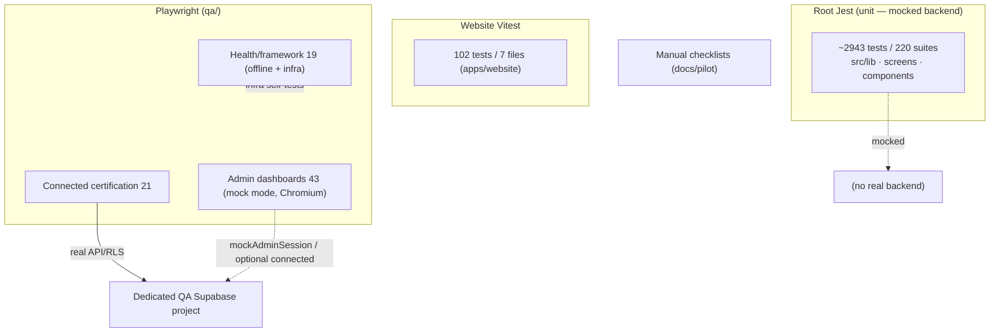
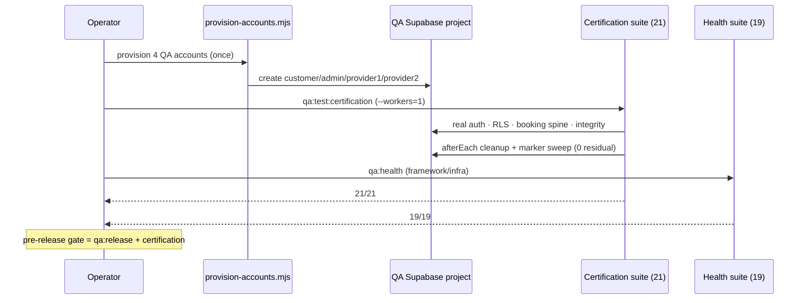

# QuickServe QA & Testing

## 1. Purpose

The authoritative QA/testing engineering reference for QuickServe. It describes the testing
systems that **exist in the repository today**, exactly what they cover, and — per the
completed **Full Platform Testing Audit** — what remains **untested**. It is deliberately
precise about the difference between **mocked unit tests**, **connected certification**, and
**not tested**.

**Scope discipline (do not misread):** mocked unit tests are **not** connected tests; unit
tests are **not** end-to-end tests; and **the platform is not fully tested**. The authoritative
QA workspace docs are `qa/docs/ARCHITECTURE.md`, `qa/docs/FLAKES.md`, and
`qa/docs/LAUNCH-CERTIFICATION.md`; this file is the engineering index into them.

## 2. Current QA Status

| Label | Meaning |
|---|---|
| **Certified** | Proven by the connected QA certification suite against the real QA backend. |
| **Tested but not certified** | Covered by mocked unit tests only (no real backend). |
| **Partially tested** | Some coverage; gated/incomplete. |
| **Test exists but not connected** | E2E test present but runs in mock mode by default. |
| **Manual evidence only** | Covered by an operator checklist, not automation. |
| **Not tested** | No automated coverage. |
| **Planned / not implemented** | Reserved; not built. |

**Summary:** the booking/dispatch backend spine is **Certified** (21/21 connected); the app's
business logic is broadly **Tested but not certified** (2943 mocked Jest tests); the admin
analytics dashboards are **Test exists but not connected**; payments, push delivery, storage,
chat, tracking, maps, native mobile, performance, security, accessibility, offline, and
cross-browser are **Not tested** (automation).

## 3. Testing Architecture

Three independent test systems plus manual checklists:

- **Root Jest** (`jest.config.js`, jest-expo) — **unit tests with a mocked backend** (Supabase,
  AsyncStorage, and the services provider are `jest.mock`-ed; `test/setup.ts`,
  `test/mock-services.ts`). Excludes `/qa/` and `/apps/website/`.
- **Website Vitest** (`apps/website/`) — unit/render tests (runner: **Vitest**, not Jest) for
  the **separate** Next.js marketing site.
- **Playwright** (`qa/playwright.config.ts`, isolated `qa/` workspace) — offline health/framework
  tests, mock-mode admin E2E, and **connected certification** against a dedicated QA Supabase
  project.
- **Manual checklists** — operator/pilot guides under `docs/pilot/` (Manual evidence only).

## 4. Testing Layers

- **Mocked unit testing** — `jest` (root). ~**2943 tests / 220 suites**; **44/45** `src/lib`
  modules have a `.test.ts` (only `supabase.ts` lacks one). Proves logic in isolation with a
  **mocked** Supabase; **does not** exercise the real backend or RLS.
- **Connected backend certification** — `qa/playwright/certification/` (**21** tests) drives the
  **real** QA backend over PostgREST/Auth and asserts persistence, RLS, dispatch, provider
  progression, the golden path, and integrity.
- **Playwright (mock/E2E)** — admin dashboards (`qa/playwright/admin/`, **43**: auth 6,
  executive 15, detailed 22) run mock-mode (Chromium-only) with optional connected mode.
- **Website tests** — `apps/website/__tests__/` run on **Vitest** (**102 tests across 7 files**
  observed in Phase 1A; the historical figure was 30): components, content, home, lib, pages,
  seo, smoke. Separate from the QuickServe app.
- **Health verification** — `qa/playwright/tests/` (**19**: framework 13, infra-health 3,
  provisioning-env 2, smoke 1).
- **Manual testing** — pilot checklists (`docs/pilot/`), e.g. backend-readiness, monitoring,
  release readiness — **Manual evidence only**.

## 5. Certification Program

Authoritative detail in `qa/docs/LAUNCH-CERTIFICATION.md`.

- **Connected certification — 21 tests** (`qa/playwright/certification/`): backend-smoke 4,
  customer-booking 2, admin-dispatch 4, provider-progression 5, golden-path 1, integrity 5.
- **Health — 19 tests** (`qa/playwright/tests/`): framework 13, infra-health 3,
  provisioning-env 2, smoke 1.
- **Four persistent QA accounts** — customer, admin, provider1, provider2, provisioned once by
  `qa/scripts/provision-accounts.mjs` into a **dedicated QA project** (guarded by
  `assertNotProduction`, `qa/playwright/support/connected/qa-accounts.ts`).
- **Deterministic cleanup** — each certification test deletes what it creates (cascade) and
  sweeps by marker; verified zero residual (the fixed 2-row provisioning-baseline notifications
  are documented and intentionally left).
- **Execution** — certification runs **serially** (`--workers=1`) to avoid a Supabase Auth
  rate-limit flake (see `qa/docs/FLAKES.md`); current result **21/21** + **19/19**.

## 6. Coverage Matrix

Summary of the current state (from the Full Platform Testing Audit — not overstated):

| Area | Status |
|---|---|
| Customer/anon auth (4 roles) + RLS isolation | **Certified** |
| Customer booking create + persistence | **Certified** |
| Admin dispatch (assign/reassign/accept/reject/status) | **Certified** |
| Provider progression + RLS negatives + terminal states | **Certified** |
| End-to-end golden path + audit ordering + notification RLS | **Certified** |
| Duplicate-booking (409, `0033`), concurrency, insert atomicity | **Certified** |
| App business logic (`src/lib` ×44) + screens/components | **Tested but not certified** (mocked) |
| Admin analytics dashboards (executive/detailed) | **Test exists but not connected** |
| Admin auth backend tests (invalid creds / valid login) | **Partially tested** (backend-gated) |
| M-Pesa settlement, push delivery, storage E2E, chat, tracking, maps | **Not tested** |
| Native Android / native iOS journeys | **Not tested** |
| Performance/load, security/pen-test, accessibility, offline, cross-browser, deploy smoke | **Not tested** |
| Website (marketing) | Tested but not certified (separate app) |
| Maestro native harness | **Planned / not implemented** (`qa/maestro/` placeholder) |

## 7. Test Infrastructure

- **Isolated `qa/` workspace** — own `package.json`/`node_modules`; excluded from the app build
  (`jest.config.js` `testPathIgnorePatterns` includes `/qa/`; Metro/tsc exclusions) so it never
  ships.
- **Shared QA primitives** — `qa/playwright/support/` (rpc-interceptor, validate-rpc-shape,
  connected-mode, rn-web, download, mock-admin-session, network guard). Page Object Model under
  `qa/playwright/pages/`.
- **Connected client** — `qa/playwright/support/connected/` (`qa-client.ts`, `qa-accounts.ts`,
  `qa-bookings.ts`) drives the QA backend via PostgREST/Auth; service-role used **only** for
  teardown/provisioning.
- **Policies** — architecture and gates in `qa/docs/ARCHITECTURE.md`; flake handling in
  `qa/docs/FLAKES.md`.

## 8. QA Environments

- **Dedicated QA/staging Supabase project** — a **separate** project via the `QA_*` env
  namespace (`qa/.env`, git-ignored); `assertNotProduction()` refuses to run if it matches the
  app's production host. **Never production.**
- **Local/offline** — mocked Jest and mock-mode Playwright require no backend.
- **Optional connected mode** — the admin suites accept `QA_DASHBOARD_CONNECTED=1` + `E2E_ADMIN_*`
  for a real-login confirmation.

## 9. Release Gates

Defined in `qa/docs/ARCHITECTURE.md`; scripts in `package.json` / `qa/package.json`:

- **Feature merge** — Chromium single run of the changed suite + `qa:typecheck`.
- **QA-infra change** — stability cycle (`qa:test:stability`) + `qa:health` + full app gate.
- **Pre-release** — `qa:release` (Jest + `tsc` + Expo web/android exports + multi-browser QA) +
  connected certification.
- **Connected confirmation** — `qa:test:connected` (advisory).

## 10. Known Testing Gaps

Reflecting the Full Platform Testing Audit (severity per that audit):

- **P0:** M-Pesa payment E2E (settlement/callback) uncertified; native mobile journeys
  uncertified; no penetration/security test of ops & payment-override authorization.
- **P1:** customer/provider signup connected E2E; storage upload/download; push delivery; admin
  operations/payment-override connected coverage; offline/error-recovery; deployment smoke.
- **P2:** search/filter, chat, tracking, maps, reviews, wallet/promos connected E2E; analytics
  **connected** confirmation; cross-browser stabilization.
- **P3:** performance/load baselines, accessibility automation, website coverage integration.

There is **no** native (Maestro/Detox/Appium) harness, and **no** performance, load, security,
accessibility, offline, or deployment-smoke tooling in the repository.

## 11. Full Platform Certification (standard — not yet achieved)

The Full Platform Testing Audit defines the standard for saying "the whole QuickServe platform
has been fully tested for pilot release": web admin + Android (customer & provider, real device)
+ iOS smoke; every P0/P1 journey Certified end-to-end (connected); M-Pesa sandbox settlement,
push delivery, and storage proven; connected certification + native Maestro green; real-device
evidence; zero P0 (payment loss, auth/RLS bypass, cancellation override, data loss); documented
P2/P3 known issues; a full regression re-run; and a sign-off report.

**This standard has NOT been achieved.** Only the backend spine is currently Certified; native,
payments, and the other areas in §10 remain outstanding. **Full production readiness cannot be
claimed from repository tests alone** (real settlement, real push, real devices, and
load/security require live/manual verification).

## 12. Related Documentation

- [Architecture](../architecture/README.md) · [Backend](../backend/README.md) ·
  [Database](../database/README.md) · [API](../api/README.md) ·
  [Authentication](../authentication/README.md) · [Security](../security/README.md) ·
  [Deployment](../deployment/README.md) · [Operations](../operations/README.md) ·
  [Releases](../releases/README.md)
- Engineering index: [../README.md](../README.md)
- QA workspace (authoritative): `../../../qa/docs/ARCHITECTURE.md`,
  `../../../qa/docs/FLAKES.md`, `../../../qa/docs/LAUNCH-CERTIFICATION.md`

---

### Certification workflow

*Verified against:* `jest.config.js`, `package.json`, `qa/package.json`, `qa/playwright.config.ts`,
`qa/playwright/certification/`, `qa/playwright/tests/`, `qa/playwright/admin/`,
`qa/scripts/provision-accounts.mjs`, `qa/docs/`, and the Full Platform Testing Audit.
