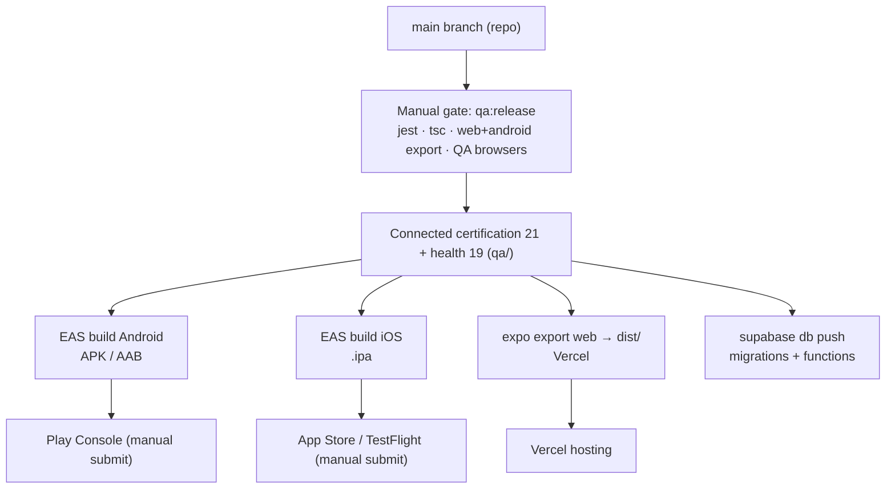

# QuickServe Releases

## 1. Purpose

The authoritative engineering reference for **how QuickServe is released, as evidenced by the
repository today**. It describes the build artifacts, the manual release sequence, the one
verified pre-release gate (`qa:release`), and how versions are managed — and it is explicit
about what does **not** exist: there is **no CI/CD, no automated release pipeline, no automated
rollback, and no git-tag/semantic-version practice** in this repository.

Deployment mechanics are covered in [deployment/](../deployment/README.md); testing/gates in
[qa/](../qa/README.md); operational runbooks in [operations/](../operations/README.md). This
document does not duplicate them — it describes the release process that ties them together.

## 2. Current Release Status

| Badge | Meaning |
|---|---|
| **Implemented** | Present in repository config/scripts and runnable as described. |
| **Partial** | Present but incomplete or not certified end-to-end. |
| **Planned** | Referenced but not built. |
| **Manual** | Performed by an operator by hand (no automation). |
| **Not documented** | No repository evidence. |

| Area | Status |
|---|---|
| EAS build profiles (Android/iOS) | **Implemented** (`eas.json`) |
| Web static export + Vercel config | **Implemented** (`vercel.json`, `app.json web.output=static`) |
| Backend release via Supabase CLI (migrations + functions) | **Implemented** (`supabase/`) |
| `qa:release` pre-release gate | **Implemented**, run **Manual**ly (`package.json`) |
| Connected certification + health gate | **Implemented** (`qa/`) — booking spine only |
| CI/CD release pipeline | **Not documented** (no `.github/`, no CI config) |
| Automated rollback | **Not documented** (forward-only migrations) |
| Git tags / semantic-version releases / changelog | **Not documented** (0 tags; no changelog file) |
| App-store submission (Play / App Store) | **Manual** (operator checklists in `docs/pilot/`) |

## 3. Release Architecture

QuickServe releases are **manual and CLI-driven**. There is **no continuous
delivery** — every build and deploy is initiated by an operator. Four release surfaces:

- **Android / iOS** — built by **EAS Build** using the profiles in `eas.json`
  (`development`, `preview`, `production`).
- **Web (admin panel)** — a static SPA produced by `expo export --platform web` → `dist/`,
  hosted on **Vercel** (`vercel.json`).
- **Backend** — a single **Supabase** project updated via the **Supabase CLI** (migrations +
  Edge Functions). See [deployment/](../deployment/README.md).
- **Quality gate** — `qa:release` (`package.json`) plus the connected certification/health
  suites (`qa/`), run by hand before a release.



## 4. Release Artifacts

Verified outputs per surface:

- **Android** — EAS Build. `development`/`preview` profiles emit an **APK**
  (`eas.json android.buildType: "apk"`); `production` emits an **AAB** (default) for the Play
  Store. Channels: `development` / `preview` / `production`. Operator steps:
  `docs/pilot/android-release.md`.
- **iOS** — EAS Build. `production` emits an **.ipa** for TestFlight / App Store; `development`
  is real-device only (`ios.simulator: false`). Operator steps: `docs/pilot/ios-release.md`.
- **Web** — `npx expo export --platform web` → **`dist/`** static SPA (`app.json`
  `web.output: "static"`), deployed via Vercel (`vercel.json`: `buildCommand`,
  `outputDirectory: dist`, SPA `rewrites`). Operator steps: `docs/pilot/web-admin-deploy.md`.
- **Backend** — SQL **migrations** (`supabase/migrations/0001`–`0034`) and **Edge Functions**
  (`supabase/functions/`) applied with the Supabase CLI. Not a bundled artifact; applied to the
  Supabase project directly.

## 5. Release Process

The verified end-to-end sequence (manual; no automation orchestrates it):

1. **Land changes on `main`** — feature/`docs` branches are merged to `main` with `--no-ff`
   "Slice" merges (git history). `main` is the release source.
2. **Run the pre-release gate** — `npm run qa:release` (§6) locally/by hand.
3. **Run connected certification + health** — `npm --prefix qa run qa:test:certification` and
   `qa:health` against the dedicated QA project (see [qa/](../qa/README.md)).
4. **Apply backend changes** — `supabase db push` (migrations) and deploy Edge Functions;
   verify **migration alignment** (§6) with `supabase migration list`.
5. **Build/deploy the surfaces** — EAS builds for Android/iOS; `expo export --platform web` →
   Vercel for the admin panel.
6. **Submit (mobile) / publish (web)** — manual Play Console / App Store submission per the
   `docs/pilot/*-release.md` checklists; Vercel serves the web export.

There is **no release-automation script** beyond `qa:release`; steps 4–6 are operator actions.

## 6. Release Gates

Only these gates are evidenced in the repository — no others are claimed:

- **`qa:release`** (`package.json`) — the single scripted pre-release gate. It runs, in order:
  `jest && tsc --noEmit && expo export --platform web && expo export --platform android &&
  npm --prefix qa run qa:test:all-browsers`. This chains **unit tests (mocked)**, a
  **TypeScript type-check**, **build verification** of the web and Android exports, and the
  **Playwright QA browsers** suite. It is run **manually** — nothing enforces it.
- **Connected certification + health** — `qa:test:certification` (**21** connected tests) and
  `qa:health` (**19**), run against the dedicated QA Supabase project. Authoritative in
  [qa/](../qa/README.md); the booking spine is the certified scope.
- **Build verification** — the `expo export` steps inside `qa:release` fail the gate if the web
  or Android bundle does not build.
- **Migration alignment** — established in the Release Candidate work: migrations are
  sequential/forward-only and local↔remote alignment is verified with `supabase migration list`
  (see [deployment/](../deployment/README.md) §13). Not part of the `qa:release` script; a
  manual backend step.

No approval workflow, no CI enforcement, and no additional gates exist in the repository.

## 7. Version Management

Repository-supported version handling only:

- **App version** — `app.json` `expo.version = "1.0.0"`; `runtimeVersion.policy = "appVersion"`.
- **Platform build numbers** — Android `versionCode: 1`, iOS `buildNumber: "1"` (`app.json`).
- **Auto-increment** — `eas.json` `production` profile sets `autoIncrement: true`, so EAS bumps
  the platform build number on production builds; `appVersionSource: "local"` (version is read
  from the repo, not remote).
- **Package version** — `package.json` `version: "1.0.0"`; `qa/package.json` `version: "0.1.0"`.

**Not present:** there are **no git tags** (0 tags), **no changelog file**, and **no
semantic-version release tagging** practice in the repository. Release identity is carried by
`main`'s git history (the `--no-ff` Slice merges) and the `app.json` version/build numbers —
not by tags or a release registry.

## 8. Release Risks

Verified risks from repository state (no speculation):

- **No CI/CD** — the `qa:release` gate is manual and unenforced; a release can be cut without
  running it (`.github/` absent).
- **Placeholder identifiers must be set before first build** — `app.json` `extra.eas.projectId`
  is empty, `ios.associatedDomains` contains `REPLACE_ME.quickserve.app`, and the Sentry plugin
  `organization`/`project` are empty. Builds/push/deep-links depend on these being filled
  (`docs/pilot/android-release.md`, `ios-release.md`).
- **Payments default to mock** — `MPESA_MODE` defaults to `mock`; real settlement requires
  `sandbox`/`live` config and is **not certified** (see [qa/](../qa/README.md) §10).
- **Backend Release Candidate is frozen with known open items** — RC1 fixed B2 (`0033`) and F4
  (`0034`); F3 (provider forward-skip, P2) and last-write-wins concurrency on booking mutations
  (no optimistic lock) remain open (`qa/docs/LAUNCH-CERTIFICATION.md`).
- **Certification scope is narrow** — passing gates certifies the booking spine only; native,
  payments, storage, push, and more are untested (§11).

## 9. Rollback

Verified rollback capability, by surface:

- **Code (app / docs / config):** `git revert` on `main` — the repository's normal branch
  workflow (see [deployment/](../deployment/README.md) §14).
- **Web (admin panel):** Vercel retains previous deployments; an operator can promote a prior
  build or unpublish the site (`docs/pilot/web-admin-deploy.md`, `web-admin-release.md`).
- **Database:** migrations are **forward-only** — there is **no automated rollback**. A rollback
  requires a **corrective forward migration**. Some slice docs include per-task rollback notes.
- **Overall automated rollback procedure:** **Not documented.** No repository-wide, automated
  rollback pipeline exists.

## 10. Release Constraints

- **Manual, operator-driven** — no automation orchestrates a release end to end.
- **Single backend project** — releases target one Supabase project; QA/certification uses a
  **separate, dedicated** QA project (never production; see [qa/](../qa/README.md) §8).
- **Forward-only migrations** — schema changes are additive/sequential; no destructive rollback.
- **Secrets never in the client bundle** — only `EXPO_PUBLIC_*` (anon) values are baked into the
  web export; service-role keys are server/QA-only (`docs/pilot/web-admin-deploy.md`).
- **Store submission is external** — Play Console / App Store review are out-of-repo manual
  steps gated by the `docs/pilot/*-release.md` checklists.

## 11. Relationship to QA

Release gating depends on QA, but the two are **not equivalent**. Full QA detail — mocked vs.
connected, coverage, and gaps — is authoritative in [qa/](../qa/README.md) and is not duplicated
here.

**Passing the current release gate (`qa:release` + connected certification/health) is NOT
equivalent to achieving Full Platform Certification.** The gate proves mocked unit tests, a
type-check, successful web/Android **builds**, the QA-browser suite, and the **connected booking
spine** (21/21). It does **not** prove payments settlement, push delivery, storage, native
Android/iOS journeys, performance, security, or accessibility — all of which remain **Not
tested**. Full Platform Certification, as defined in [qa/](../qa/README.md) §11, **has not been
achieved**, and a green release gate must not be reported as Full Platform Certification.

## 12. Related Documentation

- [Architecture](../architecture/README.md) · [Backend](../backend/README.md) ·
  [Database](../database/README.md) · [API](../api/README.md) ·
  [Authentication](../authentication/README.md) · [Security](../security/README.md) ·
  [Deployment](../deployment/README.md) · [Operations](../operations/README.md) ·
  [QA](../qa/README.md)
- [Frontend](../frontend/README.md) (placeholder) · [Mobile](../mobile/README.md) (placeholder)
- Engineering index: [../README.md](../README.md)
- Operator release checklists: `../../pilot/android-release.md`, `../../pilot/ios-release.md`,
  `../../pilot/web-admin-deploy.md`
- QA baseline (authoritative): `../../../qa/docs/LAUNCH-CERTIFICATION.md`

---

### Release gate workflow

```mermaid
sequenceDiagram
    participant Op as Operator
    participant Repo as main (repo)
    participant Gate as qa:release
    participant QA as Certification + health (qa/)
    participant Rel as Build / deploy

    Op->>Repo: merge slice (--no-ff)
    Op->>Gate: npm run qa:release
    Gate->>Gate: jest → tsc --noEmit → expo export web → expo export android → QA browsers
    alt gate fails
        Gate-->>Op: stop (fix and re-run)
    else gate passes
        Op->>QA: qa:test:certification (21) + qa:health (19)
        QA-->>Op: 21/21 + 19/19 (booking spine only)
        Op->>Rel: EAS builds · expo export web→Vercel · supabase db push
        Note over Op,Rel: manual submit (Play/App Store); NOT Full Platform Certification
    end
```

*Verified against:* `package.json`, `qa/package.json`, `eas.json`, `vercel.json`, `app.json`,
`supabase/migrations/`, `docs/pilot/android-release.md`, `docs/pilot/ios-release.md`,
`docs/pilot/web-admin-deploy.md`, `docs/pilot/web-admin-release.md`,
`qa/docs/LAUNCH-CERTIFICATION.md`, and the absence of `.github/` (no CI/CD) and git tags.
