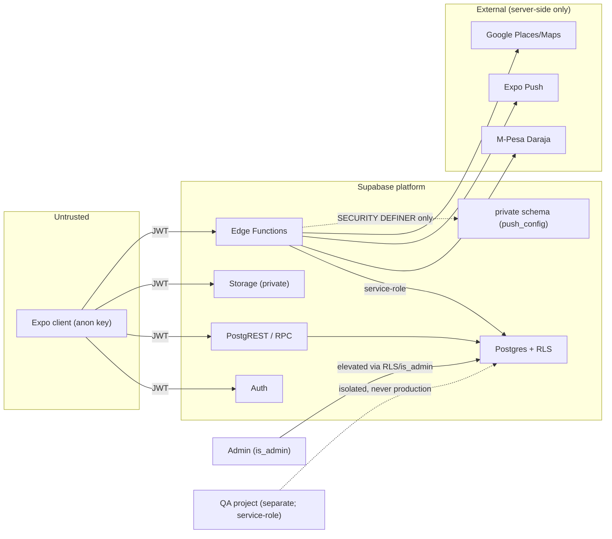
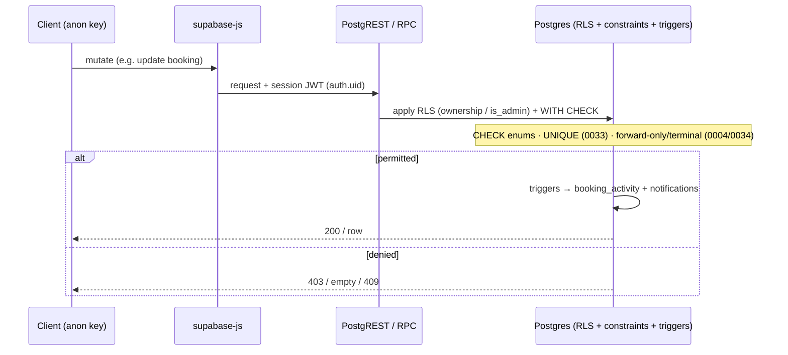

# QuickServe Security

## 1. Purpose

The authoritative security engineering reference for QuickServe, describing **only the
controls implemented in the repository today**, each traceable to source. It distinguishes
carefully between **implemented** (present in code/SQL), **certified** (proven by the QA
connected suite), and **production-ready** (not claimed here). Where the repository does not
prove a control exists, it is marked **Not verified**.

Full RLS policy text and per-flow auth detail live in [database/](../database/README.md) and
[authentication/](../authentication/README.md); this document is the security-posture view.

## 2. Current Security Status

| Badge | Meaning |
|---|---|
| **Implemented** | Present in app/DB/function code. |
| **Certified** | Additionally proven by the connected QA suite. |
| **Partial** | Present but not fully integrated / not certified end-to-end. |
| **Planned** | Referenced but not built. |
| **QA-only** | Test/certification infrastructure. |
| **Not verified** | The repository does not prove this control exists. |

**Summary:** RLS-based access control (30 tables, 84 policies), `is_admin()` checks,
`SECURITY DEFINER` functions that all pin `search_path`, JWT/secret-gated Edge Functions,
private-schema isolation of the push secret, and DB integrity constraints are **Implemented**;
the booking/dispatch/RLS spine is **Certified** (21/21). Payment settlement, push delivery,
rate-limiting, centralized monitoring, and secret rotation are **Partial** or **Not verified**.

## 3. Security Architecture

- **Untrusted client** — the Expo app holds only the **public anon key**
  (`src/lib/supabase.ts`); it is treated as untrusted. Access is not granted by the client.
- **Supabase Auth** — email/password identity; the session **JWT** carries `auth.uid()`.
- **JWT propagation** — `supabase-js` attaches the session token to every PostgREST/RPC call.
- **PostgREST / RPC** — table and function calls run under the caller's JWT; the database, not
  the client, decides access.
- **RLS** — the primary data-access boundary (30 tables; `supabase/migrations/0003`, `0004`).
  Runtime tenant isolation on `public.bookings` — cross-customer `SELECT` refusal and non-admin
  admin-field write refusal — is certified in
  [Phase 7D](../../qa/PHASE-7D-RLS-TENANT-ISOLATION-CERTIFICATION.md). That certification covers
  **only those two policy paths**; other tables, INSERT/DELETE paths, and provider UPDATE column
  pinning remain unprobed.
- **Edge Functions** — server-side code for third parties/secrets; JWT-verified or secret-gated.
- **Storage** — a private `booking-photos` bucket with policy-scoped access.
- **External providers** — M-Pesa Daraja, Expo Push, Google Places/Maps — reached only from
  Edge Functions.

(High-level; see [architecture/](../architecture/README.md).)

## 4. Trust Boundaries

Verified boundaries: the client never crosses into privileged access (RLS + anon key); the
service-role and `private` schema are reachable only server-side; external services are called
only from Edge Functions; the QA environment is a **separate** project
(`qa/playwright/support/connected/qa-accounts.ts`, `assertNotProduction`).

## 5. Identity and Access Control

Summary (full flows in [authentication/](../authentication/README.md)):

- **Roles** — `customer`, `provider`, `admin` (`src/constants/roles.ts`); no others exist.
- **Customer** — own rows only (`customer_id = auth.uid()`); can create own bookings.
- **Provider** — assigned rows only (`assigned_provider_id = auth.uid()`); forward-only,
  terminal-safe updates.
- **Admin** — elevated via `is_admin()`; not self-registrable (`handle_new_user` downgrades
  attempted admin signups, `supabase/migrations/0001_profiles.sql`).
- **Anonymous** — no access to protected rows (reads return empty sets; writes denied).
- **Client-side guards vs enforcement** — client route guards (`src/hooks/use-admin-guard.ts`,
  `src/app/_layout.tsx`) decide UI only; **enforcement is RLS**, which re-checks every request.
- **`auth.uid()` / `is_admin()`** — the JWT subject and the SECURITY DEFINER admin predicate
  (`supabase/migrations/0003_admin_dispatch.sql`) anchor all authorization.

## 6. Row Level Security

- **Enabled on 30 tables**; **84 `create policy` statements** (verified counts across
  `supabase/migrations/*.sql`).
- **Per-role isolation** — policies key on `auth.uid()` (ownership) and `is_admin()` (admin).
- **Ownership checks** — e.g. bookings insert/select by `customer_id = auth.uid()`; provider
  select/update by `assigned_provider_id = auth.uid()`; `profiles` self-update pins
  `role`/`approval_status` (no self-promotion).
- **Admin access** — `is_admin()` grants full read/update on core tables.
- **Service-role bypass boundary** — the service role **bypasses RLS** and is used only
  server-side/QA (§10); RLS is the boundary for all client access.

Policy SQL is not pasted; see [database/](../database/README.md) §13.

## 7. SECURITY DEFINER Functions

- **~84 Postgres functions**, with **88 `security definer` markers** and **88 `set
  search_path`** occurrences — i.e. every SECURITY DEFINER function pins its `search_path`
  (mitigating search-path hijacking). Verified across `supabase/migrations/*.sql`.
- **Purpose categories** — identity (`handle_new_user`), admin predicate (`is_admin`), audit,
  payments/quotes, wallet, promotions, notifications, analytics (read), operations/support,
  provider quality, services admin, tracking, addresses.
- **Owner-privilege execution** — these run with the definer's privileges; **privileged/admin
  functions guard with `is_admin()`** at entry.
- **Caller restrictions** — verified for admin RPCs (they call `is_admin()`); for the broader
  set, per-function caller restrictions are **not individually re-verified in this document**.
  Being `SECURITY DEFINER` does **not** by itself make a function safe — each relies on its own
  internal guards, which are enforced in SQL but not exhaustively audited here.

## 8. Edge Function Security

All 7 functions (`supabase/functions/`; `verify_jwt` from `supabase/config.toml`):

| Function | `verify_jwt` | Caller | Trust model | Secret | External | Verified protection | Unverified | Certified? |
|---|---|---|---|---|---|---|---|---|
| `mpesa-stk-push` | true | App | Caller JWT | — (uses service-role internally) | Daraja | JWT required | Daraja round-trip | No |
| `register-device` | true | App | Caller JWT | — | — | JWT required | — | Indirect |
| `places-autocomplete` | true | App | Caller JWT | — | Google | JWT required | provider behavior | No |
| `place-details` | true | App | Caller JWT | — | Google | JWT required | provider behavior | No |
| `tracking-map` | true | App | Caller JWT | — | Google | JWT required | provider behavior | No |
| `mpesa-callback` | **false** | Safaricom | **Secret-gated webhook** | `MPESA_CALLBACK_SECRET` (query token) | Daraja | **constant-time** secret check → 401 on mismatch | payload authenticity beyond secret | No |
| `send-push` | **false** | DB `pg_net` | **Secret-gated webhook** | `PUSH_WEBHOOK_SECRET` (`x-webhook-secret` header) | Expo Push | **constant-time** secret check → 401; kill-switch when unset | Expo delivery | No |

**JWT-verified functions** (5) act on the caller's identity. **Webhook functions** (2) accept
**no JWT** — Safaricom cannot send custom headers, so `mpesa-callback` validates a
high-entropy query token; `send-push` validates the `x-webhook-secret` header — both in
**constant time** (`supabase/functions/mpesa-callback/index.ts`, `send-push/index.ts`).

## 9. Secrets and Configuration

Names only (no values); grouped by boundary. **The client never uses service-role
credentials** — verified: no `SERVICE_ROLE`/`service_role` reference exists in `src/`.

- **Client-safe (bundled, `EXPO_PUBLIC_*`):** `EXPO_PUBLIC_SUPABASE_URL`,
  `EXPO_PUBLIC_SUPABASE_ANON_KEY` (public by design; RLS is the boundary),
  `EXPO_PUBLIC_SENTRY_DSN` (optional).
- **Server-only (Edge Functions):** `SUPABASE_SERVICE_ROLE_KEY`, `MPESA_CALLBACK_SECRET`,
  `PUSH_WEBHOOK_SECRET`, `MPESA_MODE`.
- **External integration (server-only):** `DARAJA_BASE_URL`, `DARAJA_CALLBACK_URL`,
  `DARAJA_CONSUMER_KEY`, `DARAJA_CONSUMER_SECRET`, `DARAJA_PASSKEY`, `DARAJA_SHORTCODE`,
  `GOOGLE_PLACES_API_KEY`.
- **QA-only (git-ignored `qa/.env`):** `QA_SUPABASE_URL`, `QA_SUPABASE_ANON_KEY`,
  `QA_SERVICE_ROLE_KEY` (provisioning only), `QA_{CUSTOMER,ADMIN,PROVIDER1,PROVIDER2}_*`.

Secret policy is documented in `docs/pilot/environment-secrets.md`; no secret values are
committed.

## 10. Service-Role Boundary

- **Used only server-side / QA:** `SUPABASE_SERVICE_ROLE_KEY` is referenced by the Edge
  Functions `mpesa-stk-push`, `mpesa-callback`, `send-push` (privileged writes / callbacks) and
  by QA teardown/provisioning (`qa/scripts/provision-accounts.mjs`, `qa/.../qa-client.ts`).
- **Not used by the client:** confirmed absent from `src/` — the app uses the anon key.
- **Why privileged:** the service role **bypasses RLS**; it can read/write any row.
- **Risk of accidental client exposure:** if it were ever bundled into the client, RLS would be
  bypassable. The `assertNotProduction()` guard and the `EXPO_PUBLIC_*`-only client
  configuration are the verified mitigations against misuse in QA/app code.

## 11. Database Integrity Protections

Verified defenses (in `supabase/migrations/`):

- **Primary keys** on every table; **foreign keys with `on delete cascade`** for booking
  children (audit/notifications/payments/etc.).
- **Unique constraints/indexes (3):** `bookings_active_dedup` (partial unique over active
  statuses — **duplicate-active-booking protection**,
  `supabase/migrations/0033_booking_active_dedup.sql`), `customer_addresses_one_default` (0019),
  `notifications_dedup_key` (0020); plus one-payment/one-review-per-booking unique columns.
- **Check constraints:** status enums (`bookings.status`, `payments.status`, etc.), non-negative
  money (`provider_share`/`quickserve_share`/wallet `balance` `>= 0`).
- **Terminal-state enforcement:** the provider update RLS requires the pre-update status to be
  progressable, making `cancelled`/`completed` terminal for the provider
  (`supabase/migrations/0034_provider_terminal_states.sql`); forward-only progression via `0004`.
- **Immutable/pinned fields:** `profiles_update_own` pins `role`/`approval_status`; the provider
  update policy pins customer/service/address/schedule/assignment fields.
- **Trigger-based side effects:** status/audit → `booking_activity`; events → `notifications`
  (0007, 0020) — deterministic, not client-forgeable.

## 12. Storage Security

- **Private bucket** `booking-photos` (`public = false`, `supabase/migrations/0006_booking_photos.sql`).
- **Access policies:** authenticated `insert`/`select` scoped to the bucket; **select tightened**
  in `0016` to objects correlated with a `booking_photos.photo_url` the caller may access;
  **delete requires `is_admin()`**.
- **Signed URLs:** downloads use `createSignedUrl(path, 3600)` (1-hour), never public URLs
  (`src/lib/photos.ts`).
- **Booking correlation:** the `booking_photos` row ties the object to a booking + uploader.
- **Upload validation:** the client derives `contentType` (`image/png|jpeg`) from the file
  extension (`src/lib/photos.ts`). **Server-side content-type and file-size enforcement is Not
  verified** — no size cap or MIME validation is evidenced in the storage policies.

## 13. Input Validation

- **Client wrappers:** form validation in `src/lib/validation.ts` (`validateLogin`,
  `validateRegister` — non-empty, email contains `@`, matching passwords). This is UX
  validation, not a security boundary.
- **Database constraints:** the authoritative check — enum `CHECK`s, `NOT NULL`, FK, unique
  indexes reject invalid writes (e.g. invalid booking status → 4xx, certified).
- **RPCs:** privileged RPCs guard with `is_admin()`; parameter-level validation is per-function
  in SQL (not exhaustively audited here).
- **Edge Functions:** validate input/secrets and return HTTP errors on failure.
- **External callbacks:** `mpesa-callback` validates the shared secret before processing.
- Comprehensive input validation is **not** claimed; the enforced layer is DB constraints + RLS.

## 14. Payment Security

Implemented (implementation ≠ certification ≠ production-ready):

- **STK initiation** — `mpesa-stk-push` (JWT-verified; uses service-role internally).
- **Callback** — `mpesa-callback` (no JWT) validates `MPESA_CALLBACK_SECRET` in constant time
  (401 on mismatch) before persisting via `apply_mpesa_callback` (0012).
- **Secret validation** — constant-time comparison (`supabase/functions/mpesa-callback/index.ts`).
- **Persistence** — `payments` / `payment_attempts` with status `CHECK`s and unique booking link
  (0010, 0011).
- **Reconciliation / admin override** — `override_payment_status` RPC (admin).
- **End-to-end certification — No.** Real settlement (STK → callback → paid) is not certified.
- **No PCI-compliance or production-payment-readiness claim** is made; QuickServe does not handle
  card data (M-Pesa is the payment rail).

## 15. Push and Notification Security

- **`send-push`** — secret-gated (no JWT); validates `x-webhook-secret` in constant time; a
  missing secret is a kill-switch (`supabase/functions/send-push/index.ts`).
- **`pg_net` invocation** — DB triggers POST to `send-push` with the secret header
  (`supabase/migrations/0015_push_triggers.sql`).
- **Push configuration isolation** — `private.push_config` (URL + secret) lives in a `private`
  schema with `revoke all ... from anon, authenticated` — unreadable by clients; only
  SECURITY DEFINER functions read it (0015).
- **Device registration** — `register-device` (JWT-verified) records tokens per authenticated user.
- **Notification rows** — RLS-scoped to `user_id = auth.uid()`.
- **Delivery** — **Partial / uncertified**: Expo Push delivery is not asserted by QA.

## 16. Auditability and Logging

- **`booking_activity`** — a trigger-written audit trail of status changes (0007); certified
  ordering (`qa/playwright/certification/golden-path.spec.ts`).
- **Administrative actions** — operations RPCs record support-case events/notes and account
  flags (0026); admin dispatch changes are captured in `booking_activity`/`notifications`.
- **Edge Function logs** — functions return/log errors; platform logging is provided by
  Supabase (not configured in-repo).
- **QA evidence** — connected certification asserts audit ordering and clean teardown
  (`qa/docs/LAUNCH-CERTIFICATION.md`).
- **Not present in-repo:** centralized logging, SIEM, alerting, and log-retention policies are
  **Not verified** (no such configuration exists in the repository).

## 17. QA Security Coverage

Certified by the connected suite (`qa/playwright/certification/`, 21/21):

- **Role isolation** — anon/customer/provider/admin see only what RLS permits.
- **Unauthorized access** — anon cannot read bookings; a non-owner/non-assigned user cannot see
  or write another's booking.
- **Booking ownership** — customer owns own booking; tenant isolation asserted.
- **Admin-only operations** — assignment/reassignment/status/accept-reject via admin.
- **Provider lifecycle restrictions** — forward-only; backward/reopen/repeat rejected; terminal
  states enforced (0034); cannot alter assignment metadata.
- **Duplicate-booking protection** — 409 via `0033`.
- **Cleanup isolation** — deterministic teardown, zero residual.

**Not certified:** payment settlement, push delivery, storage upload/download, realtime
tracking, chat, maps Edge Functions, and all native-mobile auth/UI paths.

## 18. Known Security Constraints

Precise, verified limitations (absence of evidence is stated as such, not as a definite flaw):

- **No optimistic concurrency** on booking mutations (last-write-wins) — a concurrent
  admin+provider write can silently lose one update.
- **Client-side checks are advisory** — route guards are UX; RLS is the enforcement boundary.
- **External integrations uncertified** — M-Pesa settlement and Google/Expo calls are not
  E2E-certified.
- **Storage content-type/size enforcement — Not verified** (client derives content-type; no
  server MIME/size cap evidenced).
- **Native-mobile auth — Not certified** (no automated coverage; iOS not automatable in the QA
  environment).
- **Application-level rate-limiting — Not verified.** Supabase Auth returns rate-limit errors
  (handled by `mapAuthError`), but no custom rate-limiting layer is evidenced.
- **Centralized security monitoring/alerting — Not verified.** Sentry crash reporting exists but
  is gated on `EXPO_PUBLIC_SENTRY_DSN`; no SIEM/alerting is configured in-repo.
- **Secret rotation process — Not documented.**

## 19. Incident and Operational Readiness

Documented only where it exists:

- **Sentry** crash reporting (gated on DSN, `src/lib/monitoring.ts`) — the only in-repo
  observability hook.
- **Incident response, alerting, backups, recovery exercises, key rotation, and access-review
  procedures — Not documented / Not verified** in the repository. Supabase provides
  platform-level backups, but no in-repo runbook exists.

See [operations/](../operations/README.md) for future operational documentation.

## 20. Security Change Rules

Verified workflow for security-impacting changes:

- **Database changes (RLS/policies/functions/constraints) require a migration**
  (`supabase/migrations/`, sequential/forward-only); **no manual production schema edits**.
- **Review RLS and SECURITY DEFINER behavior** — new/changed policies and definer functions must
  keep `set search_path` and appropriate `is_admin()` guards.
- **Edge Function auth changes** update `supabase/config.toml` (`verify_jwt`) and secret handling.
- **Re-run connected certification** for behavioral/security changes (role isolation + integrity)
  and keep migrations aligned; never weaken assertions.
- **Dedicated QA environment** — certification runs against a separate QA project, never production.
- **Update this documentation** alongside the change.

## 21. Security Review Checklist

For any security-impacting change, confirm:

- [ ] **Auth** — role/approval semantics unchanged or intentionally updated; admin remains
  non-self-assignable.
- [ ] **RLS** — every touched table keeps RLS enabled with correct ownership/`is_admin()` policies.
- [ ] **RPC privilege** — new/changed functions are `SECURITY DEFINER` with `set search_path`
  and guard privileged paths with `is_admin()`.
- [ ] **Edge Function auth** — `verify_jwt` correct; webhooks validate their secret (constant time).
- [ ] **Secrets** — client stays `EXPO_PUBLIC_*` only; service-role/third-party secrets remain
  server/QA-only; no values committed.
- [ ] **Storage** — bucket stays private; access remains booking-correlated; downloads via signed URLs.
- [ ] **Input validation** — DB constraints cover new fields/enums.
- [ ] **Auditability** — status/admin actions still emit `booking_activity`/records.
- [ ] **QA certification** — role isolation + integrity re-run green; deterministic cleanup preserved.
- [ ] **Documentation** — security/database/api/auth docs updated.

## 22. Related Documentation

- [Architecture](../architecture/README.md) · [Backend](../backend/README.md) ·
  [Database](../database/README.md) · [API](../api/README.md) ·
  [Authentication](../authentication/README.md) · [QA](../qa/README.md) ·
  [Deployment](../deployment/README.md) · [Operations](../operations/README.md)
- Engineering index: [../README.md](../README.md)
- QA (authoritative): `../../../qa/docs/LAUNCH-CERTIFICATION.md`; secrets policy:
  [../../pilot/](../../pilot/) (`environment-secrets.md`)

---

### Security enforcement for a protected mutation

*Verified against:* `src/lib/supabase.ts`, `supabase/migrations/0003`, `0004`, `0033`, `0034`,
`supabase/config.toml`, `supabase/functions/`, and `qa/playwright/certification/`.
